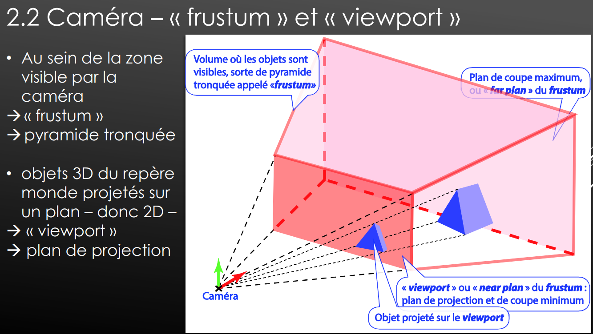
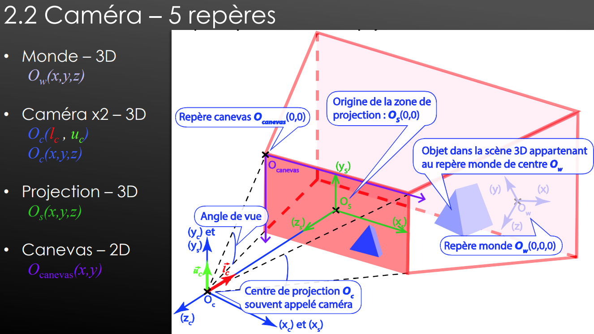

# divers
Vocabulaire importants : pages 316+
- discretiser des triangle en fonction des pixels : rasterisation
 [source](https://en.wikipedia.org/wiki/Rasterisation)

<!-- #region IMPORTANT BLOCK --> 

❗❗Important 

A se souvenir

# visualisation
<!-- #endregion IMPORTANT BLOCK -->

- CANVAS, "projection plan","front plan","viewport" :
  - C'est les 4 fois le même terme, on change juste en fonction du contexte 
  - Frustum : la pyramide tronquée (le volume)
  - 
  - 

- Les termes des repères (se souvenir d'au moins 4 !)
  - 

### Les matrices / repères
- repère monde : coord(0,0,0) (pas forcément un monde, mais peut être par exemple la coordonée initial sur Blender)
- M1 (MM) : repère modèle / matrice modèle : coordonnée de l'objet dans le monde
- M2 (VM) : Matrice de vue : permet de voir les objets (placement de la caméra)
- M3 (PM) : matrice de perspective : matrice identité; permet de définir les distances / angle de vue

Tout ces éléments sont géré par le **Vertex Shader**

### Vertex shader

Il est appelé sur chacun des vertex.

calcul la position des points

position finale = M3 * M2 * M1 * vec4(position, 1.0)
// (l'ordre est important comme les poupée russe)

<!-- #region IMPORTANT BLOCK --> 

❗❗Important 

Un vec2, vec3, vec4, etc n'a que 1 seule Dimension !!

$$\begin{vmatrix}
X1\\
Y1\\
Z1\\
\end{vmatrix}$$

Une matrice est 2D :

$$\begin{vmatrix}
X1 & X2 & X3\\
Y1 & Y2 & Y3\\
Z1 & Z2 & Z3
\end{vmatrix}$$

<!-- #endregion IMPORTANT BLOCK -->

