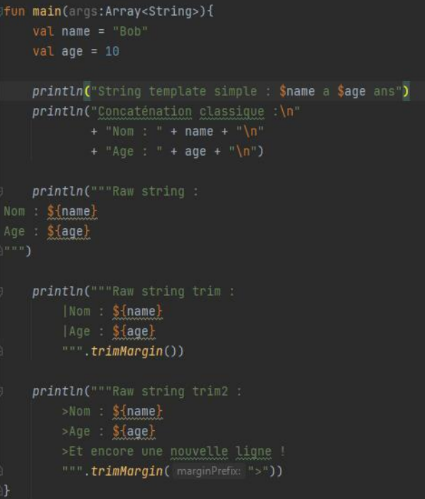
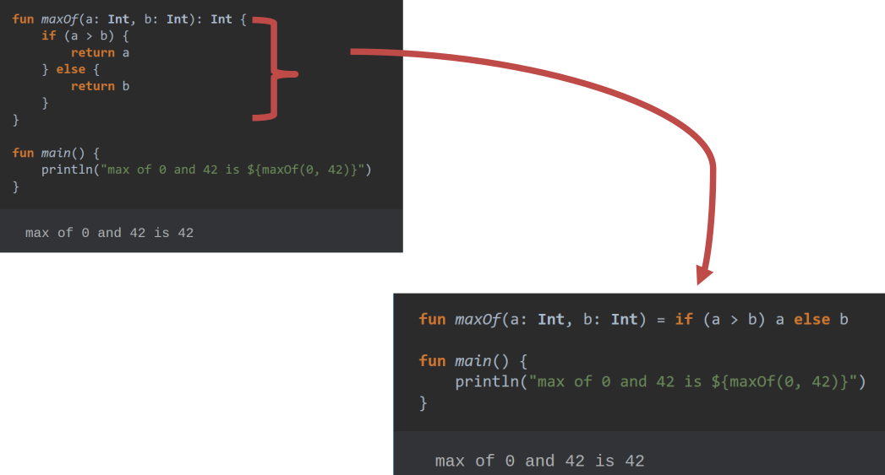
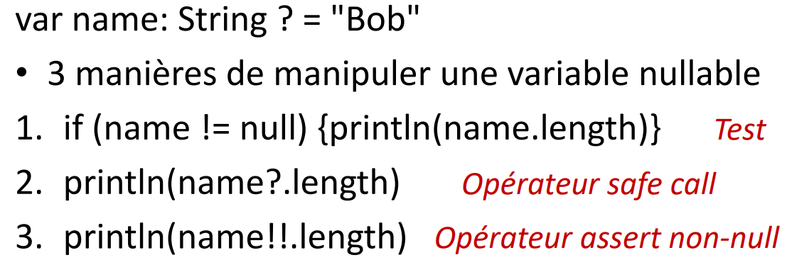
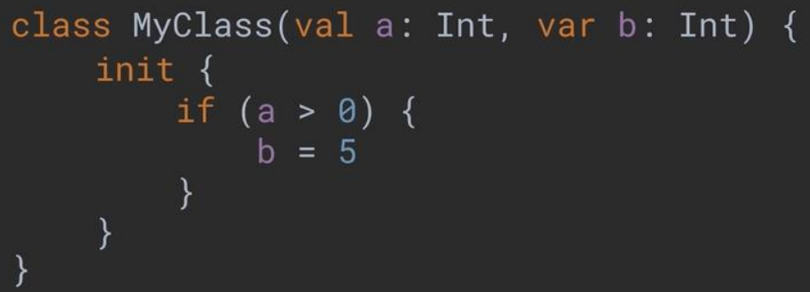
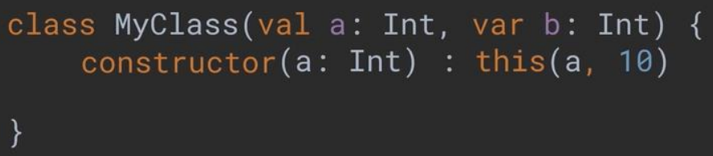

# Structure projet

- `res/drawable` Images à mettres dedans(ou `mipmap`, mais moins recommandé)
- `values` pour la traduction
- `layout` pour les vues

# Cycle de vie
onStart : quand l'activité est lancée
onResume : quand l'application permets d'afficher l'interface
onPause : quand on mets en arrière plan
onStop
onDestroy : Quand on quitte l'application

# Kotlin
possible d'avoir des fonctions hors d'une classe et les appelés dans une classe

Les variables ne sont pas nullables de base
`var name: String = "John"`
`var name: String? = null`

`var` pour les variables
`val` pour les constantes
`lateinit` indique que la variable sera initialisé plus tard

pas de `;` à la fin des lignes

Variables dans les strings

**Conditions d'Expressions**

`when` est un switch

**Safe call** et **Non null**

`?` comme en C#; n'execute la suite que si c'est pas null
`!!` si null, lève une exception

## Classes

**Constructeur primaires** : directement la définition de la classe
va appeler le `init` (qui contient le code à executer)

**Constructeurs secondaires** : comme un constructeur dans les autres langages

Héritage : la classe doit précédé du mot clé `open`, sinon elle n'est pas héritable

## static
Il n'y a plus !
en kotlin on à des `companinon`

-------------

# Le `Bundle`

petite BdD sous forme de clé-valeur pour la mémorisation des données pour la session en cours

les méthodes `onSaveInstanceState`et `onRestoreInstanceState` s'occupe de faire les actions à mémoriser dans le `Bundlexs`

Les types non primitif doivent être sérialisé. En Kotlin/Android, on utilise `Parcelable` pour cela (car on créé une "parcelle" en mémoire)