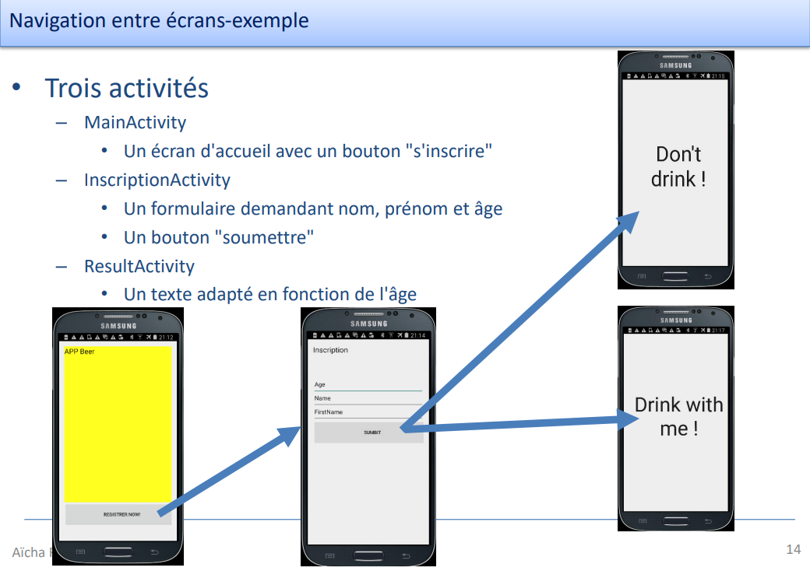

> <span style="font-size: 1.5em">📖</span> <span style="color: orange; font-size: 1.3em;">Présentation `04_InterfaceUtilisateur_2`</span>

# Intent, c'est quoi ?
empilement d'activités
permet d'améliorer l'expérience utilisateur

--> intent permet d'appeler un écran

N'a rien à voir avec le bundle (qui sert à récupéré les données quand l'application est mise en pause)
le intent permet de récupéré des données d'autres activités/applications

Dans android, tout passe par un intent



# Comment l'utiliser

```java
var extra = intent.extras
```

Extra fait le lien entre le intent et les données

le `request code` permet de savoir quel intent a été appelé (il doit être unique)

## intent implicite

```java
var intent = Intent(this, MainActivity::class.java)
startActivity(intent)
```

Fonctionne avec une URI. C'est le système qui va effectuer la connexion entre l'URI et l'application externe


## intent explicite

On donne le nom du composant, donc on le connait (même application)

```java