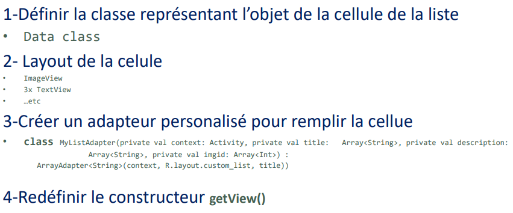

> <span style="font-size: 1.5em">📖</span> <span style="color: orange; font-size: 1.3em;">Présentation `05_List_Android_Kotlin `</span>


**RecyclerView** : Composant le plus utilisé, mappé sur les listes

**Adapter** : fait le lien entre les données et les affichages

# Listes simples
1. Créer un tableau de données
```java
val listArray = ArrayList<String>()
listArray.add("Item1");
```
2. Créer un adaptateur
```java
simpleAdapter = ArrayAdapter(this, android.R.layout.simple_list_item_1, listArray)
```
- Les paramètres sont:
  - Le context (this)
  - Le modèle de la cellule (android.R.layout.simple_list_item1)
  - Le tableau de données (ListArray)
3. Lier a la liste à l’interface graphique
`simpleListView = findViewById<ListView>(R.id.simplelistView) `
4. Appliquer l’adaptateur à la liste
`simpleListView.adapter = simpleAdapter`

# Listes personnalisées


**Inflater** : Lie la liste au Fichier XML qui décrit la structure de la ligne (layout)

```kotlin


class MyListAdapter(private val context: Activity, private val title:
        Array<String>, private val description: Array<String>, 
        private val imgid: Array<Int>)
    : ArrayAdapter<String>(context, R.layout.custom_list, title) {

    override fun getView(position: Int, view: View?, parent: ViewGroup): View {
        val inflater = context.layoutInflater
        val rowView = inflater.inflate(R.layout.custom_list, null, true)
        val titleText = rowView.findViewById(R.id.title) as TextView
        val imageView = rowView.findViewById(R.id.icon) as ImageView
        val subtitleText = rowView.findViewById(R.id.description) as TextView
        titleText.text = title[position]
        imageView.setImageResource(imgid[position])
        subtitleText.text = description[position]
        Log.i("Bonjour", "Test1")
        return rowView
    }
}
```

# ViewHolder

- Possède un système de cache pour la liste
- Optimise l'appel de `findViewById`
- Modifications dans `getView`

# RecyclerView

Le plus utilisé, bien optimisé