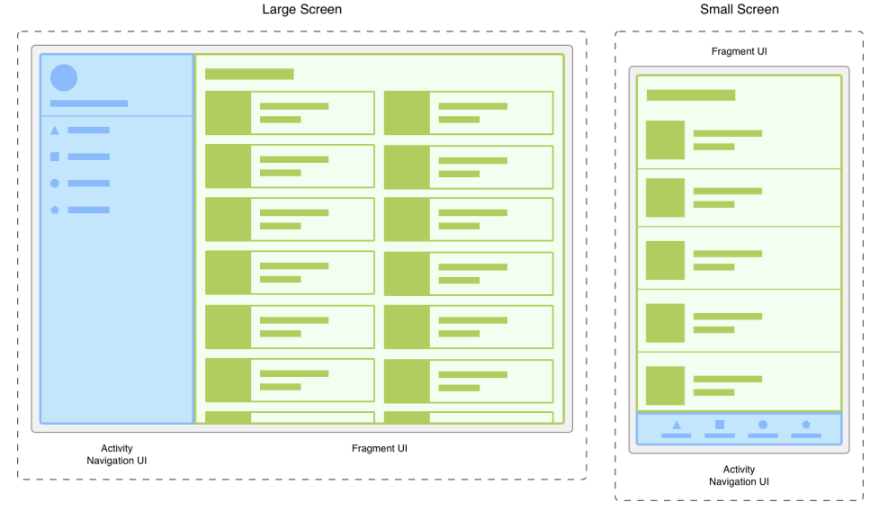

> <span style="font-size: 1.5em">📖</span> <span style="color: orange; font-size: 1.3em;">Présentation `Fragments`</span>


A quoi sa sert :

- Limiter le nombre d'activité dans l'app (trop d'activité ralenti l'app)

s'adapte automatiquement (responsive)


FragmentListener requis pour transmettre les actions aux parent (exemple l'action onclick d'un bouton)

**`redfragment.kt`**
```kotlin
class RedFragment : Fragment() {


    interface RedFragmentListener {
        fun onClick()
    }
    var listener: RedFragmentListener? = null

    override fun onCreate(savedInstanceState: Bundle?) {
        super.onCreate(savedInstanceState)

    }

    override fun onCreateView(
        inflater: LayoutInflater, container: ViewGroup?,
        savedInstanceState: Bundle?
    ): View? {
        // Inflate the layout for this fragment
        val view = inflater.inflate(R.layout.fragment_red, container, false)
        view.findViewById<Button>(R.id.button).setOnClickListener {
            Toast.makeText(activity, "Clicked", Toast.LENGTH_LONG).show()
            listener?.onClick()
        }
        return view
    }
}
```

**```MainAciivity.kt```**
```kotlin
class MainActivity : AppCompatActivity(), RedFragment.RedFragmentListener {
    private lateinit var redFragment: RedFragment

    override fun onCreate(savedInstanceState: Bundle?) {
        super.onCreate(savedInstanceState)
        setContentView(R.layout.activity_main)


        // add red fragment
        redFragment = RedFragment()
        redFragment.listener= this
        supportFragmentManager.beginTransaction()
            .replace(R.id.container, redFragment)
            .commit()


        }

    override fun onClick() {
        val blueFragment = BlueFragment()
        supportFragmentManager.beginTransaction()
            .remove(redFragment)
            .add(R.id.container,blueFragment)
            //.replace(R.id.container, blueFragment) // remplace les deux lignes
            .setTransition(FragmentTransaction.TRANSIT_FRAGMENT_OPEN)
            //.addToBackStack(null)
            .commit()
    }
}
```