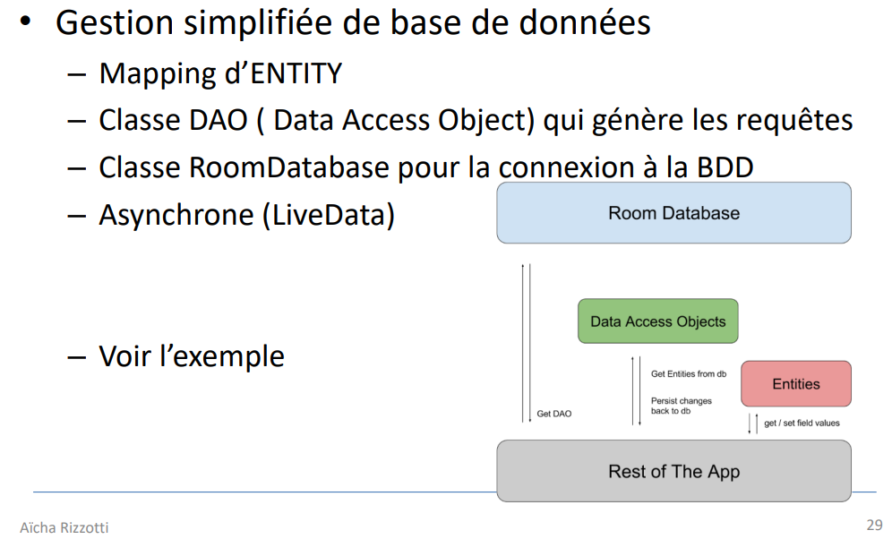

> <span style="font-size: 1.5em">📖</span> <span style="color: orange; font-size: 1.3em;">Présentation `07_Architecture_Component`</span>

LifeCycle : OnCreate, OnResume, OnDestroy, ...

# LiveData

Le type modifiable est `MutableLiveData`

```kotlin
val name = MutableLiveData<String>() // Create LiveData
name.observe(lifecycleOwner, Observer { newName ->
    Log.i(TAG,"New name=$newName")
}) // subscribe to events
name.value = "Bob" // notify Observer with newName="Bob
```
Chaque fois qu'on changera la `value` de `name`, l'Observer sera déclanché.


La base de donnée sera interfacée avec un `LiveData` pour que les changements soient automatiquement répercutés.

# Base de données
Système de `Room` pour la base de données.



DAO : Data Access Object
- Map les requêtes SQL sur des fonctions
Exemple :
```kotlin
@Dao
interface UserDao {
    @Query("SELECT * FROM user")
    fun getAll(): List<User>

    @Query("SELECT * FROM user WHERE uid IN (:userIds)")
    fun loadAllByIds(userIds: IntArray): List<User>

    @Query("SELECT * FROM user WHERE first_name LIKE :first AND " +
     "last_name LIKE :last LIMIT 1")
    fun findByName(first: String, last: String): User

    @Insert
    fun insertAll(vararg users: User)

    @Delete
    fun delete(user: User)
}
```

Pour la base de donnée, on fait un singleton.
<!-- #region NOTE BLOCK --> 
<div style="margin: 20px auto; padding: 10px; background-color: #ffd48a; border-left: 5px solid #8a5700;color: black; font-size: 2em">
<span> 📑 </span>Note<br>
<span style="font-size: 0.75em">

Reprendre le code proposé dans le projet `TestRoom` du cours
</span></div>

<!-- #endregion NOTE BLOCK -->

