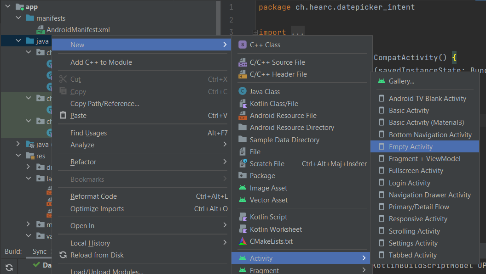

# Nouvelle activité

## Via le wizard



## Manuellement

Quand on créé une nouvelle classe de type `activity`,la classe doit dérivé de `AppCompatActivity`
```kotlin
package ch.hearc.datepicker_intent

import androidx.appcompat.app.AppCompatActivity
import android.os.Bundle

class MainActivity2 : AppCompatActivity() {
    override fun onCreate(savedInstanceState: Bundle?) {
        super.onCreate(savedInstanceState)
        setContentView(R.layout.activity_main2)
    }
}
```

Dans le manifest, il faut ajouter les infos suivantes :
```xml
        <activity
            android:name=".MainActivity2"
            android:exported="false">
            <meta-data
                android:name="android.app.lib_name"
                android:value="" />
        </activity>
```

Créé un fichier de vue `res/layout/activity_XXX.xml`

```xml	
<androidx.constraintlayout.widget.ConstraintLayout xmlns:android="http://schemas.android.com/apk/res/android"
    xmlns:app="http://schemas.android.com/apk/res-auto"
    xmlns:tools="http://schemas.android.com/tools"
    android:layout_width="match_parent"
    android:layout_height="match_parent"
    tools:context=".MainActivity">>

</androidx.constraintlayout.widget.ConstraintLayout>
```