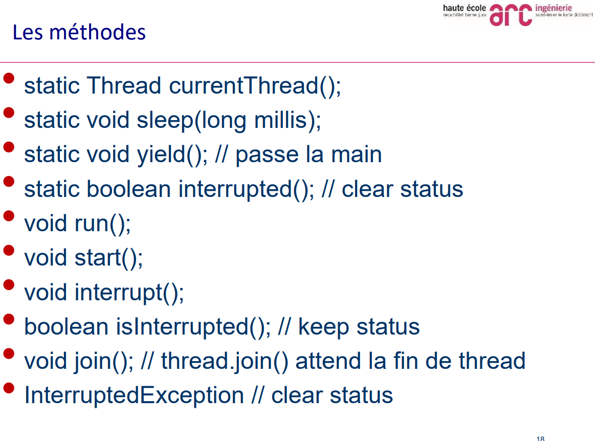

> 📖 Présentation [Basic-concurrence-java](../Cours/Slides/01_Introduction%20Java%20Thread/Basic%20concurrence-Java.pdf)
 

- **Application**
  - C'est une combinaison de données et instructions pour exécuter une tâche
- **Processus**
  - Une fois l'application est chargée dans la RAM
- **Thread**
  - une partie du processus exécutant le code machine

# Thread en java

**Yield** permet de laisser la main à un autre thread

