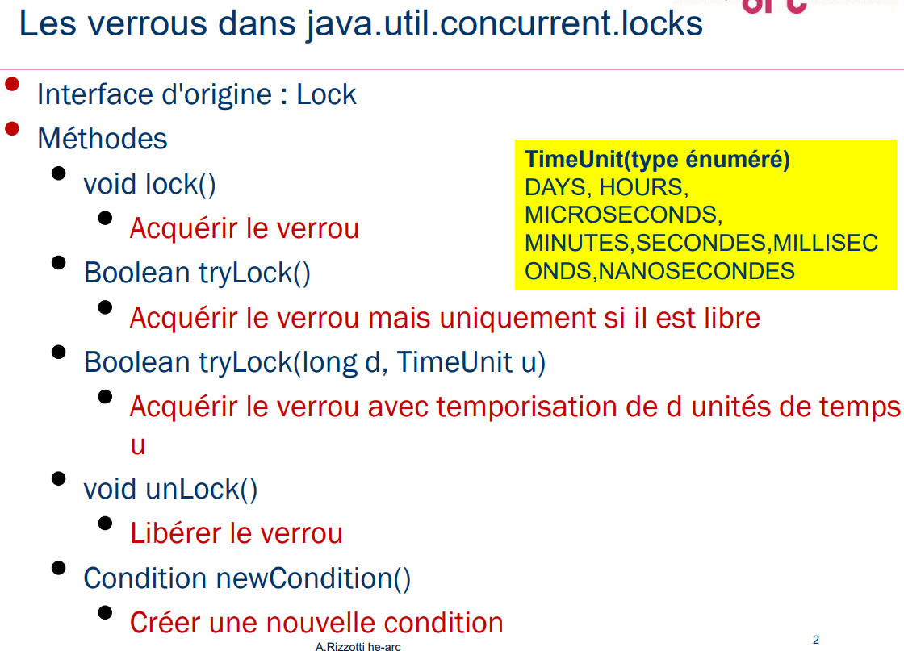
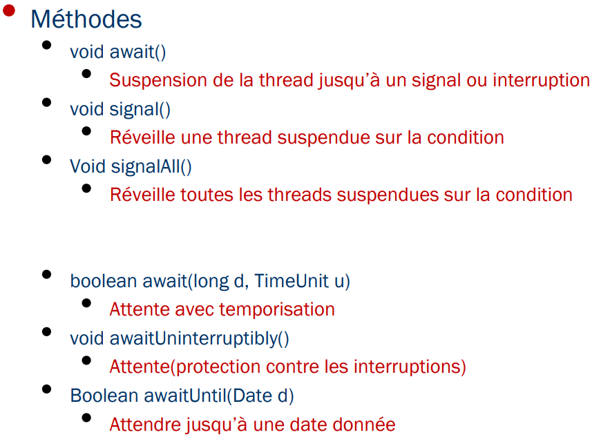
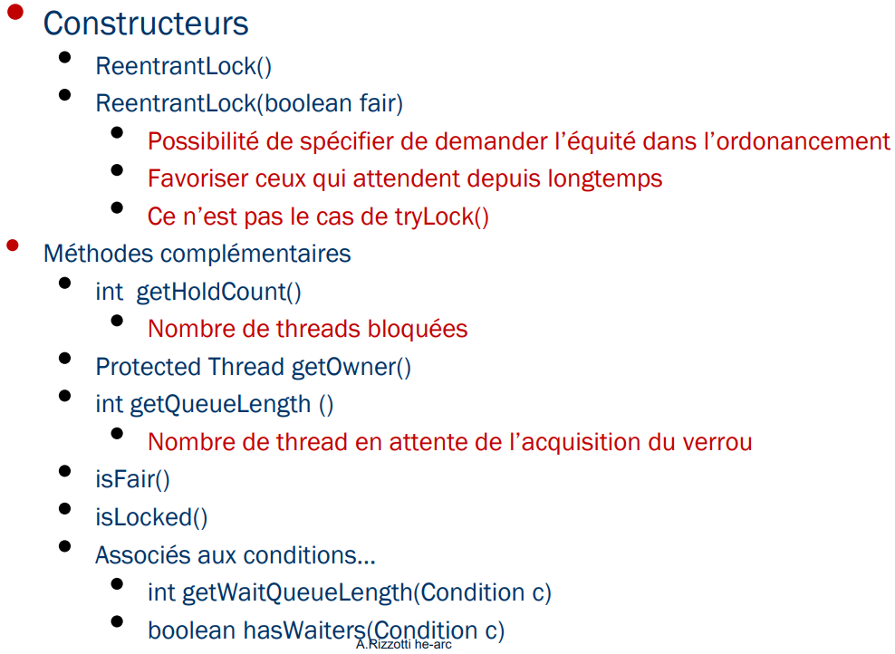
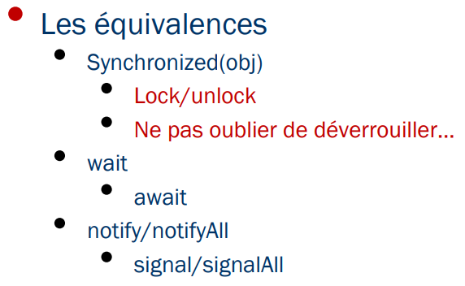
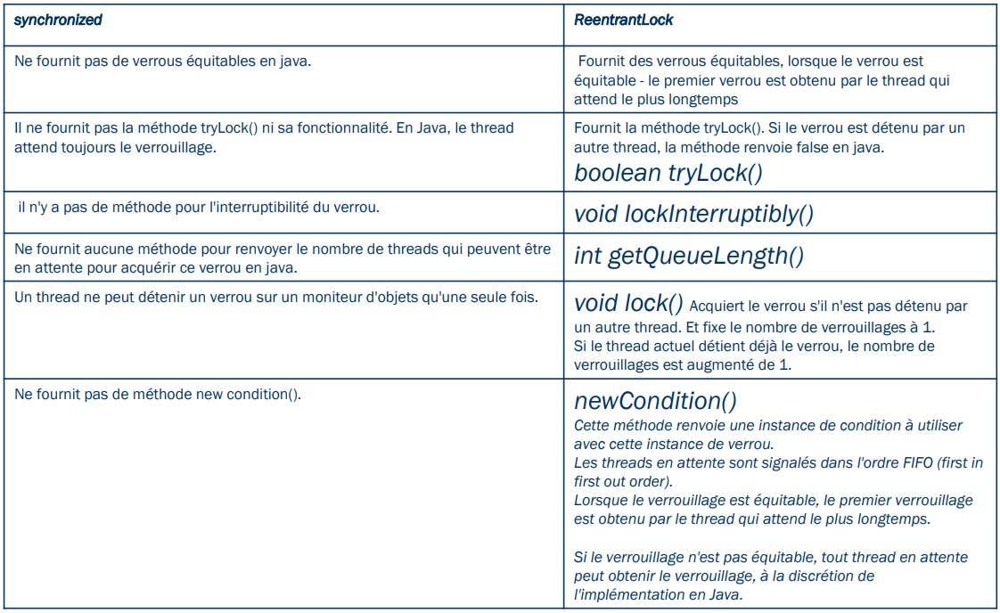

> 📖 Présentation `Verrous_Avancés.pdf`

Conditions :

# ReentrantLock

Mieux que synchronized, car il permet d'organiser de manière "fair" : permet de choisir l'ordonnancement des threads (FIFO)

## ReentrantLock vs Synchronized

