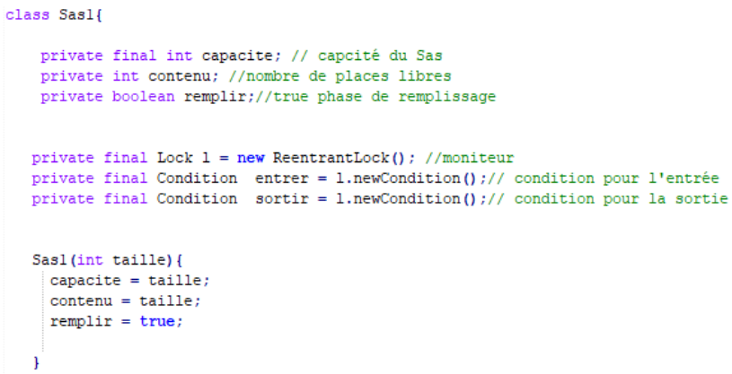

> <span style="font-size: 1.5em">📖</span> <span style="color: orange; font-size: 1.3em;">Présentation `Verrous_Avancés.pdf`</span>

# Lock


Conditions :


## Moniteur
Possèdent un système de monitoring : 
Permet de tracer les threads en attente; ceux libérés; ceux qui sont en cours d'exécution etc

Le moniteur `lock()` permet de bloquer les threads suivants.
Si un thread atteind un `await()`, il est mis en attente, et libère le `lock()`.

## Condition
Permet de mettre des conditions de lock (exemple durée max), et c'est sur ces conditions que l'on fait le wait


# ReentrantLock

Hérite de `Lock`

Mieux que synchronized, car il permet d'organiser de manière "fair" : permet de choisir l'ordonnancement des threads (FIFO)


## ReentrantLock vs Synchronized


# SAS avec ReentrantLock


Les conditions sont déclanchées lors d'un `await()` ou `signal()`

exemple :
```java
entrer.await(); // met la condition en attente

entrer.signal(); // déclanche la condition
```

