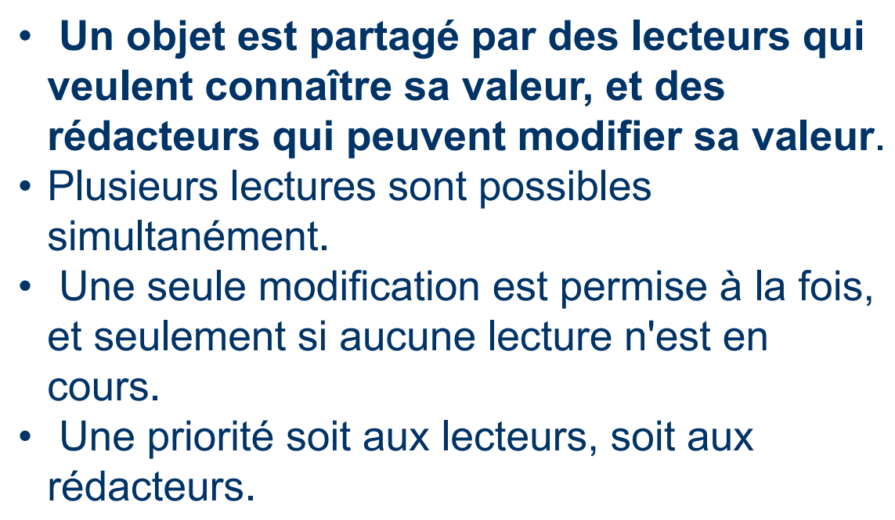
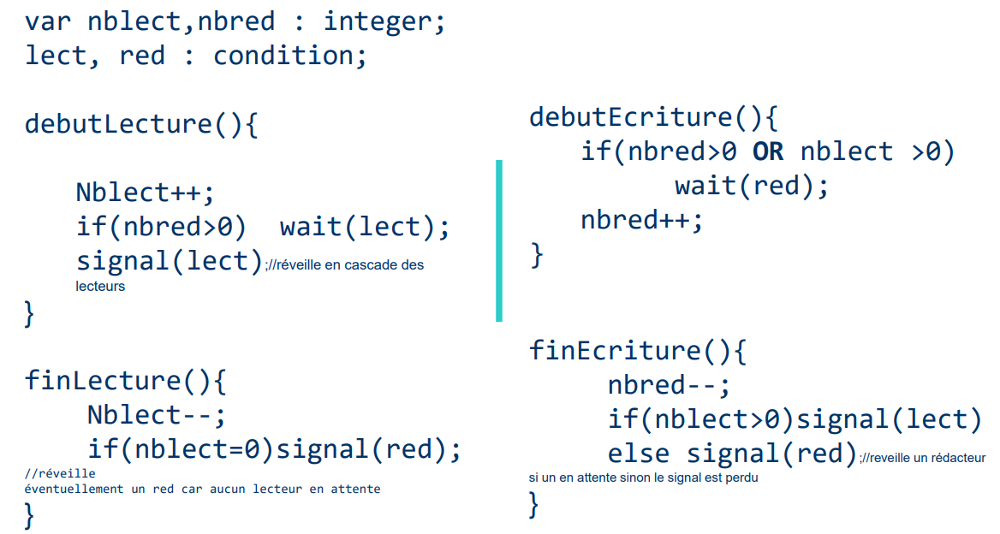
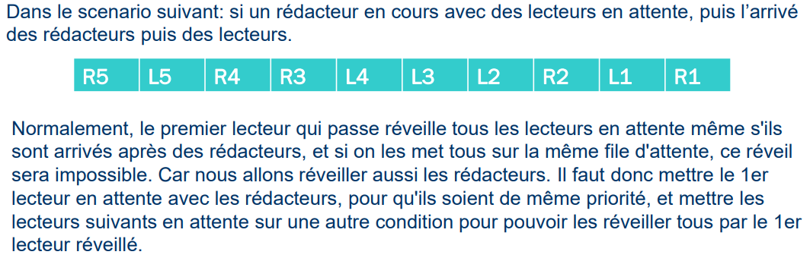
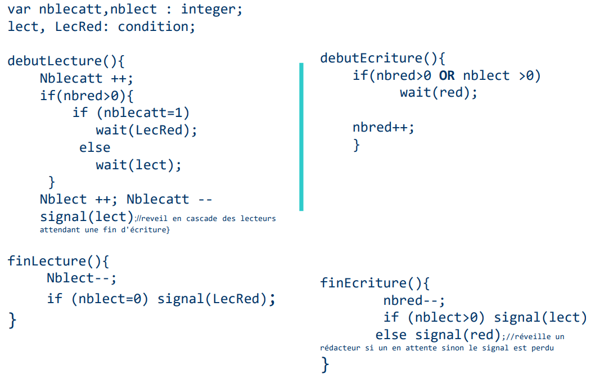
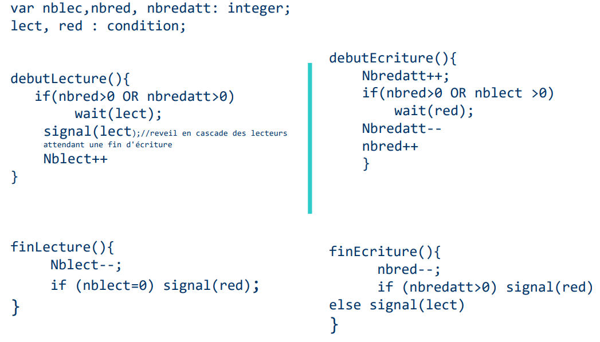

> 📖 Présentation `Pattern Lecteur rédacteur`
> https://docs.oracle.com/javase/7/docs/api/index.html?java/util/concurrent/locks/ReadWriteLock.html
> 

Passage de :
- Rédacteur -> Lecteur : Possible 
- Lecteur à rédacteur : Non possible 

#  ReadWriteLock
https://docs.oracle.com/javase/7/docs/api/index.html?java/util/concurrent/locks/ReadWriteLock.html

Résumé : le vérou possède deux mode : 1 lecture, 1 écriture

Si le verou est en lecture, tout le monde peut lire les informations
Si le vérou est en écriture, seul 1 personne écrit. Personne d'autre que lui peut lire les informations

## Cas1: Priorité Absolue des lecteurs sur rédacteurs

##  Cas2: Priorité Relative aux des lecteurs sur rédacteurs
(environ priorité égale)

## Cas3: Priorité aux rédacteurs

Il faut ajouter une variable représentant de nombre d’attente de rédacteurs permettant de bloquer les lecteurs si des rédacteurs sont en attente.

# StampedLock

Autre type de LecteurRedacteur, mais avec une optimisation comparé au précédent.

- Sans : Chaque fois qu'on fait un lock, on mobilise les ressources. Chaque fois qu'un code est vérouillé, on perd en performence (Goulot d'étranglement).
- Avec : Permet de réduire ce goulot d'étranglement.
  - Comment : on a un jeton quand on accède à la ressource, et quand on rend le jeton, une vérification est faite s'il y a eu une modification. En cas de modification, la modifie. Et s'il y a modification, les lecteurs sont informés comme quoi la données est peut être fausse.
