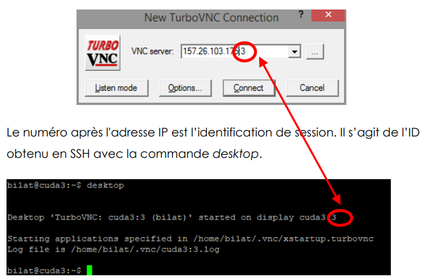

# Divers

# Dépoôt Git
astro2021
http://157.26.83.31:3000/lambda2022a/WLambda.git

VM : Dossier ayant les infos de dépots : `/opt/cbi/echange/arc/01_lambda`

## VM
1. SSH 157.26.103.173 (Putty)
2. SSH> `desktop`
3. Turbo VNC> 
4. Fermer la session (SSH>)
	- `desktop -killall` pour fermer la session
	- `desktop -list` pour lister les sessions (x)<br>`desktop -kill :x` pour fermer la session

# Notes

interface fonctionnel : 1 seul méthode -->> programmation fonctionnel :D

inféréer : Le compilateur trouve les éléments (types, return, nom de classes/méthodes, etc) par lui même

# <span style="color: green">Objectifs</span> de la programmation fonctionnel :
1. Simplification de la programmation
2. Syntaxe plus courte


# lambda :
>() -> { /* code */ };	// 0 var, parenthèses obligatoires
>arg -> { /* code */ };	// 1 var, parenthèses oubliables
>(arg, arg2, arg3) -> { /* code */ };

les lambda n'ont pas forcément besoin des {}; si qu'une seule ligne

	exemple (arg1) -> sysout(arg1);


# Interface programmation fonctionnel :
(mot clé "être et avoir" [les verbes important à 100%])
- predicate
- consumer
- binaryoperator
- function

sinon comme les verbes, il y en a plus d'une centaines

- **prédicat** : permet de donner des règles de filtrages
  - C'est comme le linq, on lui donne les condition de filtrage à la volée `{x : x.val > 10}`
- **consumer** : Permet d'appliquer une méthode à un collection d'objet (foreach)
  - Pour l'executer : consumer.accept(...)
	Une fois le consumer.accept executer, A interpreter comme si on ne peut plus rien faire sur ce consumer !! (Action terminale, cf une pizza; on la consomme : on peut plus rien faire avec ;D)

- **binaryoperator** : permet de <u>réduire</u> (passer de N objets à 1 seul) (exemple, une élection d'un seul délégué de classe parmis tous ceux de la classe)
  - Dans le sens de binary, nous ferons des comparaisons 2 à 2; Exemple a + b.
	(unary (unaire) == 1 opérateur, exemple "Not", "++")
- **function** : permet de <u>transformer</u> (passer de N objets à N objets) (exemple, transformer une liste de personne en liste de nom de personne)

		


# Référence d'une méthode
Pour supprimer la viarable (et l'oppérateur lambda) :
> `Consumer<T> consumer = t -> t.laMethode()` <span style="color: #46b7ae; font-style: italic; font-size: 0.85rem">// Avant suppression</span>
> `Consumer<T> consumer = T::laMethode;` <span style="color: #46b7ae; font-style: italic; font-size: 0.85rem">// le T:: permet le remplacement de la variable // Il faut retirer les parenthèses pour faire une référence de méthode</span>
>
>> <span style="color: #46b7ae; font-style: italic; font-size: 0.85rem"> // Les parenthèses génère des appels, qui sont une syntaxe de programmation impérative</span>
>> <span style="color: #46b7ae; font-style: italic; font-size: 0.85rem"> // T::methode signifie au compilateur : plus tard quand on appelera ce consumer, on utilisatera cette méthode</span>
>
> `T::methode > 20` <span style="color: #46b7ae; font-style: italic; font-size: 0.85rem"> // Ne compile pas car on vérifie si la référence de méthode est plus grande que 20; et non pas la valeur de "methode" de l'instance plus grande que 20 !!!</span>
>><span style="color: #46b7ae; font-style: italic; font-size: 0.85rem">// Ici on compare le type "T::methode" à un nombre :(</span>


On ne peut pas utiliser de variables dans une référence de méthode, exemple

```java
Comparator<Voiture> prix = (v1, v2) -> Integer.compare(v1.getPrix(), v2.getPrix())

// Et non pas comme ça : 
// Comparator<Voiture> prix = (v1, v2) -> Integer::compare(v1.getPrix(), v2.getPrix())

```

-----------
# Variables externes dans les lambdas

Une variable primitive externe ne peut pas être utilisée dans une expression lamnda; sauf si elle est `final` <span style="color: #46b7ae; font-style: italic; font-size: 0.85rem">// et donc non modifiable</span> .
Alors que les objets externes peuvent être sans problème.
<span style="color: #46b7ae; font-style: italic; font-size: 0.85rem">// En programmation fonctionnel, il faudrais éviter de modifier directement une variable dans une méthode</span> 

<span style="color: red">Ceci n'est donc pas possible :</span> 
```java
int count = 0;
list.forEach(i -> count++)
```

<span style="color: green">Mais ceci est ok</span> 
```java
final int MAX = 10;
list.forEach(i -> sysout(MAX))


monObjet obj = ...;
list.forEach(i -> obj.methode(i))
```

Solution : créé son propre wrapper pour un type primitf
