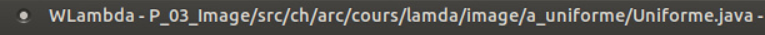
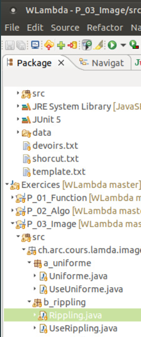

# Images

1	2	3
4	5	6
7	8	9

En prog parallèle CUDA, il n'y a pas de tableau 2D --> tout est en 1D rowmajor
--> tableau = 1 2 3 4 5 6 7 8 9
-->> on a que 1 index : on multiplie "i * w + j" (w = nombre de colonnes)

## Exercice Rippling
`/opt/cbi/doc/cuda/01_TP/01_Preparer_100/02_cuda_image`

