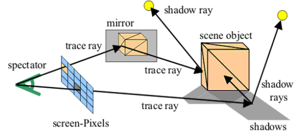
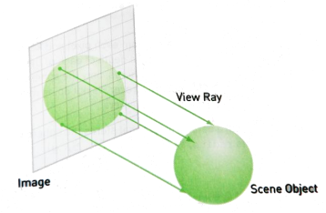
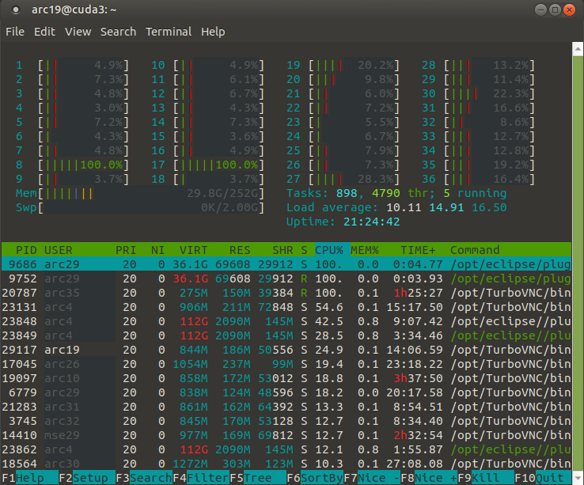

Afficher une scène 3D : 2 technique :
- Raytracing
  Le pixel tir un rayon, le rayon va toucher un objet, évtentuellement rebondire sur un autre objet, et au final on obtient la couleur moyenne de tous les rebonds (en fonction de la couleur des objets, de la force de rebond, etc)
- Mathématiques projectives
  Les données viennent de la scène 3D vers la caméra, un peu comme les moustiques qui s'écrase sur le pare-brise de la voiture et la colorent.

# RayTracing


2 étapes : 
1. Calculer la couleur
2. Calculer la distance avec le centre de l'objet, pour déterminer la brightness/saturation




Terminal `htop` pour voir qui consomme des ressources


# Analyse des résultats

<!-- #region TODO BLOCK --> 
<div style="margin: 20px auto; padding: 10px; background-color: #ffd48a; border-left: 5px solid #8a5700;color: black; font-size: 2em">
<span> 📝 </span>TODO<br>
<span style="font-size: 0.75em">
RELANCER LES TESTS ET ANALYSER LES DIFF DE PERFORMANCE DES PARRALLELE
Il faut regarder les FPS entre chaque et calculer le gain
Normalment c'est le "ligne" qui gagne !
</span></div>

<!-- #endregion TODO BLOCK -->


**Mode sans stream** :
```
-----------------------------------------------
Raytracing : (w,h)=(1200,720) : STANDARD
-----------------------------------------------

[Animator] : fps (v1)  = 0.3 (mean sum local)

[Animator] : fps (v2)  = 0.3 (mean global)

[Animator] : fps (v3)  = 0.3 (mediane)

[Animator] : Time By Iteration [ms] = LongSummaryStatistics{count=11, sum=42769, min=3674, average=3888.090909, max=4584}

[Animator] : Time By Iteration [ms] = [4584, 4011, 3703, 3751, 3843, 3812, 4007, 3740, 3748, 3674, 3896]
```

**Mode stream séquentiel** :

```
-----------------------------------------------
Raytracing : (w,h)=(1200,720) : STREAM_SEQUENTIAL
-----------------------------------------------

[Animator] : fps (v1)  = 0.2 (mean sum local)

[Animator] : fps (v2)  = 0.2 (mean global)

[Animator] : fps (v3)  = 0.2 (mediane)

[Animator] : Time By Iteration [ms] = LongSummaryStatistics{count=10, sum=40072, min=3769, average=4007.200000, max=4184}

[Animator] : Time By Iteration [ms] = [4100, 4184, 4160, 4157, 4168, 4124, 3839, 3772, 3769, 3799]
```

**Mode stream parrallèle sur les lignes** :
```
-----------------------------------------------
Raytracing : (w,h)=(1200,720) : STREAM_PARALLEL
-----------------------------------------------

[Animator] : fps (v1)  = 6.8 (mean sum local)

[Animator] : fps (v2)  = 6.8 (mean global)

[Animator] : fps (v3)  = 6.8 (mediane)

[Animator] : Time By Iteration [ms] = LongSummaryStatistics{count=272, sum=40137, min=135, average=147.562500, max=189}

[Animator] : Time By Iteration [ms] = [189, 167, 167, 157, 145, 145, 151, 147, 153, 144, 161, 149, 148, 148, 145, 140, 137, 154, 140, 137, 147, 144, 146, 146, 151, 140, 143, 147, 140, 142, 137, 148, 1
37, 144, 143, 145, 138, 141, 151, 145, 140, 146, 142, 143, 140, 149, 144, 142, 148, 143, 147, 139, 151, 155, 152, 155, 153, 153, 151, 140, 144, 143, 150, 146, 145, 146, 141, 147, 149, 145, 142, 151, 1
51, 145, 142, 150, 140, 146, 148, 152, 143, 142, 154, 144, 145, 144, 148, 138, 140, 143, 135, 139, 144, 152, 145, 139, 146, 146, 146, 143, 160, 153, 153, 154, 154, 156, 157, 154, 147, 149, 146, 144, 1
44, 154, 141, 142, 145, 147, 144, 156, 153, 145, 146, 151, 143, 148, 151, 157, 148, 148, 151, 144, 141, 151, 141, 143, 145, 156, 143, 145, 152, 146, 145, 148, 163, 146, 146, 155, 153, 155, 151, 147, 1
47, 145, 159, 152, 146, 149, 151, 150, 153, 144, 146, 145, 149, 148, 154, 156, 145, 145, 151, 148, 147, 141, 147, 143, 144, 153, 147, 145, 143, 148, 149, 154, 156, 148, 148, 145, 142, 145, 148, 156, 1
46, 146, 161, 145, 154, 152, 150, 152, 145, 153, 146, 156, 157, 148, 147, 155, 143, 138, 141, 147, 143, 137, 152, 145, 146, 140, 148, 137, 141, 147, 137, 141, 145, 154, 147, 149, 158, 156, 149, 154, 1
49, 147, 144, 154, 147, 144, 152, 145, 142, 147, 151, 143, 146, 141, 140, 141, 142, 156, 143, 143, 147, 147, 147, 141, 150, 144, 150, 159, 152, 154, 154, 161, 148, 147, 155, 155, 142, 148, 145, 146]
```

**Mode stream parrallèle sur les colonnes** :
```
```

**Mode stream parrallèle sur les lignes et les colonnes** :
```
```

## Résultats
**Stream séquentiel vs stream parrallèle sur les colonnes** :
```
Raytracing : (w,h)=(1200,720) : STREAM_PARALLEL
Duration     = 40000[ms]
speedUP      = 25.9x
#nbProcessor = 36
```