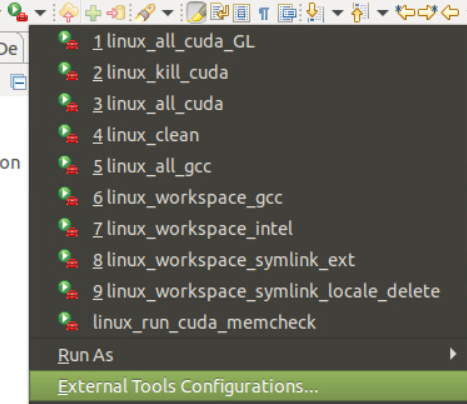
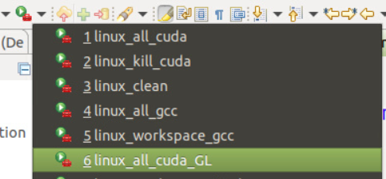

> Emplacement du code du TP : 
> `Student_Cuda_Image/src/cpp/core/01_Rippling/`
> Main : `Student_Cuda_Image/src/cpp/main.cpp`

# Notes de Sébastien
> j'était absent au début

Dériver de la méthode Animable_I<uchar4>

Une couleur en Java : `int` : 4 octets : `[ R | G | B | A ]`

En Cuda: `uchar` (unsigned char) : 1 octet
Mais aussi `uchar4` (unsigned char 4 bytes) : 4 octets

S'imaginer que le type est implémenté comme ça :

```cpp
struct uchar4 {
    uchar x; // Composante R
    uchar y; // Composante G
    uchar z; // Composante B
    uchar w; // Composante A
}
```


Convention utilisée : **Row major** :
```cpp
[1, 2, 3,
 4, 5, 6]
```

le tableau est stocké sur 1 dimension, donc on a :
```cpp
[1, 2, 3, 4, 5, 6]
```

avec `w = 3` (largeur) et `h = 2` (hauteur)

```cpp
// GPU
void process(uchar4* tabPixelsGM, uint w, uint h, float t) {
    ...
}
```

`DomainMath` --> on fait rien avec pour l'instant

```cpp
// GPU
void animationStep() {
    ...
}
```

---- 

Objectif pour la semaine prochaine : **Rippling (Cuda)**
Temps estimé pour la réalisation : 30 min (15 min pour ceux qui sont rapides)
Aucune réduction à utiliser

> "Maintenant il y a plus qu'a"
> ~ Bilat, 2023


--- 

La méthode `void Indices::toIJ(s, w, &i, &j)` permet la conversion de `s` (l'indice dans le thread) vers `i` (position Y) et `j` (position X)
Il faut faire :
```cpp
#include "Indices.cu.h"
```
 pour pouvoir utiliser la méthode utilitaire (déjà inclu) 
Pour colorier un pixel : `void ripplingMath.colorIJ(&tabPixelsGM[s], i, j)` (pas oublier le `&` vu que la méthode écrit dans la case)

# Mes notes

!!! info "Boite à outil" d'execution
    Si les executions "eclipses" n'apparaissent pas dans les outils, afficher les "externals"
    

## Tuer des executions CUDA "perdues"


Si une erreur "no process found" apparait dans la console, c'est qu'aucun processus n'était en cours, donc c'est bon 😄  

## Le mode "affichage" (`Image`)
```cpp
// Student_Cuda_Image/src/cpp/main.cpp
udaContext.launchMode = LaunchModeImage::IMAGE;
```

Pour executer ce mode, il faut lancer le programme avec `GL`


!!! info L'execution avec "GL" permet d'ajouter un proxy au pipeline d'OpenGL :
    OpenGL va afficher directement sur l'écran de l'appareil, sauf que là on est sur un serveur sans écran !
    Le fait d'ajouter un proxy, les données qui devrait être affichées sur un écran sont sauvée au format `.png` puis envoyés sur le réseau. Cette image est ensuite affichée sur la fenêtre dans notre VM.

Ce mode permet de lancer l'execution en mode graphie. On peut y voir des FPS.
- Ces FPS ne sont pas ceux qu'il faut atteindre pour les rendus !
- Les FPS affichés sont ceux du **Pipeline total** (contenant : `calcul kernel cuda` + `pipeline OpenGL` + `envoie sur le réseau`.
- Pour le Rippling, on a par exemple `17FPS`, bien loins des `183K` souhaité)

## Mode "Benchmark" (`Benchmark`)
```cpp
// Student_Cuda_Image/src/cpp/main.cpp
cudaContext.launchMode = LaunchModeBenchmark::BENCHMARK;
```

Le code n'est plus executé pour être affichés, ainsi on peut mesurer les FPS du kernel CUDA.

Comme on a plus d'affichage, il faut plus lancer avec `GL` :


### Maximiser les FPS en CUDA
- float et pas double (on passe de 100K FPS à 10K si on utilise des FPS)
- Limiter le nombre de conversions (exemple de float en int)
- Heuristique : si c'est pas "ou un multiple", les perfo sont nulles
  - Il faudra souvant faire un multiple et pas juste prendre la valeur (voir "Bruteforce")

!!! info Les meilleurs perfs
    en général, le GPU#2 est plus rapide que le 1, car il est plus éloigné (et donc plus froid) (sauf si tout le monde l'utilise 😆)

    Par contre, le prof ne se basera pas sur celui-ci pour l'évaluation 🥲

## Mode "Bruteforce" (`Bruteforce`)
```cpp
// Student_Cuda_Image/src/cpp/main.cpp
cudaContext.launchMode = LaunchModeBruteforce::BRUTEFORCE;
```

Pour chercher les meilleurs grilles : utiliser `BRUTEFORCE` (au lieu de `BENCHMARKING`)
Il va tester plusieurs grilles (respectant l'heuristique)

Ensuite, les statistiques sont affichés via MathLab. Plus les données sont jaunes, plus les FPS sont bien !

Le meilleur résultat est affiché en rouge.

**Remarque** :
Ne pas prendre forcement le meilleur résultat fournis par le bruteforce, mais celles qui sont plus constants (pour limiter les variations) 
> Ne pas "prendre" au "bords" d'une "cheminée", mais plutôt une valeur en "plaine"

## Remarques diverses

### Rappel des valeurs des heuristiques

DB == 64 à 1024 (puissance de 2)
DG == multiples de 68

### Variations entre les executions

Les différences de FPS obtenus d'une execution à l'autre sont dues aux variations de fréquences de GPU.

Si on lance, le GPU augmente ses fréquences, et quand elles atteignes le max elle reste un moment, une fois moins solicité, le GPU bride les performances ce qui les fait varié (monté-descente)
Une fois plus utilisé, la fréquence redéscend au min avant de pouvoir relancer un nouveau cycle full perf


# TP Rippling Cuda

-  atteindre 183K FPS (175K est acceptable, comme beaucoup de monde travail en même temps) (le seuil minimal est de 160K)
- Si on a un thread (grille 1,1,1) : On a quoi en FPS ? 
Chasse aux FPS : configuration de la grille (à tester différentes valeurs)
- Lire le PDF, il y a des "bétises" dans le code qu'il faut expérimenté 🙂 (et les documentés, pour éviter de les commettre dans les futures TP)

Il est possible d'améliorer les FPS (pour atteindre ~240K) en réduisant le nombre d'informations calculées :
- il est possible de calculer qu'une partie de l'image, étant donné que l'image est "symétrique"
- (optimisation par quart est plus complexe que par moitié "horizontale" à mettre en place, car y a plus de calcul de symétrie et comme chaque thread doit avoir le même code)