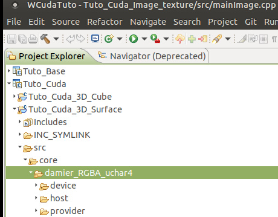
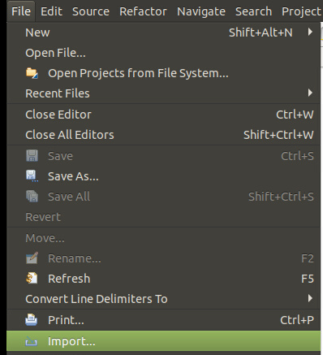
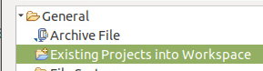

tester les types 
- `fp64` : double
- `fp32` : float
- fp16 : half

(fp == floating point)


Dans le `device`, il faut utiliser le type `real` (permet de simplement switch le type de float sans devoir les changer partout).
Le choix ce fait dans `real.h` (décommenter le type voulu)

But : tester et mesurer les performances des différents types


==> 3 TP à faire (1 par type)

Schéma


Conversion de K en Hue


Avec le double on doit pouvoir beaucoup plus zoomé, mais "taux ou tard" quelquechose devrais apparaitre : on voit les limites des nombres (flotant, double, etc) avec la pixelisation

Pour utiliser `Mandelbrot` au lieu du Rippling, il faut activer dans `mainImage` : ```Viewer<MandelbrotProvider> mandelbrot(zoomable, 0, 0);`

!!! warning Rappel
    Modifier un fichier `.h` (`.cu.h`) ==> Faire un clean avant de relancer


# Faire en 3D

Y a pas le code de base -> on se base sur le code d'exemple du tutoriel

Tutoriel : 

On copie tout le tuto_cuda_3d_surface dans notre workspace des labos

et on l'importe dans Eclipse



Pour le code, maintenant on a 2 tableaux à remplire en GlobalMemory : 
- vertex de la surfaces (X Y Z)
- Couleurs des vertextes

Il faut maintenant adapter certains endroits du code d'exemple pour intégrer le TP mandelbrote.
Exemple à changer :
- damier3D -> device -> `objet de math`