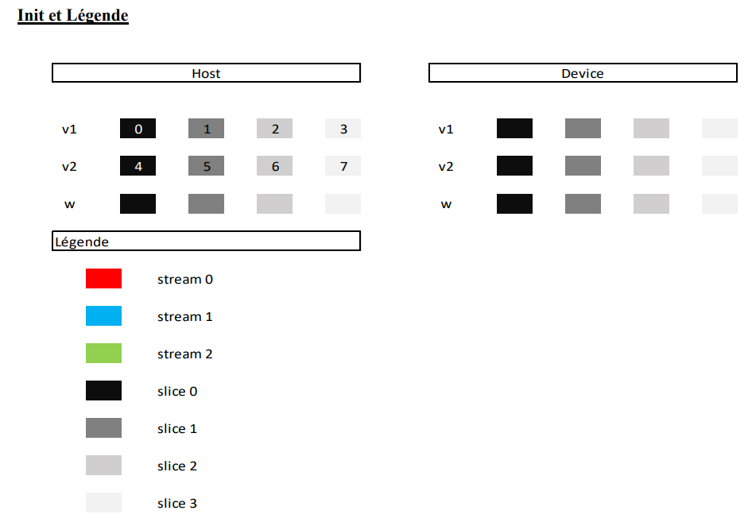
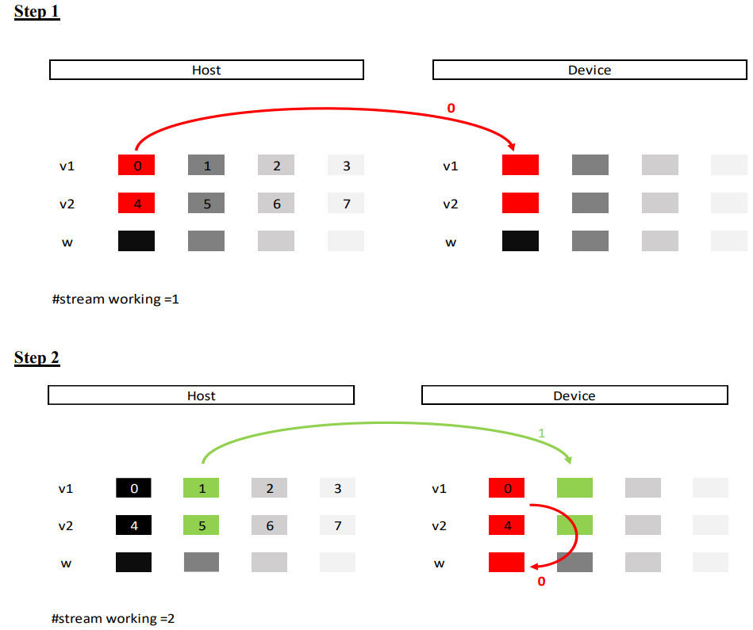
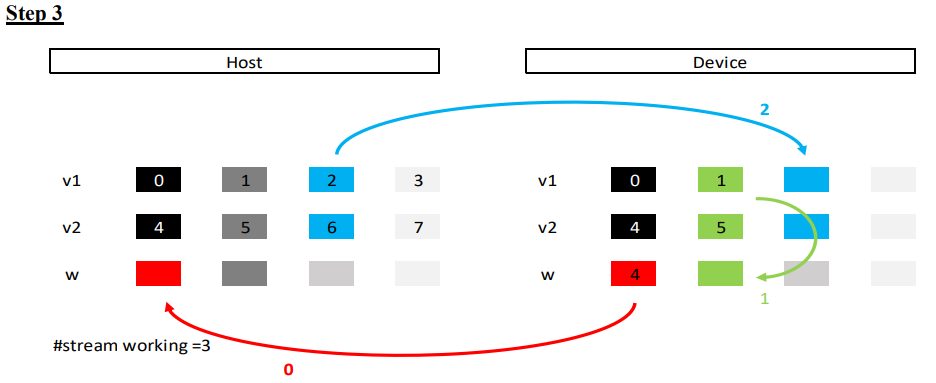
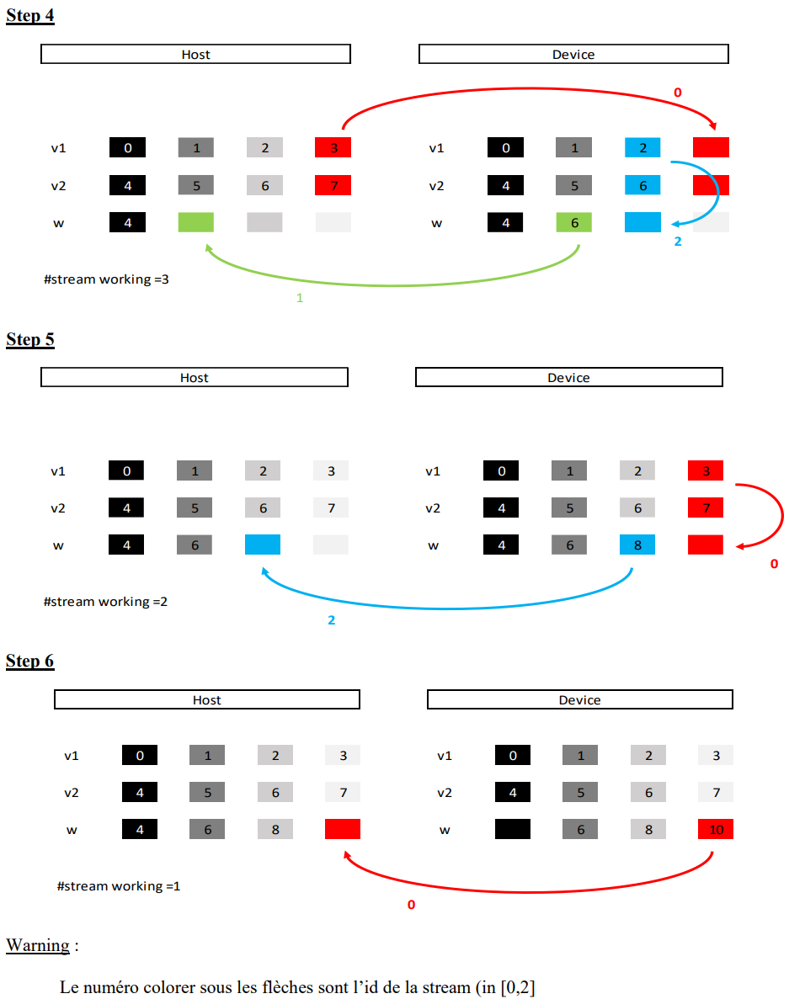

Jusqu'à maintenant, on sait faire :
- Processing (calcul)
- Memory management
  - Device to Host (D2H)
  - Host to Device (H2D)


Malheureusement on les fait en séquentiel :
```
HOST              DEVICE                HOST

data ----------->  data --------------> data
        H2D        |  ^       D2H
         ^         |__|
         |        process
         |
        Goulot d'étranglement lié au PCIExpress (16Go/s pour des gen3 cablé en x16)


        Le GPU (device) qu'on utilise à 700Go/s
```


Le GPU est fait pour être massivement parallèle.


Exemple de séquence comme on fait actuellement :
> k == kernel, mm == memory management

| `k1` <span style="color: #46b7ae; font-style: italic; font-size: 0.85rem">// asynchrone</span> 
| `mm` <span style="color: #46b7ae; font-style: italic; font-size: 0.85rem">// Attend automatiquement la fin du kernel --> pas besoin de barrière de synchro</span>
| `k2` <span style="color: #46b7ae; font-style: italic; font-size: 0.85rem">// asynchrone</span>
| `k3` <span style="color: #46b7ae; font-style: italic; font-size: 0.85rem">// Sur le HOST, le kernel ne démarre que si le précédent soit terminé</span>
| `mm`
v

**Les actions cotés HOST sont séquentielles**, ce qui est parralèle sont les opérations sur le device.

!!! note
    Pour l'instant, nous n'utilisons qu'un seul stream

Comme nous allons faire pour le TP : en utiliser plusieurs !


Syntaxe :
`Stream::` <span style="color: #46b7ae; font-style: italic; font-size: 0.85rem">// Classe du prof</span> 
- create
- destroy
- etc.

Objet de type `Stream_t` (== `int`)


```cpp
Stream_t s0; // C'est un ID d'un stream
Stream::create(&s0);

k<<<dg,db, sizeSM, s0>>>(...)
GM::memcpDTOHAsync(..., s0) // ASYNC !
GM::memcpHTODAsync(..., s0) // ASYNC !

Stream::destroy(s0);
```

On associe des actions à une stream, et ces actions seront executées de manière séquentielles.
!! Une stream ne s'execute pas !! C'est un concept.
Sa nous évite de devoir faire des barrières de synchronisation.


Exemple du PDF :





Ce qui donne (nombre d'execution parralèle) :
- `1 2 3 2 1`

On va chercher a maximiser le nombre de "3", On va donc augmenter le nombre de "slices" pour avoir :
- `1 2 3 3 3 3 3 3 ... 3 3 3 3 3 3 2 1`
==> Il faut "saucissonner" le tableau en plusieurs morceaux, ni trop, ni pas assez. Avoir trop peux de donnée ne va pas employer la pleine puissance, en avoir des trop gros va réduire le nombre de "3".

Pour le TP, on a besoin que de 3 stream, car on a que 3 "engines" (unité d'execution) sur le GPU.

Pour faire ce TP :
- Conseil de commencer avec 1 slice, puis 2, puis 3
- On commente, décommente chaque étape
- On termine par le cas général


Remarque (stratégie pour le device) :

> pour le TP, "baseline" on a 1 slice, "bistream" on a 2 slice, "tristream" on a 3 slice, etc..