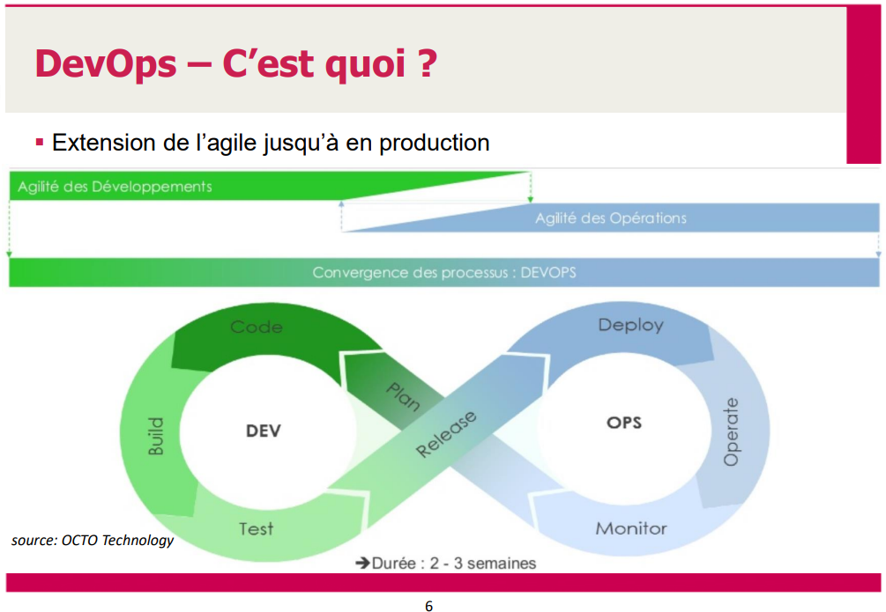
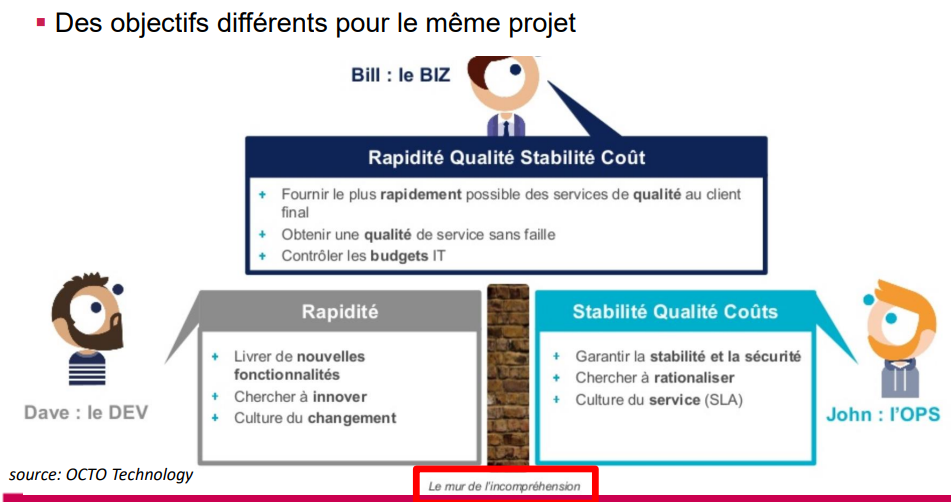
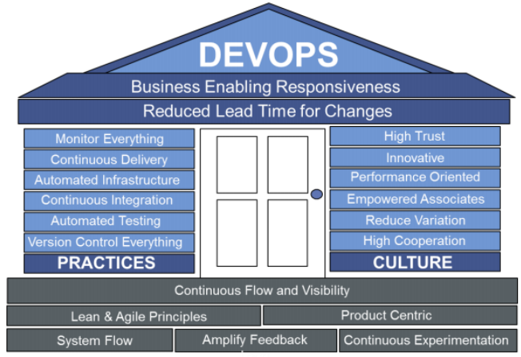
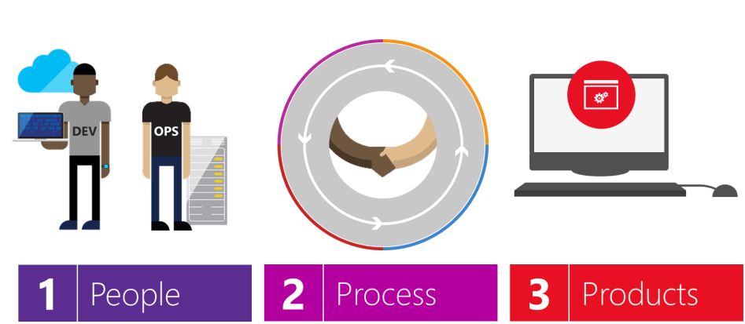
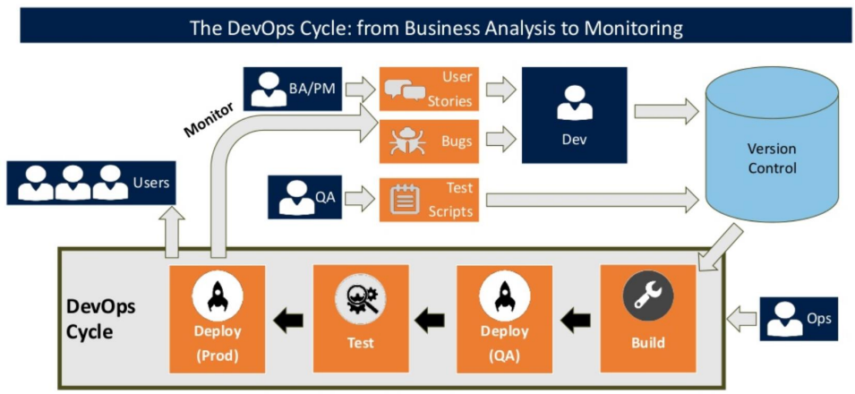

> 📖 Présentation [Chapitre 2 - Devops méthodologie](https://cyberlearn.hes-so.ch/mod/resource/view.php?id=1399676)

**Devops**

# C'est quoi ?
CI-CD
Extension de "Agile" jusqu'en production
Il s'agit de la partie "Release" qui fait le liens entre "Dev" et "Ops (opérations)"

# Pourquoi ?
Automatisation
(eviter de faire des opérations manuel comme le déploiement : copie de ce fichier ici; ajouter les dll; etc)

# Les piliers de Devops

# Les 3 P

# Process
<!-- #region IMPORTANT BLOCK --> 

❗❗Important 

Ce schéma est très intéressant, à retenir.

<!-- #endregion IMPORTANT BLOCK -->

