> 📖 Présentation `Chapitre 2: Référentiels de QdL`

Pourquoi les entreprises ce certifie en norme ISO 9001 ?
- Donner une image de qualité
- Marketing
- Nécessité (les clients peuvent demander, sinon ils cherchent ailleur)

# Normes et standard
Norme : officiel, c'est documenté, on peu les acheté; prend très longtemps à être mis en place
Standard : "best-pratice", exemple en logiciel : code review, CI/CD

## A quoi ça sert
Définir un langage commun
Outils développés par des professionnels

En interne = un outil de gestion
Se structure, donner des objectifs, moyens pour les atteindres
Piloter les projets avec indicateurs de performance

En externe = Reconnaissance, gage de qualité

# CMMI
CMMI = Capability Maturity Model Integration

Bonnes pratiques pour les processus, avec 5 niveaux // (comme dans un jeu)
Quand tout les domaines atteigne le même niveau: possibilité de lvl up au suivant

Gain de niveau : en évaluant la "maturité" des processus

## Qu'est-ce que c'est ?
CMMI n'a rien à voir avec le projet ! mais avec les processus (éfficiance dans les tâches que nous entreprennons), exemple :
- Satisafaction client
- Maitrise des projets : délais, coût, qualité
- Transparence des projets

## Piliers

## Niveaux de maturité
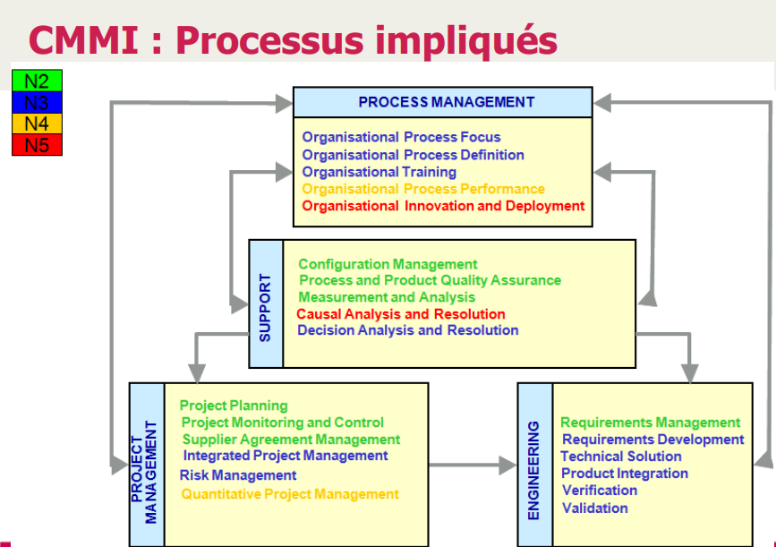

22 objectifs de base, possibilité de créé ses propre objectifs

**Comment lvl up ?**
Remplire ces objectifs, et les évaluer
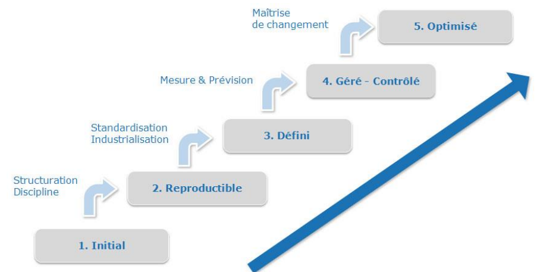

**Niveau 1**

**Niveau 2**
maitrise de 7/22 processus
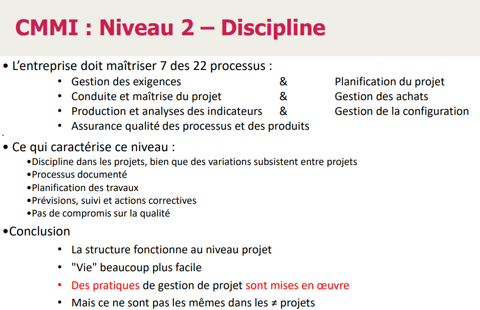

**Niveau 3**
maitrise de 18/22 processus
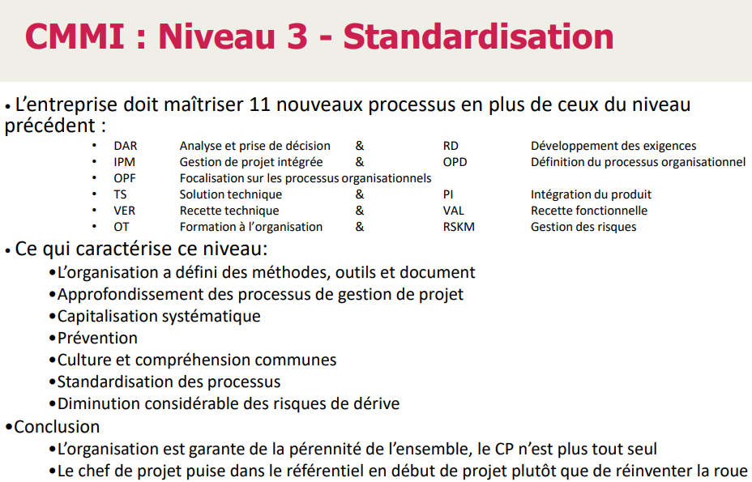

Culture de l'entreprise :
- c'est la vision/mission/stratégie de l'entreprise
- Attitudes sociales; règles implicites
- Manière de faire
  
Exemples de cultures :
- Culture "travail bien fait" : orienté client

- Culture "people first" : orienté employé (travail/horaires libres, etc)
  - Exemple chez Google : on a bc d'open space, les personnes travails comme il veulent, tant qu'ils font leur tâches

**Niveau 4**
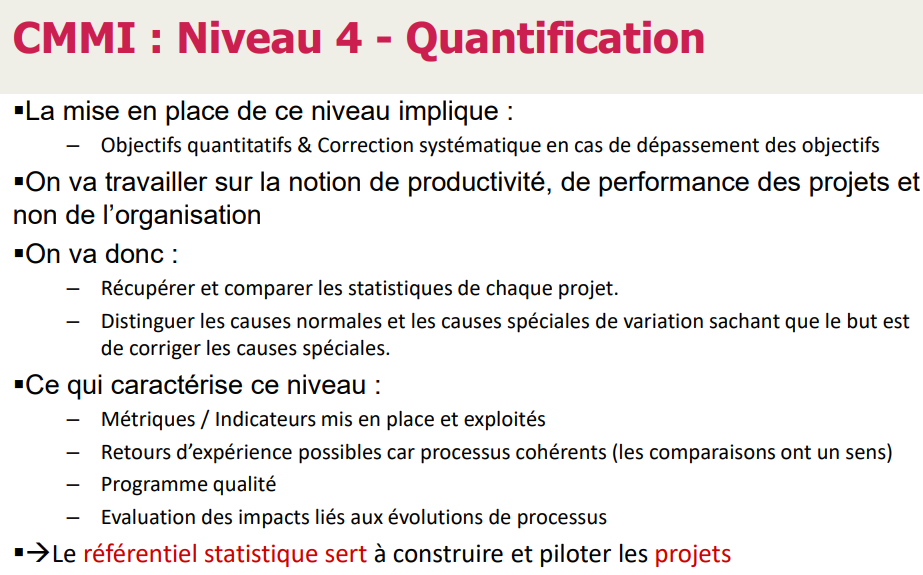

**Niveau 5**
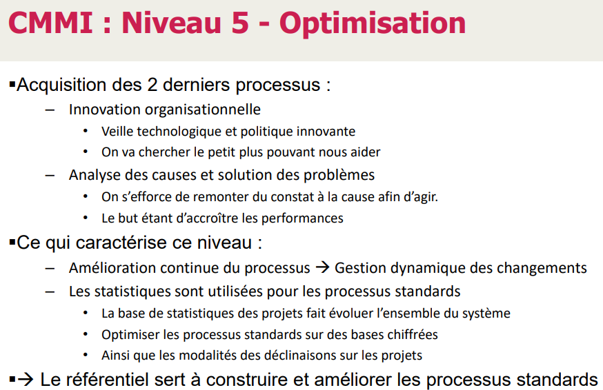

# ITIL
Information Technology Infrastructure Library

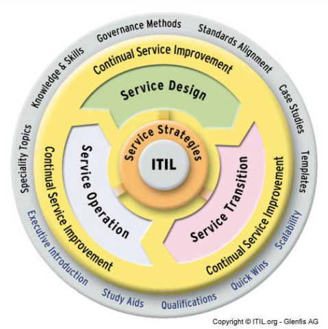

## Facteurs de réussite d'un Service

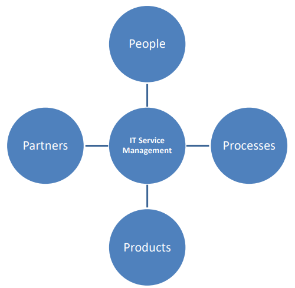

# ISO 9126
Pour l'évaluation de la qualité d'un logiciel

## Caractéristiques d'un logiciel de qualité

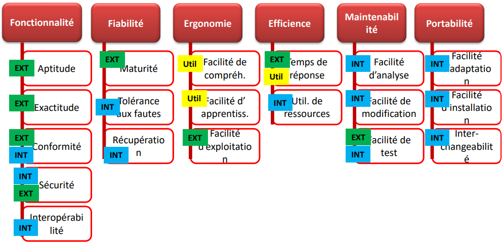
les rectangles de couleur sont la source : interne; externe, outils

# Quel norme/standard choisir ?
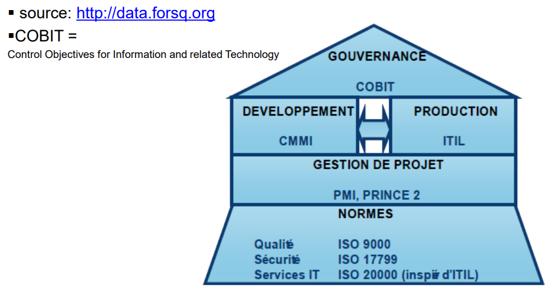
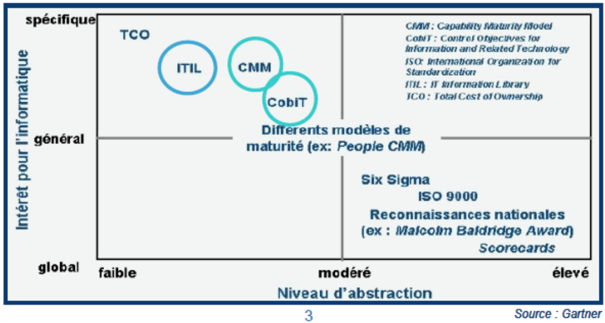
