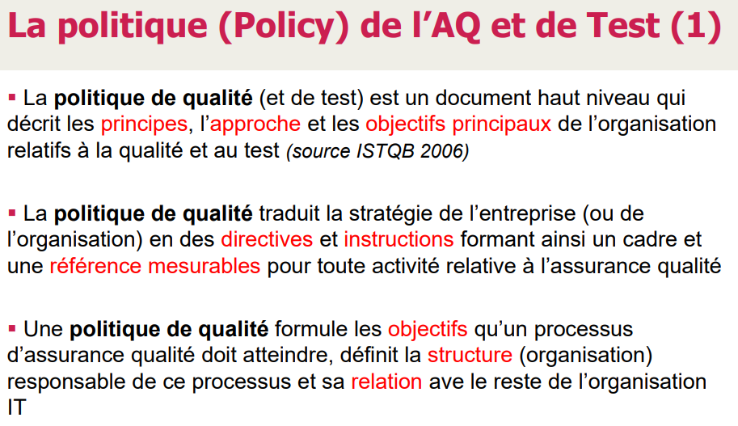
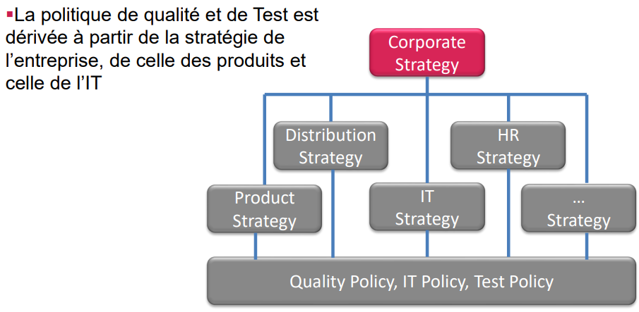
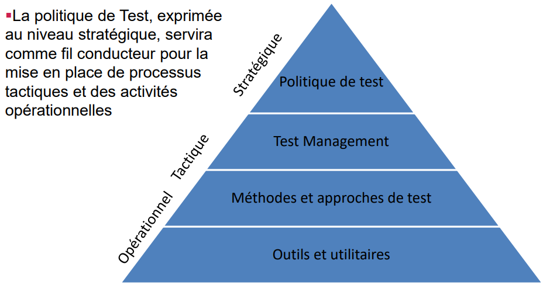
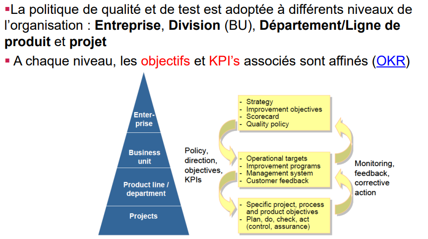

> 📖 Présentation `Stratégie d'Assurance Qualité du logiciel`

Types de tests :
- Tests unitaires
- Tests fonctionnels
    - manuel (très couteux, fastidieux)
    - avec logiciels

- Tests avec des framework d'UI (déplacement de souris, clics, etc.)
    - ! problèmes de résolutions
- Tests de performances
- Tests de déploiements
- Tests d'intégrations
  - "Boite noir" : on regarde que les outputs sont correct

<!-- #region IMPORTANT BLOCK --> 

❗❗Important 

Il est important de définir les objectifs et les KPI (Key Performance Indicators) pour mesurer la qualité du logiciel.

<!-- #endregion IMPORTANT BLOCK -->

