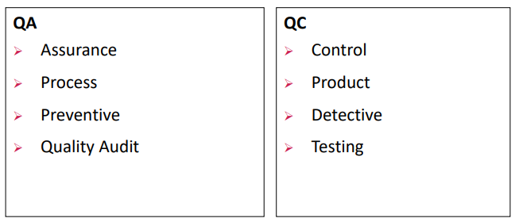
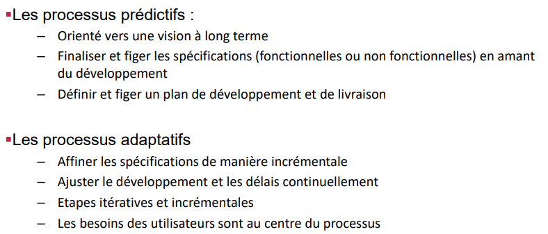
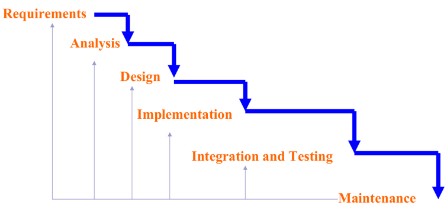
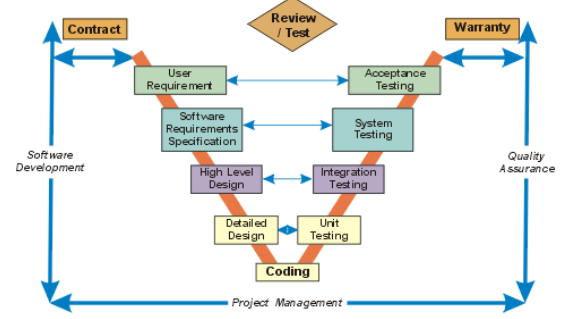
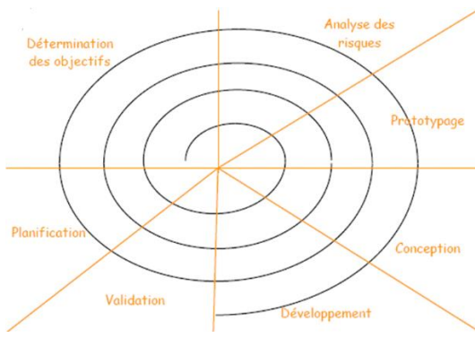
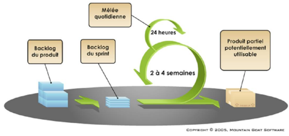

> 📖 Présentation `Chapitre 05 : Processus AQ`

# QA / QC
QA = Quality Assurance
QC = Quality Control

# Types de processus de développement

# Méthologies

- Processus en **cascade** (Waterfall)
  - Gros problème : les tests sont fait très tard, et donc très risqué
  - 
- Processus en **V**
  - Waterfall, mais corrige l'injection des tests (branche de gauche)
  - Mais le rendu du client se fait toujours très tard
  - 
- Processus adaptatifs ou itératifs
  - Cycles de développements très cours (**Sprints**)
  - Avoir toutes les 3 semaines une version utilisable et fonctionnelle
    - 
    - difficulté : on a des feedbacks tout le temps, il faut donc bien géré entre "nouveauté" et "correction clients"
  - Processus **Agiles**
    - Toutes les fonctionnalités souhaités, puis séance client pour choisir les fonctionnalités du sprint en cours
    - **Scrum** : 
    - Users Story : déscription d'une fonctionnalité
      - 1. `Rôle` ("en tant qu'utilisateur", "en tant que ...")
      - 2. `Done`, critères pour valider la fonctionnalités (80% tests, effectue ceci, etc.)
    - Efficace pour des équipes de 5 à 7