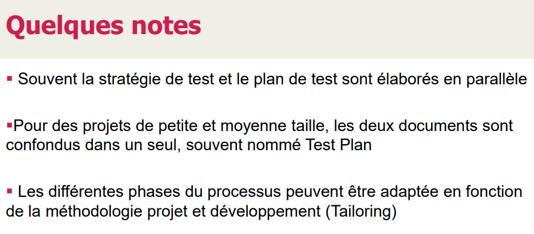
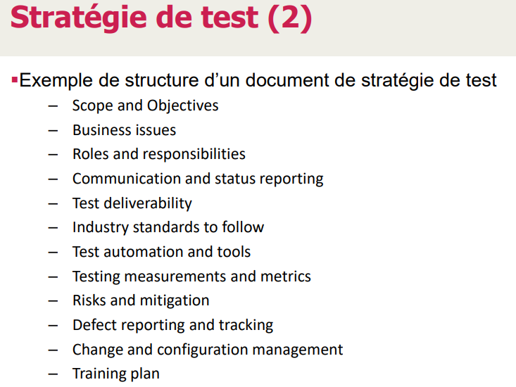

> 📖 Présentation `Chapitre 05 - Processus AQ`
> Page 14+

Tailloring : customisation des méthodologies pour simplifier / garder que ce qu'on a besoin

Matrice de risque : 
- Description
- Probabilité
- Gravité (impact sur le projet)
- Difficulté à corriger
- Détectabilité : si le risque est détectable ou non (exemple une intrusion)

Mitigation : Une fois la matrice des risques faite, on décrit des action servant à limiter l'appariation d'un risque

Change and configuration management :
- Le client viens vers nous (quand on est bien avancé dans le projet) et nous demande de changer des fonctionnalités (gros changement comparé au cahier des charges)
- Comment réagir :
  - Qualifié, faire une étude
  - Refaire un nouveau cahier des charges
  - Ne pas faire le changement sans ça
  - Protocoler la séance (Procès verbal décisionnel)
    - Si sur wiki gitlab, ajouter une mention `"en cas de non requête dans les 2 semaines après publication du PV, elle est considérée comme acceptée"`