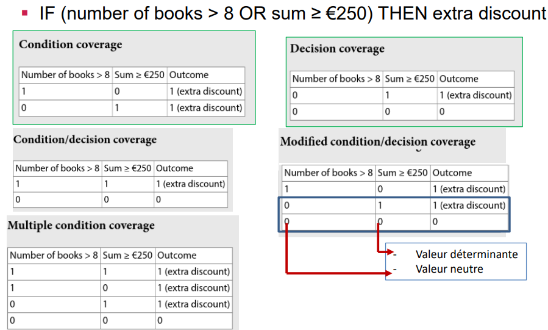
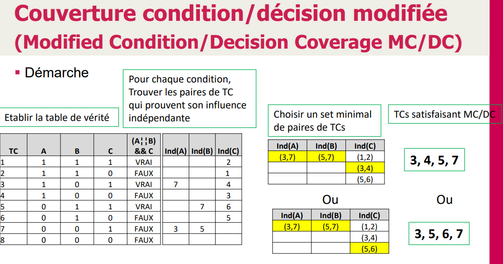

> 📖 Présentation `Chapitre 07 - Spécifications de test`

Pour les messages d'erreurs vers un utilisateur, plutôt mettre de manière positif. Exemple pour un guichet automatique :
- "Vous ne pouvez pas retirer 70CHF" -> "Vous pouvez retirer que des billets de 20CHF"

Tests non fonctionnels : Tests de perfomances, autres tests qui ne tests pas des fonctionnalités

Pair-wise : Technique pour réduire le nombre de tests à faire. On prends les valeurs de chaque paramètre et on les mélange entre eux. Exemple : 3 paramètres avec 3 valeurs chacun, on aura 27 ($3^3$) tests. Avec la technique pair-wise, on aura 7 tests.
- Pour faire ces réductions, il est conseillé d'utiliser https://pairwise.teremokgames.com/, plutôt que de le faire à la main.

# Points de décisions
> Analyse des conditions

Démarche "MC/DC" : Modified Condition/Decision Coverage.

On recherche les couples qui provoque un changement de résultat en changeant qu'une variable.
> Exemple le TC 1 et 2, on change que `C` et le résultat change --> on les marques dans le tableau "ind" comme étant lié
> le 3 et le 7 idem, en changeant le `A` -> on les marques comme étant lié
> Une fois qu'on a lié tous les tests, on les réécrit sous forme de paires et on choisit une clé par variable qui permet de tester toutes les valeurs (cases jaunes)