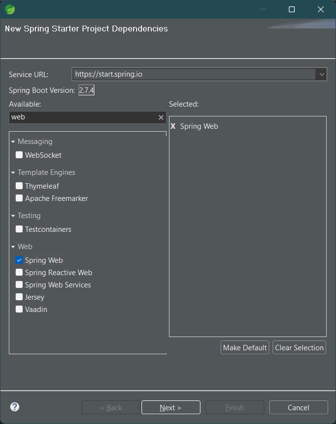
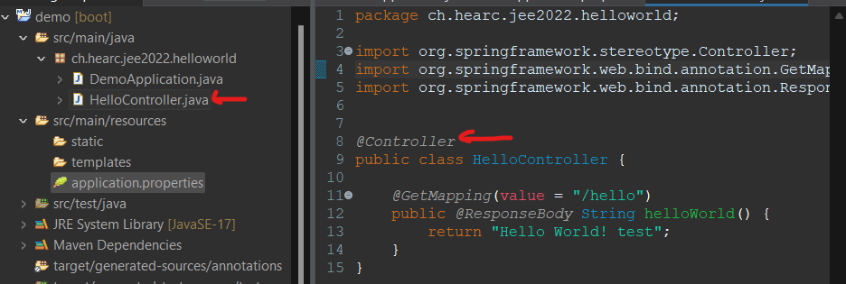
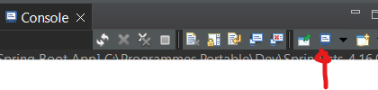
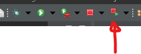
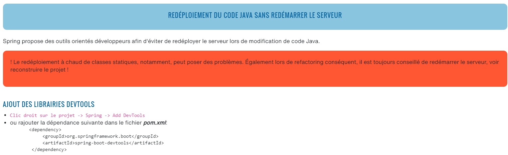

# Créer projet

VSC : CTRL SHIFT P : `Spring Initializr: Add Starters...`

Spring-tool-suite : `File > New > Spring Starter Project`

La suite du tuto est fait avec Spring-tool-suite

## Ajout fonctionnalité WEB
1. `Clic-droit sur le projet > Spring > Add Starters`
2. 
3. Tout cocher
4. Configurer le port
   1. `src/main/resources/application.properties`
   2. Ajouter cette ligne : `server.port=8081`
5. Création d'un controlleur ([source du fichier](https://gist.github.com/sebChevre/0626a00fa5b6852bbeab3b252a501825))
   1. 
   2. Créer un simple fichier
   3. Spring va executer automatiquement les classes ayant les bon stéréotypes (ici `@Controller`)
6. Accès à la page sur le navigateur : `http://localhost:8081/hello`

# Ajout de pages
dans le controlleur : 
```java
	@GetMapping(value = {"/hello2/{nom2}", "/hello2"})
	public @ResponseBody String helloWorld2(@PathVariable(required = false) String nom2) {
		if (nom2 == null)
			nom2 = "inconnu"; 
		return "Hello " + nom2;
	}
```

<span style="color: #46b7ae; font-style: italic; font-size: 0.85rem">// Ici nous ajoutons plusieurs URL possible : avec ou sans "nom"</span> 
<span style="color: #46b7ae; font-style: italic; font-size: 0.85rem">// Pour rendre le paramètre optionnel, il faut spécifié le PathVariable comme l'étant</span> 
<span style="color: #46b7ae; font-style: italic; font-size: 0.85rem">// Le nom de variable doit être identique au placeholder !</span> 


## Structure

Type | Chemin | Contenu | Remarque
|-|-|-|-|
Code | `src/main/java`
Executable | `target` | contient le .jar du projet; ce projet démarre son serveur web. Il est possible de le lancer en local avec `java -jar target/mon-projet-0.0.1-SNAPSHOT.jar` | S'il n'y a pas de .jar : `projet > run as > Maven install`. L'opération peu prendre du temps, le laisser faire

# Dictionnaire
| Termes | Définition |
| --- | --- |
Starters | Ensemble de dépendances (.jar) non executables qui permettent l'ajout de fonctionnalités
 | Le bouton n'est pas grisé : il y a plusieurs application qui tourne ! Il est plutôt conseillé de relancer l'application courrante avec  plutôt avec la flèche verte

# Rédploiement à chaud
