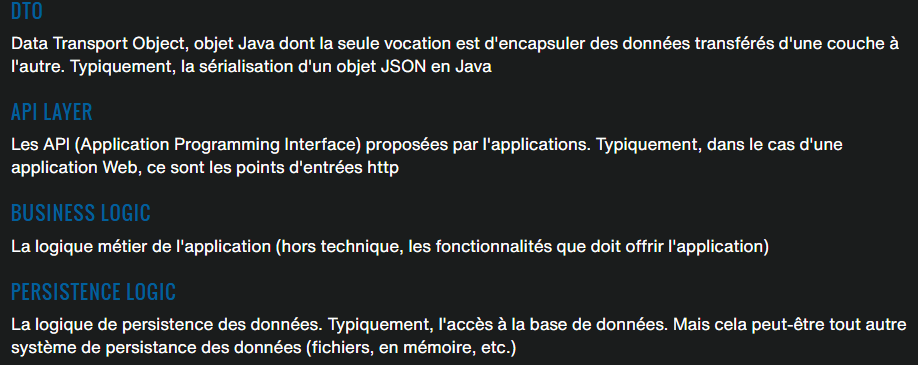

# JEE/Spring 

----------------

**Monolithe / microservice :**
- **Monolithe** == tout dans 1 seul package --> déploiement sur le servuer, faut tout redéployé
- **microservice** == séparé en plusieurs package --> déploiement sur le serveur, redéploiement que des packets modifiés

----

Pour les `@ResponseBody`, Spring convertie automatiquement les objets en JSON
Si l'on souhaite du XML, il suffit de changer 1 dépendance


Entête de méthode pour des requêtes HTTP (les 2 sont les mêmes)
```java
@GetMapping(value = {"/hello4/{nom}", "/hello4"})
@RequestMappping(value = {"/hello4/{nom}", "/hello4"}, method = RequestMethod.GET)
```

`@RequestMapping("/test")` Au dessus d'une classe permet d'indiquer l'url préfix pour toutes les pages de la classe
Exemple d'url : `http://localhost:8081/test/hello4`

----

Beans : Dans le contexte java; il s'agit d'un **objet** Spring, créé, géré et détruit par spring

----

# Architecture
Controller <-> Service <-> Repository (DAO)
Serice : la couche métier
Repository : la couche d'accès aux données (bdd, excel, txt, etc)




----

# Injection de dépendances
