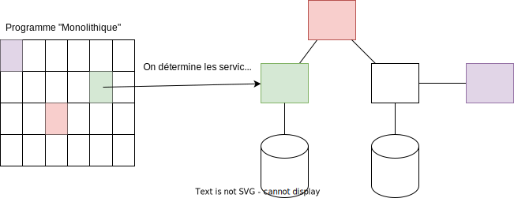
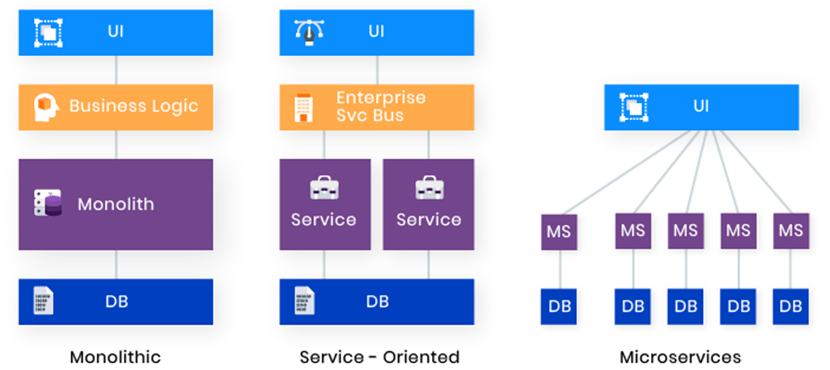
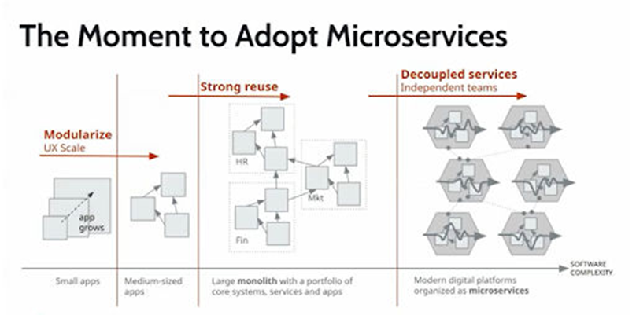

> 📖 Présentation `Microservice`
> JEE-SpringII-Architecture microservice et API
> Architecture (micro) service et API

# Définition et concepts
Un **microservices** et un **service**

Un service c'est :
- Déployable indépendamment
- Faible couplage
- Petites fonctionnalités métier (ex. une 100ène de ligne par microservice)
- Maintenu par une seule équipe
- Hautement maintenable et testable
- Interopérable

**Divisier pour mieux régner**

**On parle d’architecture distribuée ou de système distribué/réparti**

# Monolithes vs (micro)services

On ne commence pas par faire une application en microservices, on commence par faire une application monolithique, puis on découpe en microservices.

Le problème avec les microservices, c'est les liens entre eux. Si l'un tombe, il est compliqué de retrouvé l'ensemble des services qui dépendent de lui et ses impacts.

Si une URL d'un MS change, il faut changer toutes les URL des autres MS qui dépendent de lui (actuellement, à la main).

# Pourquoi utiliser des microservices ?
- Problèmes de montée en charge sur application existantes
- Equipes distribuée physiquement
- Intégration des systèmes existants
- Intégration de technologies différentes
- Application monolithique trop complexe
- Rendre une application existante compatible sur des clients différents (terminaux mobiles)

## Risques

Il ne faut pas croire ceci (en commentaire, le pourquoi) :
- Le réseau est fiable // Pleins de liens réseau, plus de risque qu'un lien tombe 
- La latence est nulle // L'accès aux MS demande du temps 
- La bande passante est infinie // Plus de trafic en même temps 
- Le réseau est sécurisé
- La topologie ne change pas
- Il n’y qu’un seul administrateur
- Le coût de transport est nul
- Le réseau est homogène
