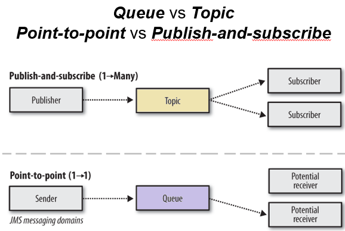
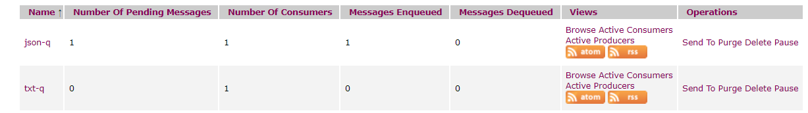
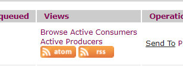
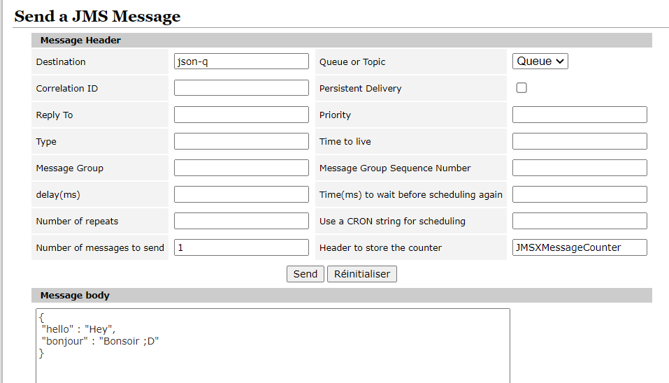
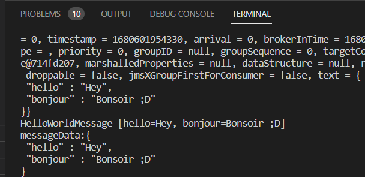

> <span style="font-size: 1.5em">📖</span> <span style="color: orange; font-size: 1.3em;">Présentation `JMS Théorie`</span>
> `JEE-SpringII-JMS et ActiveMQ.pptx`

JMS == **Broker de message**


Avant, on utilisait JPA (`Java Persistence API`) (stockage dans une base de données)
Après, on utilise JMS (`Java Message Service`) (stockage dans une file d'attente)

JMS est une API pour avoir un dialogue standard entre applications grâce à des brokers de messages ou MOM (`Middleware Oriented Message)




Publish and subscribe (1-Many)
Le message est envoyé à un topic (un canal de communication) et tous les abonnés reçoivent le message. Si aucun abonné n'est présent, le message est perdu.

Point to point (1-1)
Le message est envoyé à qu'une seul personne. Si la personne n'est pas présente, le message est mémorisé dans une queue, et quand elle se connecte elle reçoit tous les messages qu'elle a manqué.
Seul la 1 personne reçoit le message, les autres pas (c'est aléatoire qui reçoit).

Les messages sont asynchrones, il n'y a donc pas de "question réponse"

Les données envoyée sont du binaire, il faut donc les sérialiser dans le bon format !

# Exercice
https://cyberlearn.hes-so.ch/mod/page/view.php?id=2008832

On démarre le docker qui s'occupe de l'ActiveMQ

et on clone les projets de l'exercice (reciver et producer)

## 1 Avoir un reciver
On démarre le reciver

et sur le ActiveMQ (du docker) on accède à cette page :
http://localhost:8161/admin/queues.jsp



On vois qu'on a 1 personne inscrite sur la queue

On peut envoyer des messages aux utilisateurs connectés avec "`Send To`" dans les opérations




```json
{
 "hello" : "Hey",
 "bonjour" : "Bonsoir ;D"
}
```
Le noms des champs correspondent à ceux de la classe :

```java
public class HelloWorldMessage {
	
	private String hello;
	
	private String bonjour;
}
```

On remarque que le reciver à bien reçu le message



## Ex2

Reciver écoute avec :

```java
@JmsListener // sur une méthode
// ==>> Va trigger la méthode quand il y aura un message sur la queue
```

Producer écoute avec : 
```java
@Autowired
JmsTemplate jmsTemplate;

// On envoie un message sur la queue
jmsTemplate.send("txt-q", // Nom de la queue
    messageCreator -> {
        TextMessage message = messageCreator.createTextMessage();
        message.setText("youp-yop"); // Message à envoyer
        return message;
    });
```	

# Pour le projet

Faire des cas pratique avec échange "1-1" (reciver-producer dans les 2 sens)

N'est pas un cas pratique : envoyé "je souhaite les données" et "je vous envoie les données" (envoie de la requete sql, puis envoie des données)

exemple de cas : "je souhaite modifier la donnée", "je vous confirme que la donnée a été modifiée"