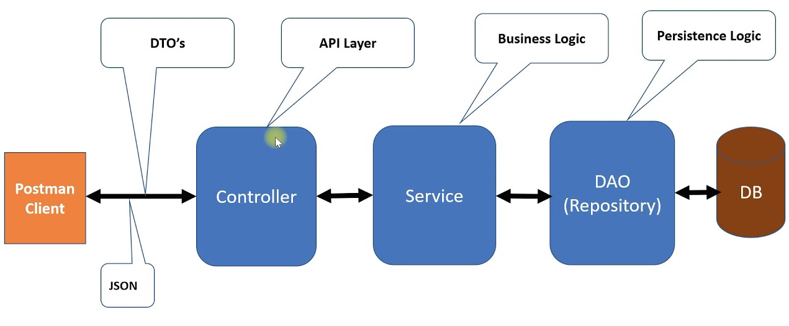
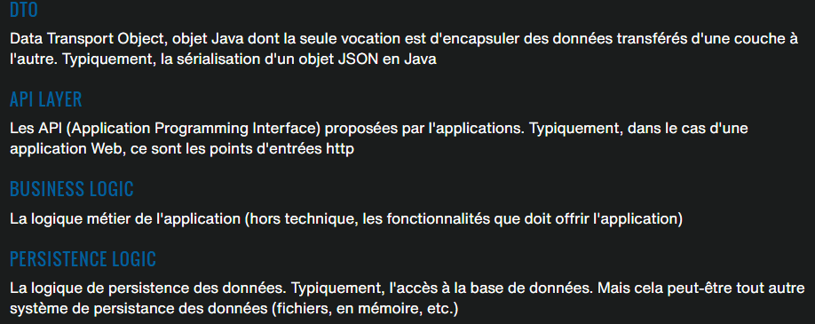
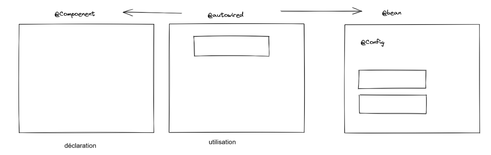
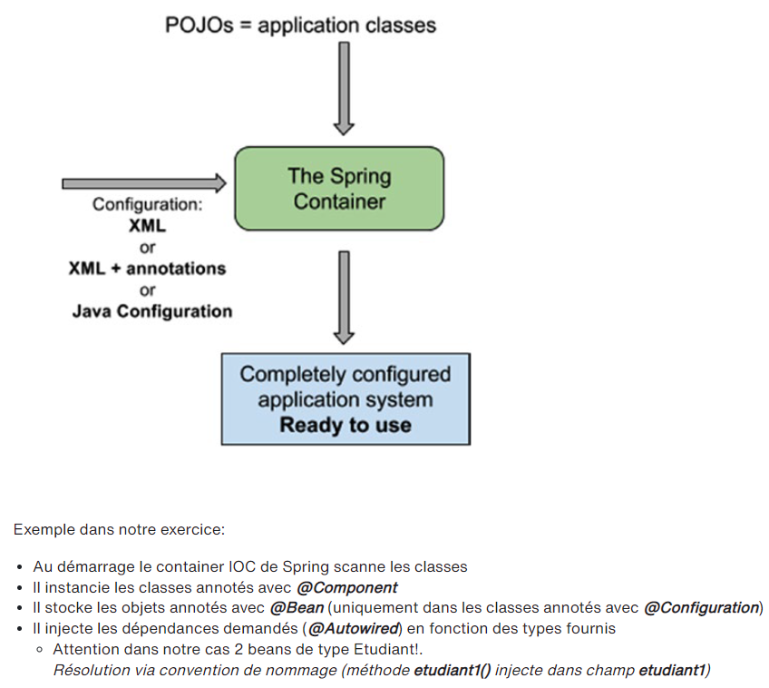
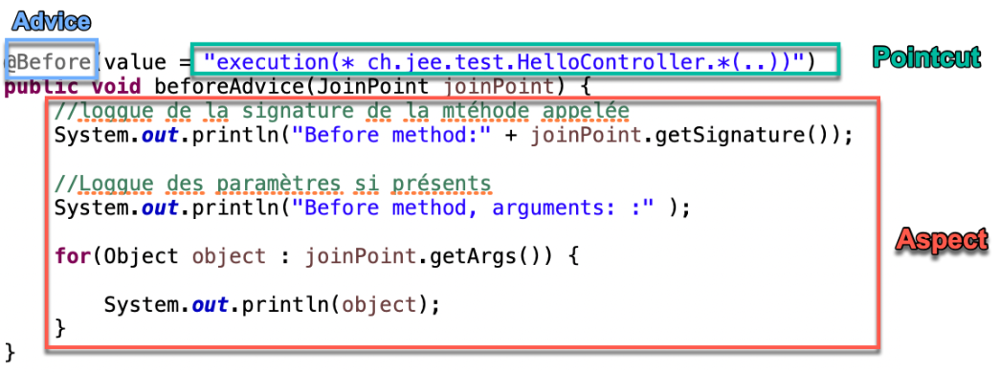

# JEE/Spring 

> <span style="font-size: 1.5em">📖</span> <span style="color: orange; font-size: 1.3em;">Présentation `Chapitre Introduction`</span>


----------------

**Monolithe / microservice :**
- **Monolithe** == tout dans 1 seul package --> déploiement sur le servuer, faut tout redéployé
- **microservice** == séparé en plusieurs package --> déploiement sur le serveur, redéploiement que des packets modifiés

----

Pour les `@ResponseBody`, Spring convertie automatiquement les objets en JSON
Si l'on souhaite du XML, il suffit de changer 1 dépendance


Entête de méthode pour des requêtes HTTP (les 2 sont les mêmes)
```java
@GetMapping(value = {"/hello4/{nom}", "/hello4"})
@RequestMappping(value = {"/hello4/{nom}", "/hello4"}, method = RequestMethod.GET)
```

`@RequestMapping({"/test"})` Au dessus d'une classe permet d'indiquer l'url préfix pour toutes les pages de la classe
Exemple d'url : `http://localhost:8081/test/hello4`

----

Beans : Dans le contexte java; il s'agit d'un **objet** Spring, créé, géré et détruit par spring

----

# Architecture
_Client_ <-> Controller <-> Service <-> Repository (DAO) <-> Stockage
- Controller : expose les actions GET/POST, les routes, etc. +validation (limites/type, etc) de données ici aussi
- Service : la couche métier (l'implémentation des actions POST)
- Repository : la couche d'accès aux données (bdd, excel, txt, etc)





Pour les classes "Repository" on en fait 2 par objets :
- `repository/XXXRepository` : interface qui contient les méthodes de requêtes
- `repository/impl/XXXMemoryRepository` : classe qui implémente les méthodes de l'interface (accès au stockage, bdd, etc)

----

# Injection de dépendances (IoC)
IoC = Inversion of Control
Injection de dépendances = mécanisme qui permet de créer des objets et de les lier entre eux

Mot clé @ | Effet | Remarque/Exemple
---|---|---
`@postConstruct` | méthode qui s'execute après la création de l'objet
`@autowired` | permet d'injecter une dépendance dans un objet | se défini sur des attributs
`@bean` | permet de créer un objet Spring | se défini sur des méthodes

@autowired : dit "cherche moi cette classe, stock là dans la variable" et après on peut l'utiliser (on ne créé nul part un `new` ou autre). Pour que le la classe puisse être prise, il faut qu'elle soit à choix `@Component`, `@Service`, `@Repository`, `@Controller` (en soit c'est un peu comme un `Singleton`).





Spring gère aussi bien les fichiers "XML + JAVA" que "JAVA + Annotation"

les annotations permettent d'avoir que des fichiers java, mais deviennent dépendantes de Spring,
alors que le XML va lié les classes java entre elle, ainsi le code java reste indépendant de Spring.

Slide importante : https://cyberlearn.hes-so.ch/mod/book/view.php?id=1867182&chapterid=9550 (`IOC - INVERSION OF CONTROL > 4. COMPONENT VS BEAN`)

# Réflexion (ou introspection)
La **reflection** (parfois appelé introspection) est la faculté pur un langage de pouvoir agir sur les méta-données des éléments du logiciel (classes, méthodes, exécution).

La reflection est au cœur du mécanisme de Spring (chargement des classes, traitement des annotations, etc...)

# Logging (package AOP)

slide : https://cyberlearn.hes-so.ch/mod/book/view.php?id=1869061&chapterid=9541

ajouter ces dépendances dans le pom.xml
```xml
<dependency>
  <groupId>org.springframework.boot</groupId>
  <artifactId>spring-boot-starter-aop</artifactId>
</dependency>
```

Exemple de code pour logger dans la console :
```java
import org.aspectj.lang.JoinPoint;
import org.aspectj.lang.annotation.Aspect;
import org.aspectj.lang.annotation.Before;
import org.springframework.stereotype.Component;

@Aspect
@Component
public class AspectController {
    //               quand  portée   package.class.method(..)   // .. == 0-n param
    @Before(value = "execution(* ch.hearc.jee2022.helloworld.HelloController.*(..))")
    public void beforeAdvice(JoinPoint joinPoint) {
			//loggue de la signature de la mtéhode appelée
		System.out.println("Before method:" + joinPoint.getSignature());
			
		//Loggue des paramètres si présents
		System.out.println("Before method, arguments: :" );
			
		for(Object object : joinPoint.getArgs()) {				
            System.out.println(object);
		}
	}
}
```


- la classe demande d'avoir les annotations `@Aspect` et `@Component` pour être pris en compte par Spring
- **`@Aspect`** permet de dire que c'est une classe qui va être modulisée (utilisée dans plusieurs classes)
- **before** : execute ceci avant l'execution de chaque méthode (privée ou publique) respectant le prédicat
  - Contenu du before : <span style="color: #46b7ae; font-style: italic; font-size: 0.85rem">// quand  portée   package.class.method(..)   // .. == 0-n param</span> 
- **JoinPoint** : méthode qui va être executé par le controlleur
  - un JoinPoint c'est l'annotation @GetMapping au dessus de la méthode