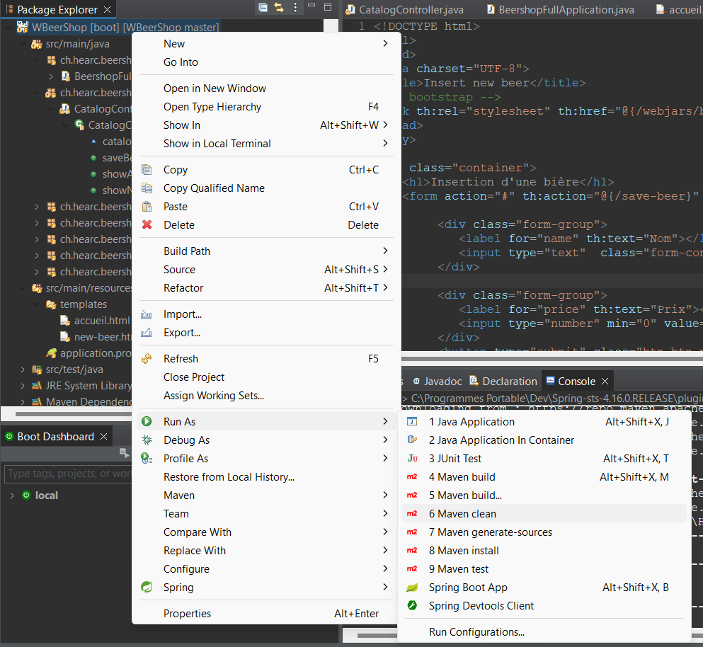

> 📖 Présentation [SPRING, MAVEN ET STRUCTURE DE PROJET](https://cyberlearn.hes-so.ch/mod/book/view.php?id=1871671)

la présentation contient : 
1. Importer un projet existant
2. structure maven
3. création du jar executable (par maven)

Maven permet de simplifier en grande partie la gestion des dépendances et de la structure de projet, ainsi que le déploiement de l’application.
Il importe plus de 100 librairies, et donc pas besoin de les importées nous même.

En cas de problème avec la compilation, penser a faire un `maven clean`
commande : `mvn clean`

pour créé le jar executable, il faut faire un `maven install`
commande : `mvn clean install`