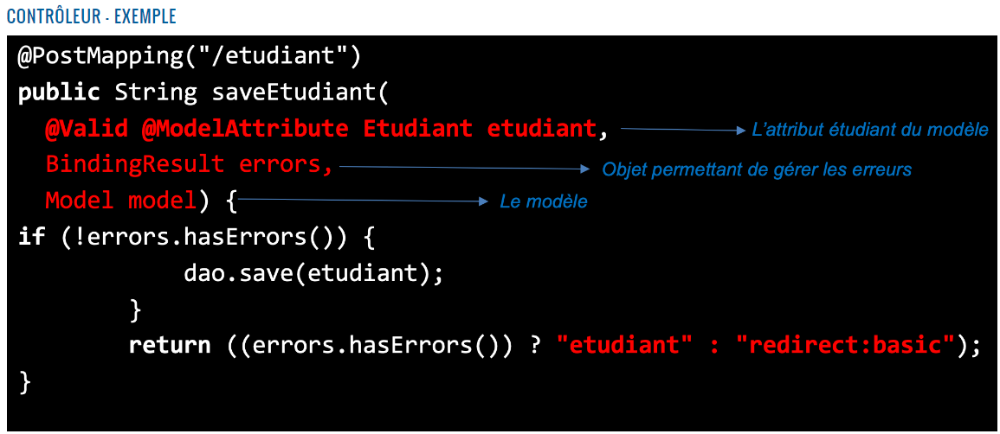

> <span style="font-size: 1.5em">📖</span> <span style="color: orange; font-size: 1.3em;">Présentation [Moteur de templates](https://cyberlearn.hes-so.ch/mod/book/view.php?id=1898943)</span>


# Tymeleaf
Tymeleaf est un moteur de template multilangage

Nécessite d'ajouter 2 starters.
rappel : starter (niveau spring) : 
- dans le `pom.xml`
- ensemble de jar à executer

via l'IDE Spring : 
- Clic Droit sur le projet --> Spring --> Add starters --> Ajouter thymeleaf
Manuellement :
- ```xml
  <dependencies>
    <dependency>
      <groupId>org.springframework.boot</groupId>
      <artifactId>spring-boot-starter-thymeleaf</artifactId>
    </dependency>
  ...
  </dependencies>
  ```

## Fonctionnement


## Eléments (variables, méthodes, etc) de base
cf https://cyberlearn.hes-so.ch/mod/book/view.php?id=1898943&chapterid=9639

Concaténation dans un th : 
`<dd th:text="${product.price} + ' CHF'">40 CHF</dd>`

# Lab d'exemple
http://itutorial.thymeleaf.org/exercise/1
> Note : on a pas le controlleur, mais il retourne un objet "product". Ici on traite juste la partie affichage.

## Forumlaires


Les éléments `prenom` et `sexe` seront sérialisé dans l'objet `etudiant` au format Java


> dans le retour, le `"etudiant"` correspond au formulaire de saisie

## Webjars
Librairies Java, mais qui ne contiennent pas du Java. Elles contiennent du HTML, CSS, JS, etc.