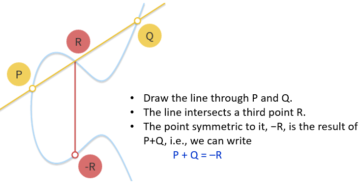
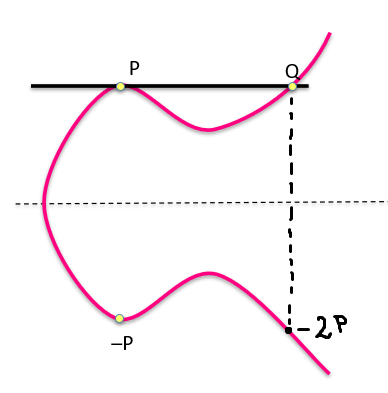
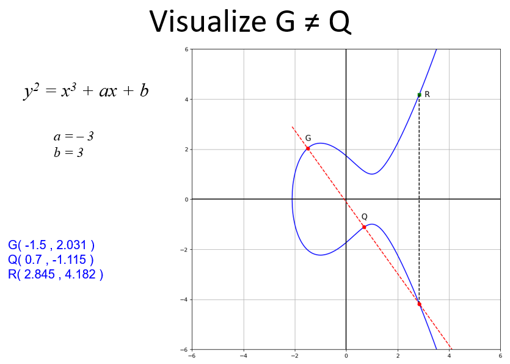
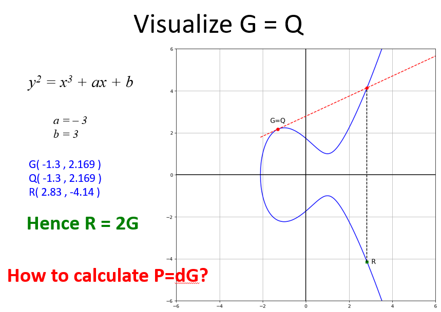
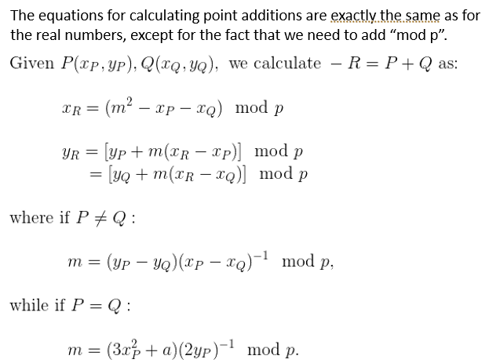

> 📖 Présentation `03_EllipticCurveCryptography_RealNumbers`
> Elliptic Curve Cryptography (ECC)

!!! warning "Avertissement"
    Il ne faut pas voir les formules suivantes avec un esprit "math" mais plutôt que du simple algèbre

**Point d'infini** est écrit `0` (coordonnées `(0,0)`)

P + Q + R = 0
P + Q = -R

$P(x_p, y_p)$
$Q(x_q, y_q)$
$R(x_r, y_r)$
$-R(x_r, -y_r)$

!!! note Ordre de P Q R
    L'ordre n'a pas d'importance :
    P et Q sont 2 points, et R est l'intersection de la droite entre les 2 points et la courbe

P + 0 = P //  
0 + 0 = 0
P + (-P) = 0
P + (-P) + 0 = 0
P + P = 2P
2P = -R
P + 0 = P + P + Q + R = 2P + Q + R

!!! note Comment lire ?
    On regarde les changements de l'axe X pour déterminer les valeurs

Ainsi `P = -P` et `Q = -2P`

`P + Q = ??` (quand on ne franchit pas 3 fois la ligne)
--> `P + Q = P + (-2P) = -P`

!!! note
    Si `P == Q`, la ligne rouge est la tangente au point
    Si `P != Q`, la ligne rouge est la droite passant par P et Q
    `R` est à l'opposée (ligne noir)

# Finite Fields
Différence avec avant

$\left\{ (x,y)\in\mathbb{R}^2 ~|~ y^2 = x^3+ax+b,~ 4a^3+27b^2\ne 0\right\} ~\cup~\{0\}$
Devient
$\left\{ (x,y)\in(\mathbb{F}_p)^2 ~|~ y^2 = (x^3+ax+b)\mod p, ~ (4a^3+27b^2)\mod p\ne 0\right\}~\cup~\{0\}$

!!! note
    $\mathbb{F}_p$ = GF(p) = {0, 1, 2, ..., p-1}

$\mathbb{F}_p$ Equations :

!!! note
    Pour rappel : $a^{-1}$ = $a^{p-2}$ = inverse modulaire

NP = 0
nhp = 0
nG = 0
G = hp

A = $g^a$ % p
A = aG
h = N/n
a = d * log(A) % p

G (Xg, Yg)