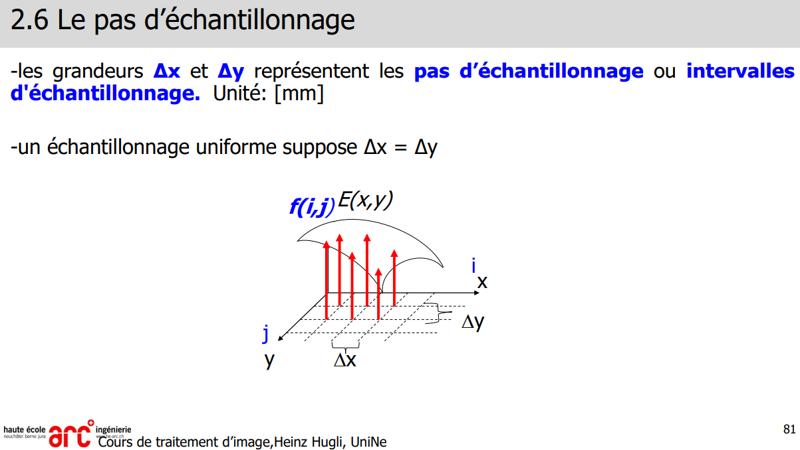
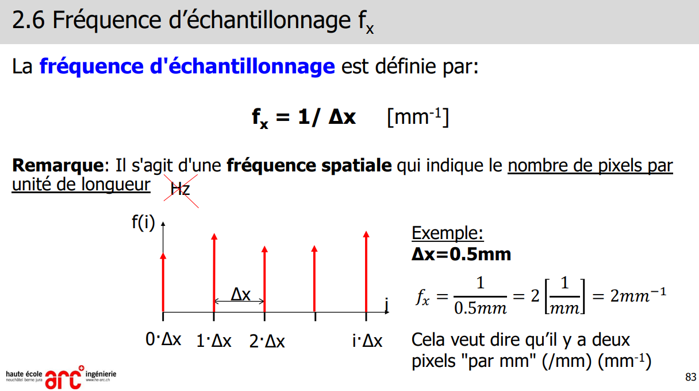
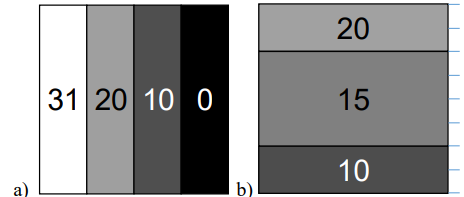

OpenCV : BGR et non pas RGB !

> 📖 Présentation `2 Modélisation d'image`

Histogramme : hauteur max == taille de l'image (en pixels) (largeur * hauteur)
L = 2^b - 1 (b = nombre de bits) (L = Niveau de gris)
M = hauteur max (M = nombre de pixels)
N = largeur max (N = nombre de pixels)

----
# 17.10.2022

Comment on passe d'un objet réel à un objet numérique ?
1. Transformation optique : lentille & capteur
<!-- #region drawnote -->
<svg id="svg" xmlns="http://www.w3.org/2000/svg" viewbox="84.05999755859375,-1,511.20001220703125,315.20001220703125" style="height:315.20001220703125"><path d="M 417.06,47.4 L 416.46,47.4 L 414.86,50.6 L 414.06,51.4 L 400.46,67.4 L 390.86,77 L 378.86,87.4 L 369.26,94.6 L 365.26,98.6 L 364.46,99.4 L 364.46,100.2 L 366.86,101 L 368.46,101 L 374.06,101 L 382.06,101 L 390.86,101.8 L 397.26,101.8 L 403.66,102.6 L 407.66,102.6 L 410.06,102.6 L 410.86,102.6 L 412.46,102.6 L 412.46,103.4 L 411.66,103.4 L 409.26,105 L 403.66,107.4 L 397.26,111.4 L 393.26,113.8 L 383.66,120.2 L 376.46,125.8 L 366.86,133 L 354.86,142.6 L 347.66,146.6 L 345.26,149 L 346.06,149 L 346.86,149 L 347.66,149 L 348.46,149 L 350.06,149 L 354.86,149 L 366.86,149.8 L 373.26,149.8 L 380.46,149.8 L 385.26,149.8 L 389.26,149.8 L 390.86,149.8 L 391.66,149.8 L 393.26,149.8 L 394.86,149 L 397.26,149 L 398.06,149 L 398.86,149 L 399.66,149 L 401.26,149 L 402.06,149 L 402.06,149.8 L 401.26,149.8 L 399.66,152.2 L 394.06,157 L 389.26,160.2 L 382.06,166.6 L 374.86,173.8 L 370.86,177 L 369.26,180.2 L 367.66,181.8 L 366.06,184.2 L 364.46,185.8 L 363.66,187.4 L 365.26,187.4 L 370.86,188.2 L 382.06,188.2 L 390.06,189 L 405.26,189 L 411.66,189 L 416.46,189 L 419.66,189.8 L 422.86,189.8 L 428.46,190.6 L 431.66,190.6 L 435.66,190.6 L 442.06,191.4 L 449.26,192.2 L 453.26,192.2 L 456.46,192.2 L 459.66,192.2 L 469.26,193 L 471.66,193 L 474.06,193 L 475.66,193 L 478.06,193 L 477.26,192.2 L 476.46,190.6 L 473.26,188.2 L 470.86,185 L 466.06,180.2 L 461.26,174.6 L 457.26,170.6 L 454.86,168.2 L 453.26,166.6 L 453.26,165 L 452.46,165 L 457.26,164.2 L 460.46,163.4 L 470.06,162.6 L 477.26,162.6 L 481.26,162.6 L 486.06,162.6 L 489.26,161.8 L 492.46,161.8 L 494.06,161.8 L 495.66,161.8 L 496.46,161 L 496.46,160.2 L 494.86,160.2 L 494.06,158.6 L 488.46,152.2 L 484.46,146.6 L 481.26,143.4 L 478.86,137.8 L 475.66,133.8 L 471.66,127.4 L 467.66,123.4 L 464.46,118.6 L 459.66,113 L 451.66,103.4 L 449.26,100.2 L 449.26,99.4 L 450.86,99.4 L 455.66,99.4 L 465.26,101 L 474.06,101.8 L 478.06,101.8 L 481.26,102.6 L 482.06,102.6 L 482.86,102.6 L 482.06,101 L 480.46,99.4 L 478.06,95.4 L 473.26,91.4 L 466.86,85.8 L 462.86,81.8 L 458.86,78.6 L 450.86,73.8 L 446.06,69.8 L 438.06,63.4 L 435.66,60.2 L 432.46,57.8 L 430.86,56.2 L 429.26,54.6 L 427.66,53 L 427.66,52.2 L 426.06,51.4 L 426.06,50.6 L 424.46,49.8 L 424.46,49 L 423.66,48.2" fill="none" stroke="#d9e70d" stroke-width="2"></path><path d="M 408.26,190.6 L 408.46,191.4 L 408.46,194.6 L 406.86,202.6 L 405.26,208.2 L 402.86,217.8 L 402.06,224.2 L 401.26,229 L 400.46,232.2 L 399.66,234.6 L 398.86,236.2 L 398.86,237.8 L 398.06,238.6 L 397.26,240.2 L 396.46,242.6 L 396.46,244.2 L 395.66,245 L 396.46,245 L 398.06,245 L 402.86,245.8 L 408.46,245.8 L 418.06,246.6 L 425.26,246.6 L 431.66,246.6 L 434.86,247.4 L 440.46,247.4 L 443.66,247.4 L 444.46,247.4 L 446.06,247.4 L 447.66,247.4 L 448.46,247.4 L 449.26,247.4 L 449.26,245.8 L 448.46,245.8 L 447.66,242.6 L 443.66,237 L 440.46,226.6 L 438.86,220.2 L 438.06,216.2 L 437.26,213 L 437.26,209.8 L 436.46,207.4 L 436.46,205.8 L 436.46,205 L 435.66,203.4 L 434.86,202.6 L 434.86,201 L 434.86,200.2 L 434.06,199.4 L 433.26,198.6 L 433.26,197 L 433.26,196.2 L 433.26,195.4 L 432.46,195.4 L 432.46,194.6" fill="none" stroke="#d9e70d" stroke-width="2"></path><path d="M 420.26,37 L 420.46,37.8 L 416.46,39.4 L 408.46,43.4 L 399.66,45.8 L 387.66,50.6 L 379.66,54.6 L 370.06,58.6 L 364.46,61.8 L 359.66,64.2 L 356.46,65 L 349.26,69 L 345.26,70.6 L 340.46,73.8 L 334.06,77.8 L 322.86,85.8 L 314.86,89.8 L 310.86,92.2 L 309.26,93.8 L 302.06,97 L 294.86,101.8 L 289.26,105 L 283.66,106.6 L 281.26,109 L 274.86,111.4 L 270.06,113.8 L 262.06,119.4 L 255.66,121.8 L 250.06,125 L 241.26,129.8 L 238.06,131.4 L 234.06,133 L 230.86,134.6 L 223.66,138.6 L 221.26,140.2 L 215.66,142.6 L 211.66,144.2 L 207.66,145.8 L 200.46,149 L 197.26,150.6 L 188.46,154.6 L 181.26,157 L 173.26,159.4 L 171.66,161 L 168.46,162.6 L 166.86,162.6 L 162.86,164.2 L 158.86,167.4 L 153.26,169.8 L 149.26,171.4 L 145.26,173.8 L 141.26,176.2 L 135.66,179.4 L 133.26,181 L 130.86,181.8 L 128.46,183.4 L 126.86,185 L 125.26,185.8 L 124.46,185.8 L 123.66,186.6 L 119.66,188.2 L 114.86,189.8 L 113.26,189.8 L 111.66,191.4 L 110.06,191.4 L 107.66,193 L 105.26,193.8 L 102.86,194.6 L 102.06,195.4 L 100.46,195.4 L 99.66,196.2" fill="none" stroke="#d9e70d" stroke-width="2"></path><path d="M 101.86,200.2 L 102.06,201 L 102.06,200.2 L 101.26,199.4 L 101.26,197.8 L 101.26,197 L 101.26,195.4 L 101.26,193.8 L 102.06,193 L 102.86,191.4 L 103.66,190.6 L 104.46,190.6 L 105.26,190.6 L 106.86,191.4 L 106.86,192.2 L 106.86,193.8 L 106.86,197.8 L 104.46,200.2 L 102.86,201 L 101.26,201.8 L 99.66,201.8 L 98.86,201.8 L 95.66,199.4 L 94.06,198.6 L 94.06,197.8 L 94.06,196.2 L 94.06,195.4 L 94.06,193.8 L 95.66,193.8 L 97.26,193 L 99.66,192.2 L 102.06,192.2 L 102.86,192.2 L 103.66,192.2 L 104.46,193 L 104.46,193.8 L 105.26,194.6 L 105.26,196.2 L 105.26,197 L 105.26,197.8 L 103.66,197.8 L 102.86,197.8 L 101.26,197.8 L 100.46,197.8 L 98.86,197.8 L 98.06,196.2 L 98.06,195.4 L 98.06,193 L 99.66,190.6 L 105.26,186.6 L 107.66,186.6 L 110.06,185.8 L 110.86,185.8 L 112.46,185.8 L 113.26,187.4 L 113.26,189.8 L 113.26,193 L 113.26,194.6 L 110.86,197 L 110.86,197.8 L 108.46,197.8 L 107.66,197.8 L 102.86,197.8 L 101.26,196.2 L 98.86,193.8 L 98.86,193 L 98.86,190.6 L 98.86,189 L 99.66,189 L 101.26,189 L 104.46,189 L 105.26,189.8 L 106.06,191.4 L 106.06,193 L 106.06,194.6 L 105.26,196.2 L 104.46,197 L 103.66,197 L 102.06,197 L 100.46,197 L 99.66,197 L 98.86,196.2 L 98.06,195.4 L 98.06,193.8 L 98.86,192.2 L 100.46,192.2 L 102.86,192.2 L 106.06,192.2" fill="none" stroke="#d9e70d" stroke-width="2"></path><path d="M 112.26,196.2 L 112.46,197 L 113.26,197.8 L 114.86,197.8 L 122.06,200.2 L 134.86,201.8 L 142.86,203.4 L 154.86,205 L 163.66,205.8 L 169.26,206.6 L 172.46,207.4 L 176.46,207.4 L 180.46,208.2 L 185.26,209 L 196.46,210.6 L 205.26,211.4 L 214.06,213.8 L 222.86,216.2 L 233.26,218.6 L 246.06,221 L 254.06,221.8 L 263.66,222.6 L 269.26,223.4 L 275.66,224.2 L 282.06,225.8 L 293.26,227.4 L 298.06,228.2 L 308.46,229.8 L 314.06,231.4 L 319.66,232.2 L 324.46,233.8 L 331.66,235.4 L 342.86,237 L 348.46,237.8 L 352.46,238.6 L 356.46,239.4 L 362.06,240.2 L 368.46,241.8 L 371.66,242.6 L 372.46,242.6 L 373.26,242.6 L 374.86,242.6 L 375.66,243.4 L 376.46,243.4 L 378.06,243.4 L 378.86,243.4 L 380.46,243.4 L 381.26,243.4 L 382.86,243.4 L 384.46,243.4 L 386.06,243.4 L 387.66,243.4 L 389.26,244.2 L 390.06,244.2 L 391.66,245 L 392.46,245 L 393.26,245" fill="none" stroke="#d9e70d" stroke-width="2"></path><path d="M 201.86,155.4 L 202.06,156.2 L 202.06,157 L 202.06,160.2 L 202.86,165.8 L 204.46,170.6 L 204.46,179.4 L 204.46,186.6 L 204.46,188.2 L 204.46,190.6 L 204.46,193 L 204.46,193.8 L 204.46,195.4 L 204.46,196.2 L 205.26,197.8 L 205.26,200.2 L 205.26,201 L 205.26,202.6 L 205.26,205 L 205.26,206.6 L 205.26,209 L 205.26,210.6 L 205.26,212.2 L 205.26,213.8" fill="none" stroke="#d9e70d" stroke-width="2"></path><path d="M 114.66,214.6 L 114.86,215.4 L 114.06,216.2 L 114.06,217 L 114.06,218.6 L 114.06,220.2 L 114.06,221.8 L 114.06,222.6 L 114.06,225 L 114.86,226.6 L 115.66,229 L 117.26,229.8 L 118.86,231.4 L 120.46,231.4 L 122.06,232.2 L 126.06,233 L 130.06,233 L 131.66,233 L 133.26,233 L 134.86,233 L 138.06,233 L 139.66,233 L 141.26,233 L 142.06,232.2 L 145.26,231.4 L 147.66,230.6 L 149.26,230.6 L 151.66,229.8 L 153.26,229 L 156.46,229 L 158.86,228.2 L 159.66,228.2 L 161.26,228.2 L 162.86,228.2 L 164.46,229 L 166.06,229.8 L 167.66,231.4 L 168.46,232.2 L 169.26,233 L 170.06,234.6 L 170.06,235.4 L 170.06,237 L 170.06,238.6 L 170.06,239.4 L 170.06,240.2 L 170.06,238.6 L 169.26,236.2 L 169.26,234.6 L 169.26,233 L 169.26,232.2 L 169.26,231.4 L 170.06,231.4 L 170.06,230.6 L 171.66,230.6 L 173.26,230.6 L 174.06,230.6 L 177.26,230.6 L 178.86,230.6 L 181.26,230.6 L 183.66,230.6 L 185.26,230.6 L 186.86,230.6 L 188.46,230.6 L 190.06,231.4 L 190.86,231.4 L 192.46,231.4 L 194.06,231.4 L 195.66,231.4 L 196.46,231.4 L 198.06,231.4 L 198.86,231.4 L 200.46,230.6 L 202.06,230.6 L 202.06,229.8 L 202.86,229 L 203.66,227.4 L 203.66,225 L 203.66,223.4 L 203.66,221.8 L 203.66,220.2 L 203.66,218.6 L 202.86,218.6 L 202.06,218.6 L 201.26,218.6" fill="none" stroke="#d9e70d" stroke-width="2"></path><path d="M 115.46,283.4 L 115.66,282.6 L 114.86,281 L 113.26,276.2 L 111.66,267.4 L 111.66,262.6 L 112.46,261 L 114.06,260.2 L 115.66,260.2 L 119.66,261 L 122.06,261.8 L 122.86,262.6 L 123.66,263.4" fill="none" stroke="#d9e70d" stroke-width="2"></path><path d="M 111.46,269 L 111.66,269.8 L 110.06,270.6 L 110.86,270.6 L 111.66,270.6 L 115.66,270.6 L 119.66,271.4" fill="none" stroke="#d9e70d" stroke-width="2"></path><path d="M 131.46,271.4 L 130.86,271.4 L 129.26,271.4 L 128.46,271.4 L 128.46,272.2 L 128.46,273 L 128.46,273.8 L 129.26,274.6 L 130.06,275.4 L 132.46,275.4 L 134.06,275.4 L 135.66,275.4 L 136.46,275.4 L 137.26,273.8 L 137.26,273 L 136.46,272.2 L 135.66,271.4 L 133.26,271.4" fill="none" stroke="#d9e70d" stroke-width="2"></path><path d="M 149.06,270.6 L 149.26,269.8 L 148.46,269.8 L 147.66,269.8 L 146.86,269.8 L 146.06,270.6 L 146.06,272.2 L 146.86,272.2 L 148.46,273 L 149.26,273.8 L 150.86,273.8 L 152.46,273.8 L 154.06,273.8 L 155.66,273.8 L 157.26,273.8 L 159.66,273.8 L 160.46,273.8" fill="none" stroke="#d9e70d" stroke-width="2"></path><path d="M 169.06,273 L 169.26,272.2 L 169.26,270.6 L 169.26,269.8 L 169.26,269 L 168.46,269 L 166.86,269.8 L 166.86,270.6 L 166.06,271.4 L 166.06,272.2 L 166.06,273 L 166.06,273.8 L 166.06,274.6 L 166.06,275.4 L 166.86,275.4 L 167.66,275.4 L 168.46,275.4 L 169.26,275.4 L 170.06,275.4 L 170.86,275.4 L 171.66,274.6 L 171.66,273 L 171.66,272.2 L 171.66,273 L 171.66,274.6 L 172.46,275.4 L 173.26,275.4 L 173.26,277 L 174.06,277.8 L 174.06,277 L 174.06,277.8" fill="none" stroke="#d9e70d" stroke-width="2"></path><path d="M 180.26,274.6 L 180.46,273.8 L 180.46,272.2 L 180.46,269.8 L 180.46,266.6 L 180.46,265 L 180.46,263.4 L 180.46,261.8 L 180.46,260.2 L 180.46,257.8 L 180.46,256.2 L 180.46,254.6 L 180.46,253.8 L 180.46,253" fill="none" stroke="#d9e70d" stroke-width="2"></path><path d="M 125.86,301.8 L 125.26,301.8 L 125.26,300.2 L 122.86,293 L 122.86,289.8 L 122.86,289 L 122.86,287.4 L 122.86,286.6 L 123.66,286.6 L 125.26,286.6 L 126.86,286.6 L 129.26,287.4 L 130.06,287.4" fill="none" stroke="#d9e70d" stroke-width="2"></path><path d="M 124.26,297 L 125.26,297 L 126.06,297 L 126.86,297 L 128.46,297" fill="none" stroke="#d9e70d" stroke-width="2"></path><path d="M 137.06,297.8 L 138.06,297.8 L 138.86,297.8 L 138.06,297.8 L 138.06,298.6 L 137.26,299.4 L 136.46,300.2 L 136.46,301 L 136.46,301.8 L 136.46,302.6 L 136.46,303.4 L 137.26,303.4 L 137.26,304.2 L 138.86,304.2 L 139.66,304.2 L 140.46,304.2 L 141.26,303.4 L 141.26,302.6 L 141.26,301.8 L 142.06,301.8 L 142.06,301 L 142.06,300.2 L 142.06,299.4 L 141.26,299.4 L 139.66,298.6" fill="none" stroke="#d9e70d" stroke-width="2"></path><path d="M 236.26,160.2 L 234.86,162.6 L 233.26,165.8 L 232.46,166.6 L 229.26,172.2 L 227.66,175.4 L 226.86,177 L 226.86,178.6 L 226.86,179.4 L 226.06,179.4 L 226.06,180.2 L 225.26,181 L 225.26,181.8 L 225.26,182.6 L 224.46,183.4 L 223.66,185 L 222.86,185.8" fill="none" stroke="#d9e70d" stroke-width="2"></path><path d="M 222.66,166.6 L 223.66,166.6 L 224.46,167.4 L 225.26,168.2 L 230.06,173 L 231.66,175.4 L 235.66,178.6 L 238.86,181.8 L 240.46,183.4 L 242.06,185 L 242.86,186.6 L 243.66,187.4 L 244.46,189 L 245.26,189.8" fill="none" stroke="#d9e70d" stroke-width="2"></path><path d="M 521.86,41 L 522.06,41.8 L 522.06,42.6 L 522.86,51.4 L 524.46,58.6 L 526.06,64.2 L 527.66,73 L 528.46,82.6 L 528.46,86.6 L 529.26,90.6 L 530.06,97 L 530.86,101 L 531.66,105 L 532.46,109.8 L 533.26,113 L 534.06,118.6 L 534.86,123.4 L 536.46,131.4 L 537.26,137.8 L 538.86,145.8 L 540.46,153 L 541.26,157.8 L 542.06,164.2 L 542.86,170.6 L 543.66,180.2 L 543.66,185.8 L 543.66,191.4 L 543.66,193.8 L 543.66,201.8 L 543.66,207.4 L 543.66,210.6 L 543.66,213 L 543.66,215.4 L 543.66,221 L 543.66,225 L 543.66,228.2 L 543.66,234.6 L 543.66,237.8 L 543.66,245 L 543.66,246.6 L 543.66,247.4 L 543.66,249 L 543.66,249.8 L 543.66,250.6 L 543.66,252.2 L 543.66,253 L 543.66,254.6" fill="none" stroke="#d9e70d" stroke-width="2"></path><path d="M 569.06,118.6 L 569.26,119.4 L 569.26,120.2 L 565.26,129.8 L 562.06,137.8 L 558.86,143.4 L 556.46,146.6 L 556.46,149 L 555.66,149.8" fill="none" stroke="#d9e70d" stroke-width="2"></path><path d="M 554.66,123.4 L 554.86,124.2 L 555.66,127.4 L 557.26,129.8 L 558.86,133.8 L 560.46,136.2 L 562.06,138.6 L 562.06,140.2 L 562.86,140.2 L 563.66,141 L 564.46,141.8 L 565.26,142.6 L 566.06,143.4 L 566.86,143.4 L 567.66,144.2 L 568.46,144.2 L 571.66,145.8 L 574.06,146.6" fill="none" stroke="#d9e70d" stroke-width="2"></path><path d="M 583.46,142.6 L 582.86,142.6 L 582.06,142.6 L 580.46,142.6 L 579.66,142.6 L 578.86,143.4 L 578.06,144.2 L 578.06,145.8 L 578.06,147.4 L 578.06,149 L 578.06,149.8 L 578.86,149.8 L 579.66,149.8 L 580.46,149.8 L 582.06,149.8 L 582.86,149.8 L 583.66,149 L 584.46,149 L 584.46,148.2 L 584.46,147.4 L 585.26,146.6 L 585.26,145.8 L 585.26,145 L 583.66,145 L 582.86,144.2 L 582.06,143.4 L 581.26,143.4 L 580.46,143.4" fill="none" stroke="#d9e70d" stroke-width="2"></path><path d="M 105.06,10.6 L 105.26,12.2 L 105.26,13 L 104.46,19.4 L 104.46,23.4 L 104.46,28.2 L 104.46,32.2 L 104.46,37 L 104.46,38.6 L 104.46,39.4 L 104.46,41 L 104.46,41.8" fill="none" stroke="#0d1ce7" stroke-width="2"></path><path d="M 104.26,31.4 L 106.06,31.4 L 106.86,31.4 L 117.26,31.4 L 126.06,32.2 L 151.66,32.2 L 162.86,33 L 172.46,33 L 176.46,33 L 183.66,33 L 193.26,33 L 208.46,33 L 228.46,33 L 239.66,33 L 253.26,33 L 262.86,33 L 279.66,33 L 286.86,31.4 L 291.66,31.4 L 298.06,31.4 L 303.66,31.4 L 306.06,31.4 L 310.86,31.4 L 317.26,31.4 L 320.46,31.4 L 329.26,31.4 L 335.66,31.4 L 345.26,32.2 L 350.86,32.2 L 358.86,32.2 L 362.06,32.2 L 367.66,32.2 L 370.06,32.2 L 376.46,32.2 L 382.86,32.2 L 390.86,32.2 L 401.26,32.2 L 406.86,32.2 L 418.06,32.2 L 422.86,30.6 L 426.06,30.6 L 428.46,30.6 L 434.06,30.6 L 434.86,30.6 L 436.46,30.6 L 438.86,30.6 L 439.66,30.6 L 442.86,30.6 L 443.66,30.6 L 444.46,30.6 L 446.06,30.6 L 446.86,30.6 L 448.46,30.6 L 449.26,30.6 L 451.66,30.6 L 453.26,30.6 L 454.86,30.6 L 455.66,30.6 L 456.46,30.6 L 457.26,30.6 L 458.06,30.6 L 458.86,30.6 L 459.66,30.6 L 461.26,30.6 L 462.06,30.6 L 462.86,30.6 L 463.66,30.6 L 464.46,30.6 L 465.26,30.6 L 466.06,30.6" fill="none" stroke="#0d1ce7" stroke-width="2"></path><path d="M 465.06,22.6 L 464.46,22.6 L 464.46,24.2 L 464.46,28.2 L 464.46,35.4 L 464.46,37 L 465.26,41.8 L 465.26,42.6" fill="none" stroke="#0d1ce7" stroke-width="2"></path><path d="M 273.06,10.6 L 275.66,9 L 278.86,9 L 280.46,9 L 282.86,9 L 285.26,9 L 288.46,9 L 290.06,9 L 290.06,9.8 L 290.06,10.6 L 290.06,11.4 L 290.06,12.2 L 288.46,14.6 L 286.06,15.4 L 282.86,17 L 281.26,18.6 L 279.66,20.2 L 279.66,21 L 278.86,21.8 L 279.66,21.8 L 281.26,22.6 L 284.46,22.6 L 286.86,23.4 L 291.66,23.4 L 297.26,23.4 L 298.86,23.4 L 299.66,23.4 L 301.26,23.4 L 302.06,23.4" fill="none" stroke="#0d1ce7" stroke-width="2"></path><path d="M 279.46,18.6 L 280.46,18.6 L 282.06,18.6 L 283.66,18.6 L 285.26,18.6 L 287.66,18.6 L 288.46,18.6 L 290.86,18.6 L 292.46,18.6 L 293.26,18.6 L 294.86,18.6" fill="none" stroke="#0d1ce7" stroke-width="2"></path><path d="M 308.26,18.6 L 308.46,19.4 L 307.66,19.4 L 307.66,20.2 L 306.06,21.8 L 305.26,22.6 L 304.46,23.4 L 304.46,25 L 306.06,26.6 L 307.66,27.4 L 307.66,28.2 L 308.46,28.2 L 310.06,28.2 L 310.86,28.2 L 311.66,28.2 L 312.46,27.4 L 312.46,26.6 L 312.46,25.8 L 312.46,24.2 L 312.46,23.4 L 310.86,23.4 L 310.06,23.4 L 309.26,22.6 L 308.46,22.6 L 308.46,21.8 L 307.66,21.8 L 306.86,21.8" fill="none" stroke="#0d1ce7" stroke-width="2"></path><text font-family="inherit" font-size="14" fill="#0dcee7" x="127.46" y="112.2">Ecran caméra</text><path d="M 204.26,136.2 L 204.46,137 L 204.46,138.6 L 205.26,139.4 L 192.26,141.8 L 193.86,142.6 L 200.26,145.8 L 206.66,148.2 L 213.06,150.6 L 216.26,153 L 217.86,153 L 221.06,155.4 L 221.86,157 L 222.66,157.8 L 222.66,158.6 L 222.66,159.4 L 222.66,160.2 L 223.46,161 L 223.46,162.6 L 223.46,164.2 L 224.26,165 L 223.46,165.8 L 222.66,164.2 L 220.26,161 L 216.26,156.2 L 212.26,150.6 L 210.66,148.2 L 209.86,146.6 L 209.06,145.8 L 208.26,144.2 L 207.46,143.4 L 206.66,142.6 L 206.66,141.8 L 205.86,141 L 205.06,140.2 L 205.06,139.4" fill="none" stroke="#0dcee7" stroke-width="2"></path><path d="M 195.46,136.2 L 196.46,136.2 L 197.26,137 L 197.26,137.8 L 198.06,138.6 L 198.06,139.4 L 198.86,140.2 L 198.86,141" fill="none" stroke="#0dcee7" stroke-width="2"></path><path d="M 193.06,141" fill="none" stroke="#0dcee7" stroke-width="2"></path></svg>  
<!-- #endregion -->

$f_0 / z_0 O x / x_0$ ; $f_x > 2fs$

2. Echantillonage
fréquence d'échantillonage : $f_x = 1/ \Delta_X$
> L'unité n'est pas des Hertz, car on a pas la notion de temps
> Ici on a le nombre d'échantillons par centimètres
> Fréquence d'un sinus : $f_s = 1 / Période$

----

**Mode** : échantillons ayant la plus grande quantité
**Contraste** : Valeur max - Valeur min du mode

a. Mode = {31,20, 10, 0} / Contraste = 31 - 0 = 31
b. Mode = {15} / Contraste = 20 - 10 = 10

---

> 📖 Présentation [4 Transformation géométrique](https://cyberlearn.hes-so.ch/mod/resource/view.php?id=1894005)

