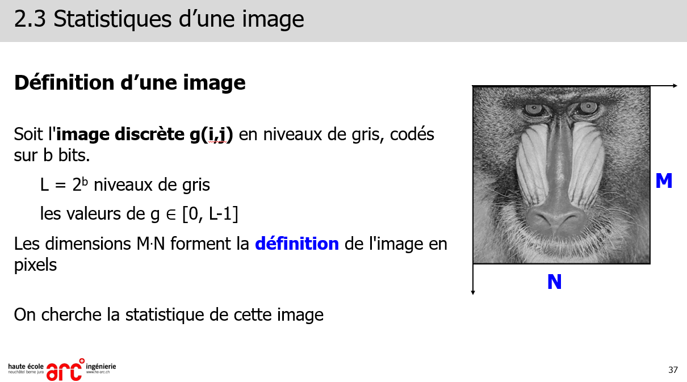
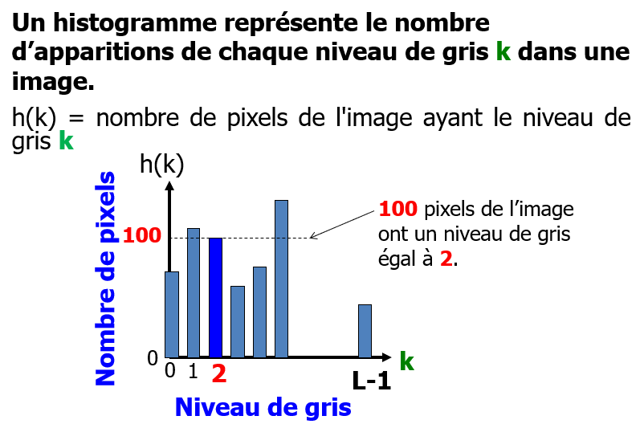
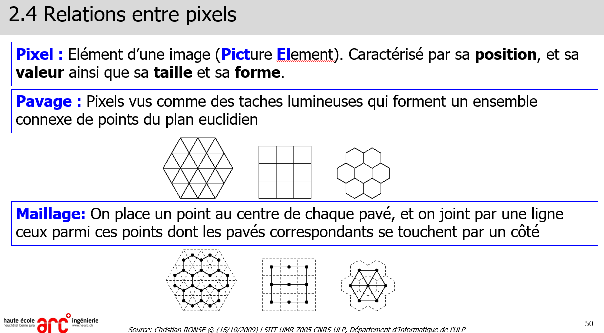

OpenCV : BGR et non pas RGB !

> 📖 Présentation `2 Modélisation d'image`

Histogramme : hauteur max == taille de l'image (en pixels) (largeur * hauteur)
L = 2^b - 1 (b = nombre de bits) (L = Niveau de gris)
M = hauteur max (M = nombre de pixels)
N = largeur max (N = nombre de pixels)

