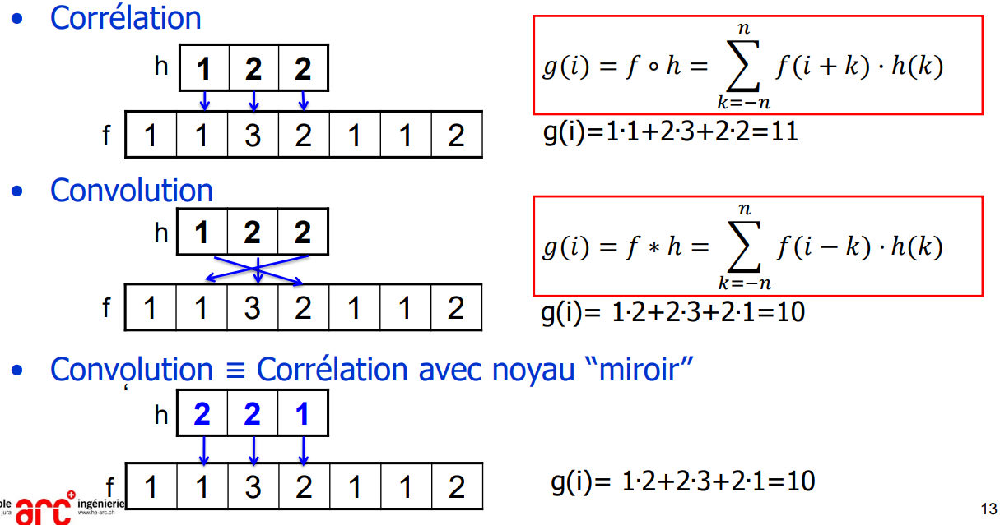
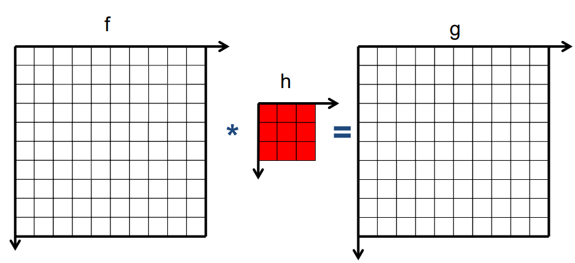
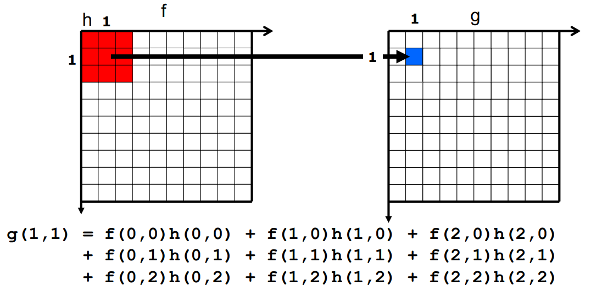
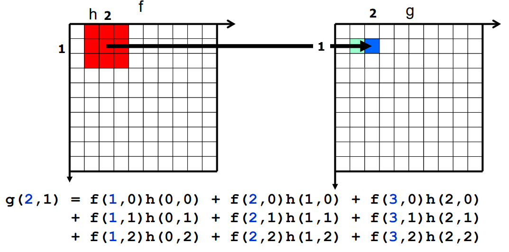
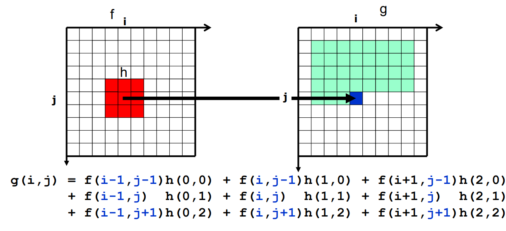
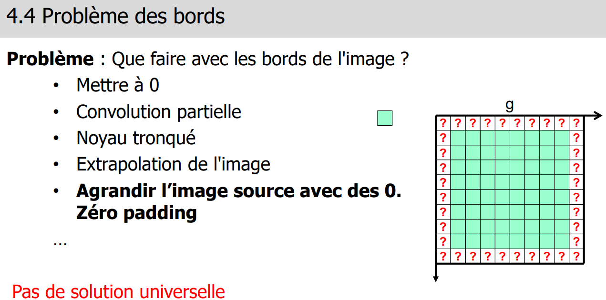
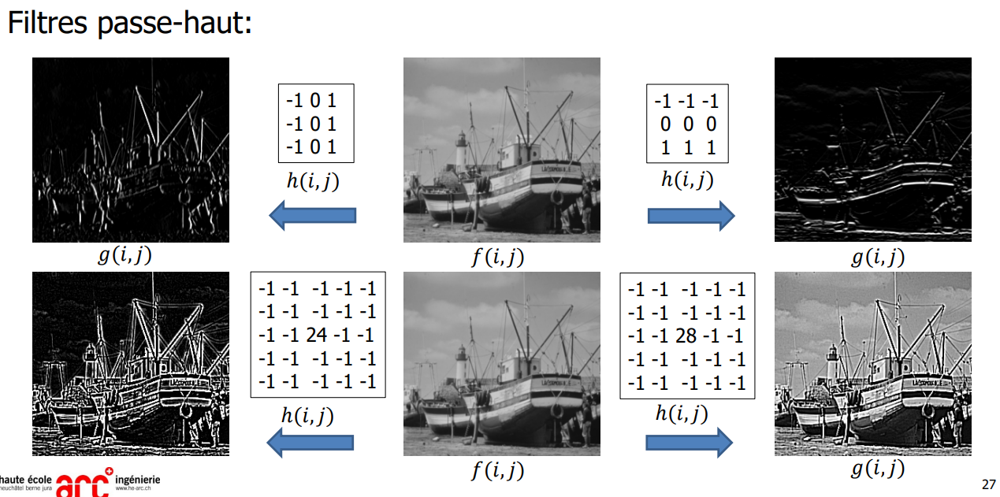

> 📖 Présentation [4.1 Transformation géométrique](https://cyberlearn.hes-so.ch/mod/resource/view.php?id=1894005)

<!-- #region TODO BLOCK --> 

 📝 TODO 

Ajouter screen 4.1.3

<!-- #endregion TODO BLOCK -->

> 📖 Présentation `4.2 transformation en niveau de gris`

- 
- Sur chaqun de ces histogrammes, le nombre de pixels est le même !
  - On dirait pas, mais enfaite c'est la hauteur max de l'histogramme qui change ;) 

(3 sur l'image) : **Seuillage** : ce qui est en dessous est noir, ce qui est au dessus est blanc

<!-- #region IMPORTANT BLOCK --> 

❗❗Important 

Le schéma de la normalisation est sujet à question de TE

<!-- #endregion IMPORTANT BLOCK -->

**Normalisation** :

**Gamma**:
- 
- 
- 

<!-- #region IMPORTANT BLOCK --> 

❗❗Important 

Serie 4.1 : Exercice Typique TE, a connaitre la démarche

<!-- #endregion IMPORTANT BLOCK -->

> 📖 Présentation `4.3 Mathématiques`

Masques `AND, OR, XOR` : bitwise

----

> 📖 Présentation `4.4 Convolution`

# Convolution et correlation

Noyau de convolution : en faisant passer le noyeau sur les points de l'image permet d'obtenir une image de corrélation

## Exemple : Convolution numérique g=f*h

matrice de convolution `[1 0 -1]` : fait une différence de pixels sur l'axe X
<!-- #region drawnote -->
<svg id="svg" xmlns="http://www.w3.org/2000/svg" viewbox="111.48999786376953,27,620.7999877929688,307.20001220703125" style="height:307.20001220703125"><path d="M 185.89,41.6 L 183.09,52.2 L 181.49,61 L 178.29,86.6 L 177.49,108.2 L 181.49,156.2 L 187.09,197 L 189.49,229 L 190.29,241.8 L 190.29,245.8 L 190.29,248.2 L 190.29,249" fill="none" stroke="#6190e8" stroke-width="2"></path><path d="M 170.69,56.8 L 171.09,56.2 L 172.69,55.4 L 174.29,52.2 L 179.09,48.2 L 186.29,41 L 189.49,37 L 190.29,37 L 191.09,39.4 L 191.89,41.8 L 192.69,47.4 L 193.49,54.6 L 193.49,58.6 L 193.49,59.4 L 194.29,59.4" fill="none" stroke="#6190e8" stroke-width="2"></path><path d="M 123.49,96 L 123.89,95.4 L 129.49,94.6 L 134.29,93.8 L 136.69,93.8 L 137.49,93.8 L 137.49,96.2 L 131.89,104.2 L 127.89,106.6 L 125.49,106.6 L 125.49,107.4 L 127.09,107.4 L 130.29,109 L 131.89,111.4 L 131.89,113 L 131.89,113.8 L 131.09,113.8 L 127.89,114.6 L 125.49,114.6 L 123.09,113.8 L 122.29,112.2 L 121.49,112.2" fill="none" stroke="#6190e8" stroke-width="2"></path><path d="M 148.29,99.2 L 147.89,98.6 L 146.29,98.6 L 145.49,100.2 L 143.89,102.6 L 142.29,109 L 142.29,112.2 L 143.09,113.8 L 143.89,114.6 L 146.29,114.6 L 147.89,114.6 L 150.29,112.2 L 151.89,110.6 L 154.29,105.8 L 154.29,103.4 L 154.29,101.8 L 154.29,101 L 152.69,101 L 147.89,101 L 145.49,102.6" fill="none" stroke="#6190e8" stroke-width="2"></path><path d="M 129.89,159.2 L 129.49,158.6 L 129.49,157.8 L 129.49,157 L 130.29,156.2 L 131.09,156.2 L 132.69,156.2 L 134.29,156.2 L 135.09,156.2 L 135.09,157 L 135.89,159.4 L 135.89,162.6 L 134.29,164.2 L 131.09,165.8 L 128.69,168.2 L 128.69,169 L 129.49,169 L 131.89,169.8 L 135.09,169.8 L 139.89,170.6 L 140.69,170.6" fill="none" stroke="#6190e8" stroke-width="2"></path><path d="M 153.09,157.6 L 151.09,157.8 L 147.89,160.2 L 147.09,161.8 L 145.49,164.2 L 145.49,166.6 L 145.49,169 L 146.29,169.8 L 148.69,169.8 L 151.09,169.8 L 152.69,169.8 L 155.09,169 L 156.69,166.6 L 157.49,164.2 L 157.49,162.6 L 156.69,160.2 L 155.09,159.4 L 154.29,158.6 L 151.89,158.6" fill="none" stroke="#6190e8" stroke-width="2"></path><path d="M 129.09,225.6 L 128.69,225 L 131.09,221.8 L 134.29,215.4 L 135.89,210.6 L 138.29,207.4 L 138.29,206.6 L 138.29,207.4 L 138.29,210.6 L 138.29,217 L 137.49,225 L 137.49,233.8 L 137.49,235.4" fill="none" stroke="#6190e8" stroke-width="2"></path><path d="M 154.69,212.8 L 153.49,213 L 151.09,213 L 149.49,214.6 L 145.49,220.2 L 143.89,224.2 L 143.89,226.6 L 143.89,229 L 147.89,229 L 151.09,229 L 153.49,229 L 155.89,227.4 L 156.69,226.6 L 158.29,222.6 L 158.29,220.2 L 158.29,217.8 L 157.49,216.2 L 155.09,215.4 L 154.29,215.4 L 152.69,215.4 L 151.09,215.4 L 150.29,216.2" fill="none" stroke="#6190e8" stroke-width="2"></path><path d="M 192.29,246.4 L 192.69,247.4 L 194.29,247.4 L 203.89,249 L 228.69,252.2 L 247.09,253.8 L 272.69,253.8 L 299.89,253.8 L 325.49,253.8 L 365.49,256.2 L 382.29,257 L 395.89,257.8 L 409.49,257.8 L 438.29,257.8 L 451.89,257.8 L 463.89,257.8 L 475.09,257.8 L 482.29,257.8 L 489.49,259.4 L 495.09,260.2 L 500.69,260.2 L 504.69,260.2 L 512.69,260.2 L 514.29,260.2 L 515.09,260.2 L 515.89,260.2" fill="none" stroke="#6190e8" stroke-width="2"></path><path d="M 513.09,254.4 L 513.49,254.6 L 514.29,254.6 L 518.29,254.6 L 522.29,255.4 L 524.69,256.2 L 527.09,257.8 L 527.89,257.8 L 527.89,259.4 L 527.89,260.2 L 527.09,261.8 L 523.09,263.4 L 518.29,265 L 515.09,265.8 L 512.69,266.6 L 511.89,266.6 L 511.89,267.4" fill="none" stroke="#6190e8" stroke-width="2"></path><path d="M 234.69,285.6 L 235.09,285 L 236.69,283.4 L 239.09,280.2 L 241.49,277 L 242.29,275.4 L 242.29,274.6 L 242.29,276.2 L 242.29,281 L 240.69,292.2 L 239.89,297 L 239.89,299.4" fill="none" stroke="#6190e8" stroke-width="2"></path><path d="M 288.29,280 L 287.09,280.2 L 286.29,281 L 285.49,282.6 L 283.09,284.2 L 283.09,287.4 L 283.09,289 L 286.29,293 L 288.69,294.6 L 291.09,295.4 L 293.49,295.4 L 295.89,295.4 L 296.69,295.4 L 297.49,294.6 L 298.29,293.8 L 299.09,291.4 L 298.29,285.8 L 296.69,281.8 L 293.49,278.6 L 292.69,278.6 L 290.29,278.6 L 287.89,278.6 L 287.09,278.6 L 285.49,278.6 L 285.49,279.4 L 284.69,280.2" fill="none" stroke="#6190e8" stroke-width="2"></path><path d="M 325.09,290.4 L 326.29,290.6 L 327.89,290.6 L 330.29,291.4 L 333.49,291.4 L 335.09,291.4 L 337.49,291.4 L 340.69,291.4 L 341.49,291.4" fill="none" stroke="#6190e8" stroke-width="2"></path><path d="M 345.89,293.6 L 346.29,293.8 L 347.09,293.8 L 347.89,293.8 L 348.69,292.2 L 350.29,289 L 351.09,286.6 L 351.89,282.6 L 352.69,279.4 L 352.69,277.8 L 352.69,277 L 352.69,277.8 L 352.69,280.2 L 352.69,284.2 L 353.49,289 L 354.29,293 L 354.29,294.6" fill="none" stroke="#6190e8" stroke-width="2"></path><path d="M 247.49,252.8 L 246.29,253 L 246.29,252.2 L 246.29,251.4 L 246.29,249.8 L 246.29,248.2 L 246.29,246.6 L 246.29,245.8 L 245.49,241.8 L 244.69,238.6 L 244.69,237 L 244.69,236.2 L 244.69,234.6 L 244.69,233.8 L 244.69,233 L 244.69,232.2 L 244.69,231.4 L 244.69,229.8 L 244.69,229 L 244.69,228.2 L 244.69,227.4 L 244.69,226.6 L 243.89,226.6" fill="none" stroke="#6190e8" stroke-width="2"></path><path d="M 242.69,224.8 L 241.49,225 L 240.69,223.4 L 240.69,222.6 L 240.69,221.8 L 240.69,221 L 241.49,221 L 242.29,221 L 243.09,221 L 244.69,221 L 248.69,221 L 249.49,221.8 L 250.29,221.8 L 251.09,223.4 L 251.09,224.2 L 250.29,225.8 L 249.49,226.6 L 247.89,227.4 L 245.49,228.2 L 244.69,228.2 L 243.09,228.2 L 242.29,227.4 L 242.29,226.6" fill="none" stroke="#6190e8" stroke-width="2"></path><path d="M 293.09,253.6 L 292.69,253 L 292.69,250.6 L 291.89,245 L 291.89,241.8 L 291.89,237.8 L 291.89,232.2 L 291.89,228.2 L 291.89,225 L 291.89,222.6 L 291.89,220.2 L 291.89,216.2 L 291.89,213.8 L 291.89,211.4 L 291.89,209.8 L 291.89,208.2 L 291.89,206.6 L 291.89,205 L 291.89,203.4 L 291.89,202.6 L 291.89,201.8 L 291.89,201 L 291.89,200.2 L 291.89,199.4 L 291.89,198.6 L 291.89,197.8 L 291.89,197 L 291.89,196.2 L 291.89,195.4 L 291.89,194.6 L 291.09,194.6 L 291.09,193.8 L 291.09,192.2 L 291.09,191.4 L 291.09,189.8 L 290.29,189 L 289.49,187.4 L 289.49,186.6 L 288.69,185.8 L 288.69,184.2 L 288.69,182.6 L 288.69,181 L 288.69,179.4 L 288.69,178.6 L 288.69,177.8 L 288.69,177 L 288.69,176.2 L 287.89,176.2 L 287.09,175.4 L 287.09,174.6 L 287.09,173.8 L 287.09,172.2 L 287.09,171.4 L 287.09,170.6 L 287.89,170.6 L 290.29,170.6 L 293.49,170.6 L 295.89,170.6 L 297.49,171.4 L 298.29,173 L 299.09,173.8 L 299.09,175.4 L 299.89,177 L 299.89,178.6 L 299.89,181.8 L 299.89,182.6 L 299.09,183.4 L 299.09,184.2 L 298.29,184.2 L 296.69,184.2 L 294.29,183.4 L 291.89,182.6 L 291.89,181.8 L 291.09,181 L 291.09,179.4 L 291.09,178.6 L 291.09,177.8" fill="none" stroke="#6190e8" stroke-width="2"></path><path d="M 355.49,253.6 L 355.09,253 L 355.09,249.8 L 355.09,246.6 L 355.09,241.8 L 355.09,237.8 L 355.09,233 L 354.29,224.2 L 353.49,218.6 L 352.69,214.6 L 351.09,209 L 349.49,201.8 L 348.69,199.4 L 348.69,195.4 L 348.69,191.4 L 348.69,186.6 L 347.89,181 L 347.89,180.2 L 347.89,175.4 L 347.89,166.6 L 347.89,161 L 347.89,157.8 L 347.89,155.4 L 347.89,151.4 L 348.69,145.8 L 349.49,141.8 L 350.29,138.6 L 350.29,135.4 L 351.09,129 L 351.89,125.8 L 352.69,122.6 L 352.69,119.4 L 352.69,118.6 L 352.69,117.8 L 352.69,116.2 L 352.69,115.4 L 352.69,114.6 L 352.69,113.8" fill="none" stroke="#6190e8" stroke-width="2"></path><path d="M 352.29,115.2 L 351.09,115.4 L 350.29,115.4 L 349.49,115.4 L 348.69,115.4 L 347.89,114.6 L 347.89,113.8 L 346.29,112.2 L 346.29,108.2 L 346.29,105 L 346.29,102.6 L 347.09,101 L 349.49,100.2 L 352.69,99.4 L 357.49,99.4 L 359.89,99.4 L 363.89,105 L 363.89,106.6 L 365.49,109 L 365.49,111.4 L 365.49,113 L 365.49,113.8 L 363.89,113.8 L 362.29,114.6 L 360.69,114.6 L 355.89,114.6 L 355.09,113.8" fill="none" stroke="#6190e8" stroke-width="2"></path><path d="M 237.89,323.2 L 237.49,322.6 L 238.29,321.8 L 238.29,321 L 239.89,318.6 L 242.29,314.6 L 243.09,313.8 L 243.09,312.2 L 244.69,309.8 L 244.69,309 L 244.69,308.2 L 244.69,309 L 244.69,310.6 L 243.89,314.6 L 242.29,320.2 L 242.29,322.6 L 242.29,323.4" fill="none" stroke="#e967c7" stroke-width="2"></path><path d="M 256.29,311.2 L 255.89,312.2 L 255.09,313 L 253.49,315.4 L 253.49,316.2 L 253.49,317.8 L 253.49,318.6 L 255.09,319.4 L 255.89,319.4 L 256.69,319.4 L 259.09,319.4 L 259.89,319.4 L 261.49,318.6 L 262.29,316.2 L 262.29,314.6 L 262.29,313 L 262.29,311.4 L 260.69,310.6 L 259.89,310.6 L 258.29,310.6 L 255.89,312.2 L 255.09,313.8 L 254.29,315.4 L 253.49,316.2" fill="none" stroke="#e967c7" stroke-width="2"></path><path d="M 291.49,308.8 L 290.29,309 L 290.29,308.2 L 291.09,308.2 L 291.89,308.2 L 292.69,308.2 L 294.29,308.2 L 295.89,309.8 L 296.69,310.6 L 297.49,312.2 L 297.49,314.6 L 296.69,315.4 L 293.49,317.8 L 292.69,318.6 L 290.29,319.4 L 288.69,319.4 L 288.69,320.2 L 288.69,321.8 L 288.69,322.6 L 289.49,322.6 L 290.29,323.4 L 295.09,324.2 L 298.29,324.2 L 300.69,324.2 L 301.49,323.4 L 302.29,323.4" fill="none" stroke="#e967c7" stroke-width="2"></path><path d="M 312.29,312 L 311.09,312.2 L 309.49,312.2 L 307.09,312.2 L 305.49,313.8 L 303.89,316.2 L 303.09,317.8 L 303.09,318.6 L 304.69,320.2 L 308.69,321 L 311.89,321.8 L 313.49,321.8 L 315.09,321.8 L 317.49,321 L 318.29,317.8 L 318.29,316.2 L 318.29,315.4 L 315.89,313.8 L 313.49,313 L 312.69,313 L 311.09,313 L 310.29,313" fill="none" stroke="#e967c7" stroke-width="2"></path><path d="M 348.29,309.6 L 349.49,309.8 L 351.09,309.8 L 355.09,309.8 L 355.89,309.8 L 357.49,312.2 L 357.49,313 L 357.49,315.4 L 355.89,317 L 355.09,317 L 355.89,317.8 L 355.89,318.6 L 356.69,319.4 L 357.49,320.2 L 357.49,321.8 L 355.89,322.6 L 353.49,322.6 L 351.89,322.6 L 348.69,322.6 L 346.29,321 L 344.69,320.2" fill="none" stroke="#e967c7" stroke-width="2"></path><path d="M 372.29,308 L 371.09,308.2 L 369.49,308.2 L 368.69,309 L 367.89,311.4 L 367.09,313.8 L 367.09,317 L 367.89,318.6 L 369.49,318.6 L 369.49,319.4 L 372.69,320.2 L 374.29,320.2 L 375.89,320.2 L 376.69,320.2 L 376.69,319.4 L 378.29,317 L 379.09,312.2 L 379.09,310.6 L 378.29,309.8 L 377.49,309 L 376.69,309 L 374.29,309 L 373.49,309 L 372.69,309 L 371.89,309 L 370.29,309.8" fill="none" stroke="#e967c7" stroke-width="2"></path><path d="M 410.69,316 L 411.89,316.2 L 423.89,316.2 L 429.49,316.2 L 435.09,316.2 L 441.49,316.2" fill="none" stroke="#e967c7" stroke-width="2"></path><path d="M 437.89,311.2 L 439.09,311.4 L 440.69,311.4 L 443.09,311.4 L 444.69,311.4 L 447.09,313 L 449.49,313.8 L 449.49,314.6 L 450.29,315.4 L 450.29,316.2 L 450.29,317 L 450.29,317.8 L 449.49,317.8 L 445.49,320.2 L 442.29,321 L 439.89,321.8 L 439.09,321.8 L 438.29,322.6" fill="none" stroke="#e967c7" stroke-width="2"></path><path d="M 223.49,316 L 223.09,315.4 L 223.09,316.2 L 223.09,317 L 222.29,317 L 221.49,317 L 221.49,316.2 L 221.49,315.4 L 223.09,315.4 L 223.89,315.4 L 224.69,315.4 L 224.69,316.2 L 224.69,317 L 223.89,317 L 223.09,317 L 222.29,317 L 221.49,317 L 220.69,317 L 220.69,316.2 L 221.49,316.2 L 221.49,317 L 221.49,317.8 L 220.69,317.8 L 219.89,318.6" fill="none" stroke="#e967c7" stroke-width="2"></path><path d="M 477.09,315.2 L 477.49,315.4 L 477.49,314.6 L 481.49,310.6 L 483.09,308.2 L 484.69,307.4 L 484.69,306.6 L 484.69,309 L 484.69,313 L 483.89,316.2 L 483.09,319.4 L 483.09,322.6 L 483.09,323.4 L 483.09,324.2" fill="none" stroke="#e967c7" stroke-width="2"></path><path d="M 501.89,308.8 L 500.69,309 L 500.69,309.8 L 499.89,310.6 L 498.29,311.4 L 497.49,313 L 496.69,315.4 L 496.69,317 L 497.49,317.8 L 498.29,318.6 L 499.09,320.2 L 500.69,321 L 501.49,321 L 502.29,321 L 503.09,321 L 505.49,321 L 506.29,321 L 507.89,319.4 L 509.49,317 L 510.29,314.6 L 510.29,313.8 L 510.29,313 L 508.69,312.2 L 507.89,310.6 L 507.09,310.6 L 506.29,310.6 L 505.49,310.6 L 504.69,310.6" fill="none" stroke="#e967c7" stroke-width="2"></path><path d="M 522.69,314.4 L 523.09,314.6 L 523.89,314.6 L 524.69,314.6 L 527.09,314.6 L 527.89,314.6 L 531.89,314.6 L 535.09,314.6 L 535.09,313.8" fill="none" stroke="#e967c7" stroke-width="2"></path><path d="M 531.49,308 L 531.09,309 L 531.09,310.6 L 531.09,313 L 531.09,314.6 L 531.89,316.2 L 531.89,317.8 L 531.89,319.4 L 531.89,320.2 L 531.89,321 L 531.89,321.8 L 531.89,322.6 L 531.89,323.4" fill="none" stroke="#e967c7" stroke-width="2"></path><path d="M 551.49,308 L 550.29,308.2 L 549.49,309 L 548.69,310.6 L 547.89,312.2 L 547.89,313.8 L 547.89,315.4 L 548.69,317.8 L 548.69,318.6 L 549.49,319.4 L 551.09,320.2 L 552.69,320.2 L 553.49,320.2 L 554.29,320.2 L 556.69,319.4 L 556.69,318.6 L 558.29,316.2 L 559.09,315.4 L 559.09,313.8 L 559.09,310.6 L 558.29,309.8 L 557.49,309 L 556.69,309 L 555.89,309 L 555.09,308.2 L 554.29,308.2 L 553.49,308.2" fill="none" stroke="#e967c7" stroke-width="2"></path><path d="M 569.09,314.4 L 571.09,314.6 L 573.49,314.6 L 575.89,314.6 L 576.69,314.6 L 579.09,314.6 L 580.69,314.6 L 581.49,314.6" fill="none" stroke="#e967c7" stroke-width="2"></path><path d="M 594.69,305.6 L 594.29,305 L 595.09,305 L 596.69,305 L 599.09,305 L 600.69,305 L 601.49,306.6 L 602.29,307.4 L 603.09,309.8 L 602.29,312.2 L 600.69,313 L 599.89,313.8 L 599.09,313.8 L 599.89,313.8 L 600.69,314.6 L 602.29,314.6 L 602.29,316.2 L 603.09,317 L 603.09,317.8 L 603.09,319.4 L 603.09,320.2 L 602.29,320.2 L 599.09,321 L 594.29,321 L 591.09,321 L 588.69,321" fill="none" stroke="#e967c7" stroke-width="2"></path><path d="M 618.69,308 L 618.29,309 L 618.29,309.8 L 617.49,309.8 L 616.69,311.4 L 616.69,314.6 L 616.69,315.4 L 616.69,316.2 L 616.69,317 L 618.29,317.8 L 619.89,318.6 L 620.69,319.4 L 621.49,319.4 L 623.09,319.4 L 624.69,319.4 L 625.49,318.6 L 626.29,317.8 L 627.09,317 L 627.09,315.4 L 627.09,313 L 626.29,311.4 L 625.49,309 L 623.89,307.4 L 623.09,306.6 L 622.29,305.8 L 621.49,305.8 L 619.89,305.8 L 619.89,306.6 L 619.09,308.2" fill="none" stroke="#e967c7" stroke-width="2"></path><path d="M 638.69,311.2 L 639.09,311.4 L 640.69,311.4 L 644.69,311.4 L 649.49,311.4 L 651.89,311.4" fill="none" stroke="#e967c7" stroke-width="2"></path><path d="M 644.29,317.6 L 644.69,317.8 L 646.29,317.8 L 648.69,317.8 L 650.29,317.8 L 655.09,317.8 L 658.29,317.8 L 659.09,317.8" fill="none" stroke="#e967c7" stroke-width="2"></path><path d="M 666.69,315.2 L 667.09,315.4 L 667.89,315.4 L 671.09,315.4 L 674.29,315.4 L 675.09,315.4 L 676.69,315.4" fill="none" stroke="#e967c7" stroke-width="2"></path><path d="M 685.89,307.2 L 686.29,307.4 L 687.09,306.6 L 687.89,305.8 L 689.49,305.8 L 691.89,305.8 L 693.49,305.8 L 695.89,306.6 L 696.69,307.4 L 697.49,310.6 L 697.49,313 L 696.69,316.2 L 695.89,317 L 695.09,318.6 L 693.49,320.2 L 691.89,321 L 691.09,322.6 L 691.09,323.4 L 691.89,323.4 L 693.49,323.4 L 695.09,324.2 L 699.09,324.2 L 701.49,324.2 L 703.09,324.2 L 703.89,324.2" fill="none" stroke="#e967c7" stroke-width="2"></path><path d="M 717.09,310.4 L 715.89,310.6 L 715.09,310.6 L 714.29,312.2 L 712.69,313.8 L 712.69,315.4 L 712.69,318.6 L 712.69,320.2 L 713.49,323.4 L 714.29,323.4 L 715.89,324.2 L 717.49,324.2 L 719.09,324.2 L 720.69,323.4 L 721.49,321.8 L 722.29,320.2 L 722.29,318.6 L 720.69,313.8 L 719.89,312.2 L 719.09,312.2 L 718.29,312.2 L 717.49,312.2 L 716.69,312.2 L 715.89,312.2" fill="none" stroke="#e967c7" stroke-width="2"></path></svg>  
<!-- #endregion -->
matrice de convolution `[0 0 0 0 1]`: fait un décalage de 2 bits contre la gauche // nombre de bit axe X = (longueur matrice - 1) / 2 

La matrice est de taille **impaire** (3x3, 1x5, 5x3, etc)

**Normalisation** : diviser par la somme des coefficient du noyau
- Pour obtenir le résultat souhaité, il faut normaliser. Il est nécessaire de normaliser si les valeurs obtenues ne sont pas dans l'intervalle initial (exemple une image qui monte jusqu'à 30 et que le résultat obtenu serait exemple 60)
- Si le résultat est 0, c'est bien plus complexe, mais c'est pas trop important (car l'image ne dépasse pas les valeurs de base)
- exemple la matrice `[1 2 4]`, avec les valeurs "`10 20 30`" : `1 * 10 + 2 * 20 + 4 * 30 = 140` --> `140 > 30` -> normalisation : `140 / (1 + 2 + 4) = 20`