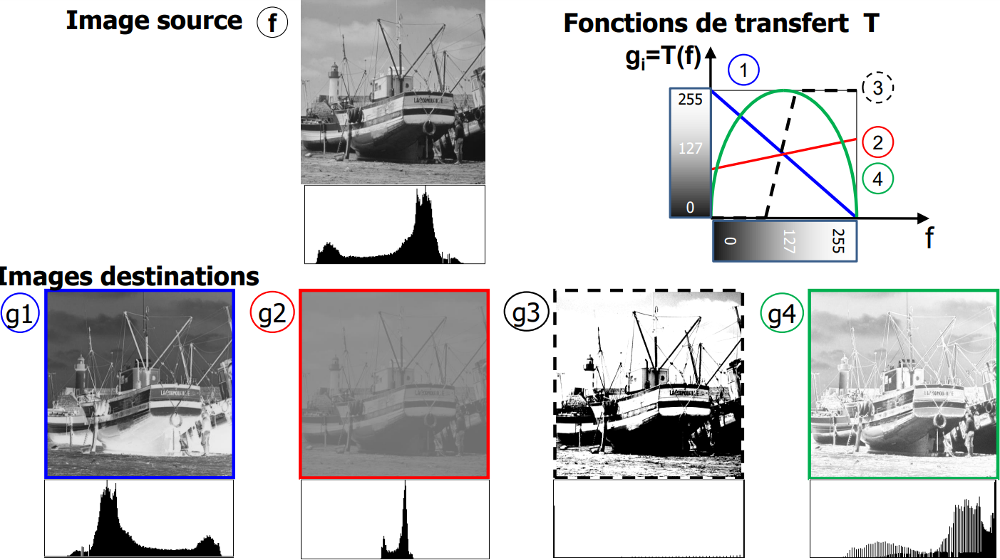
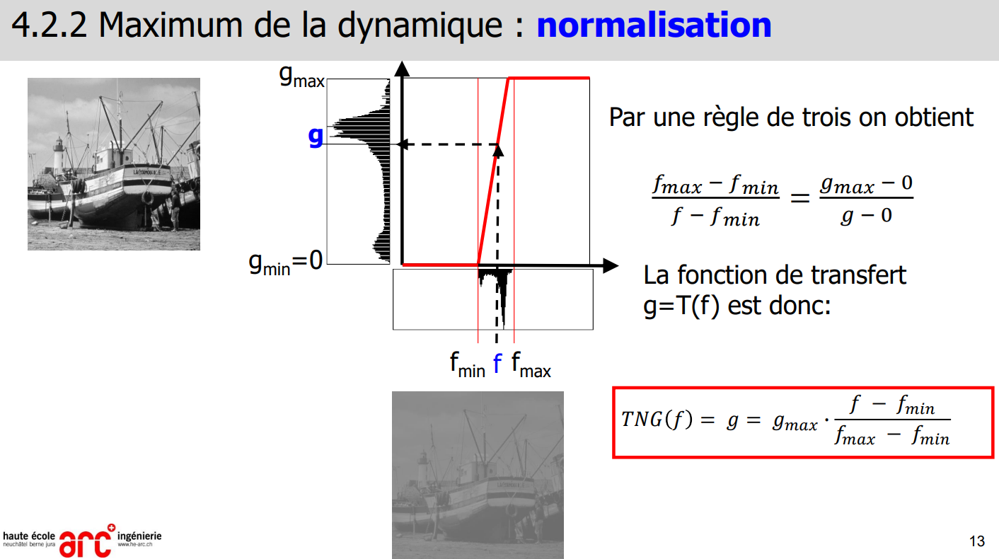
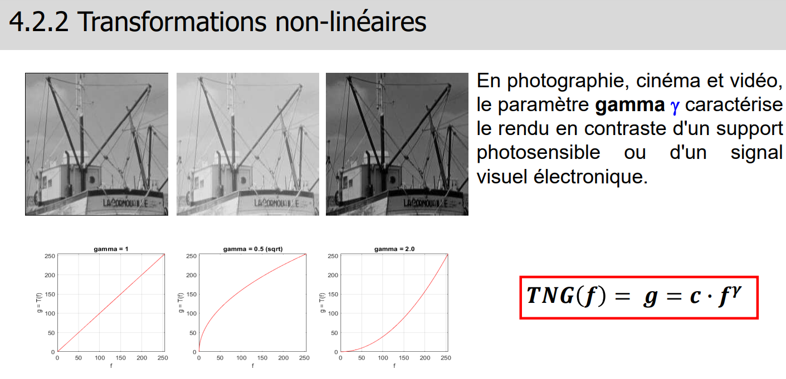
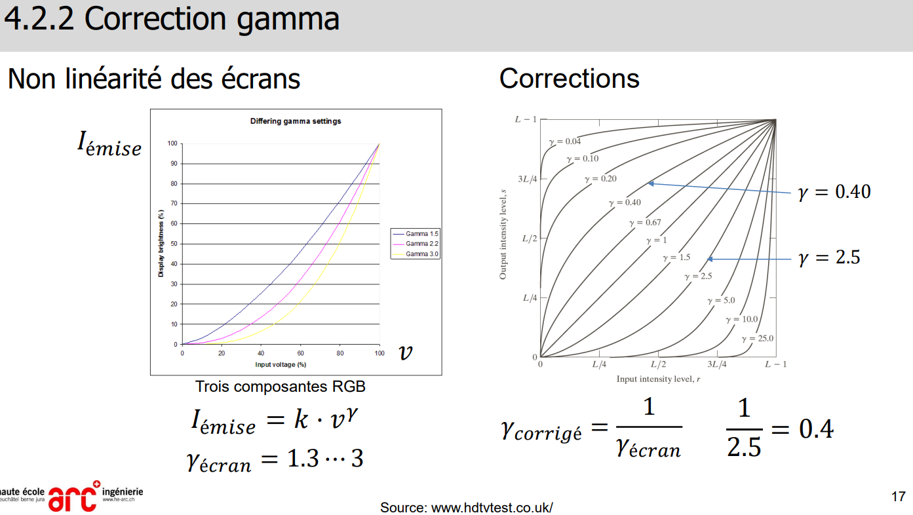
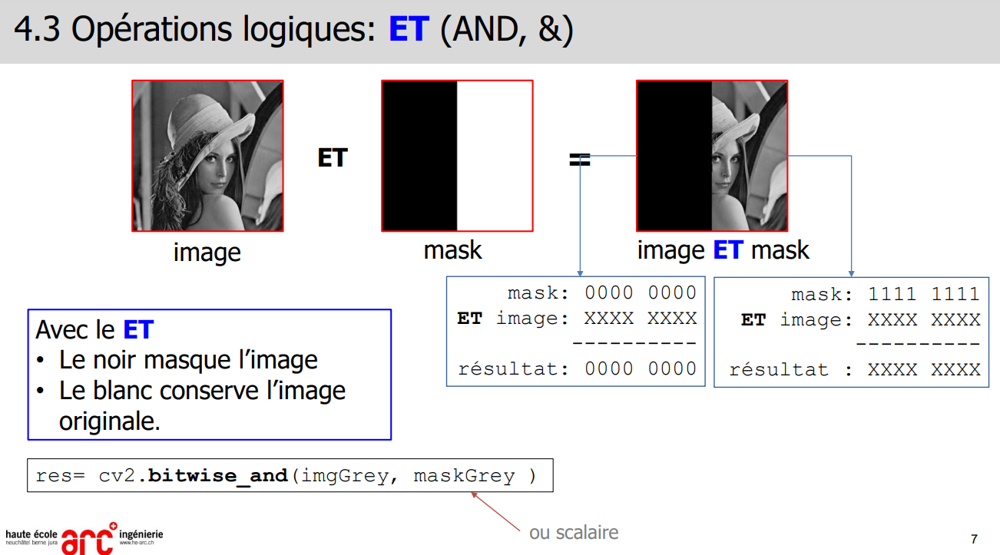
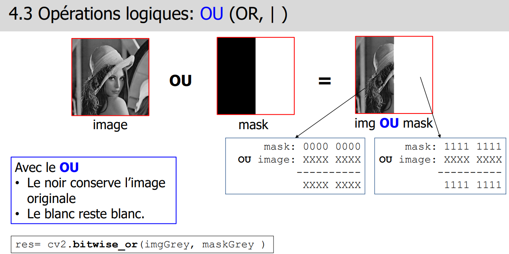
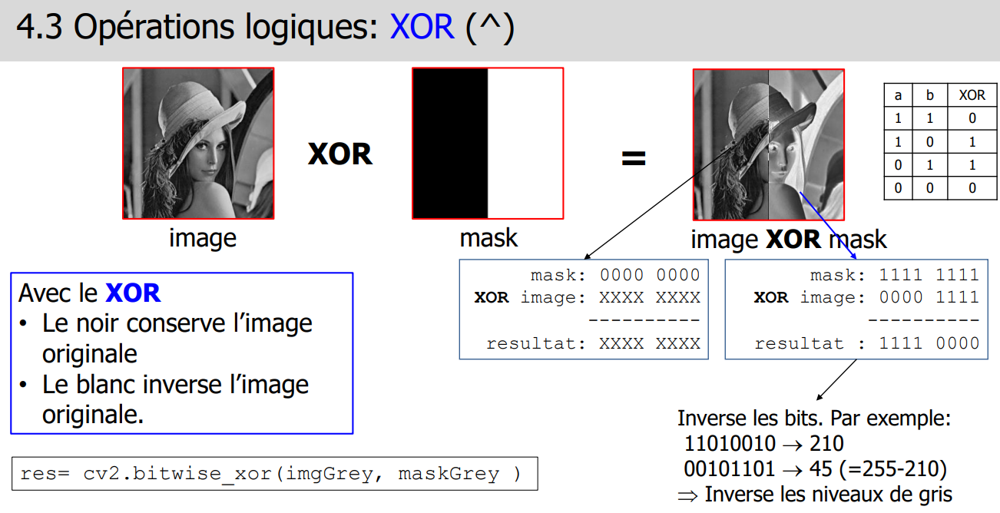

> 📖 Présentation [4.1 Transformation géométrique](https://cyberlearn.hes-so.ch/mod/resource/view.php?id=1894005)

<!-- #region TODO BLOCK --> 

 📝 TODO 

Ajouter screen 4.1.3

<!-- #endregion TODO BLOCK -->

> 📖 Présentation `4.2 transformation en niveau de gris`

- 
- Sur chaqun de ces histogrammes, le nombre de pixels est le même !
  - On dirait pas, mais enfaite c'est la hauteur max de l'histogramme qui change ;) 

(3 sur l'image) : **Seuillage** : ce qui est en dessous est noir, ce qui est au dessus est blanc

<!-- #region IMPORTANT BLOCK --> 

❗❗Important 

Le schéma de la normalisation est sujet à question de TE

<!-- #endregion IMPORTANT BLOCK -->

**Normalisation** :

**Gamma**:
- 
- 
- 

<!-- #region IMPORTANT BLOCK --> 

❗❗Important 

Serie 4.1 : Exercice Typique TE, a connaitre la démarche

<!-- #endregion IMPORTANT BLOCK -->

> 📖 Présentation `4.3 Mathématiques`

Masques `AND, OR, XOR` : bitwise

