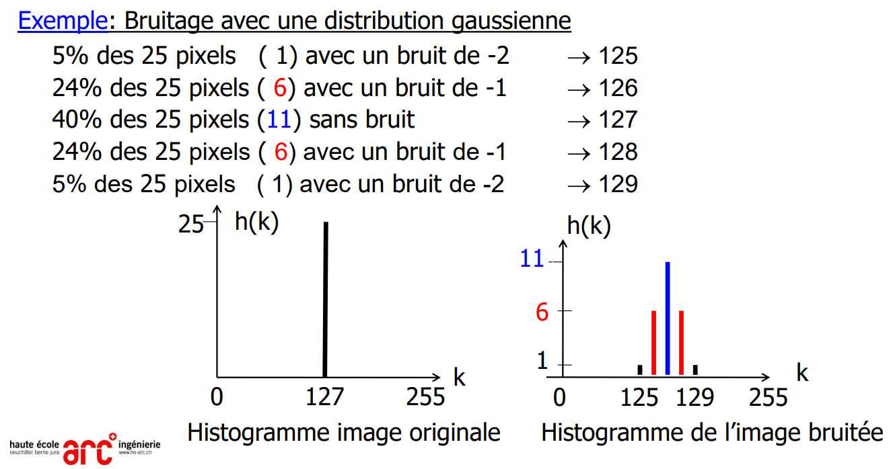

> 📖 Présentation `4-5 Filtrage du bruit`

# Bruit Additif

Pourquoier ajouter du bruit : uniquement à but de tests

bruiter : fait un histograme pas très lisse
bruiter puis ajouter un égalisage (matrice de 1) = flouté, l'histogramme est resséré

## Uniforme

Quand on "bruite" on rajoute des nouveaux de gris
Ici on corrige tout à 20%

## Gaussienne

La courbe inidique la quantité % de pixels qui sont corrigés

# Filtrage du bruit

Il faut éviter les "escalier" avec le filtre gaussien 

Si c'est bruité avec gaussien et poivre-sel, il faut retirer en 1er le minmax (poivre-sel) et ensuite le gaussien, pour réduire les "escaliers" provoqués par le poivre-sel

## Conclusion

C'est difficile et sa prend du temps de filtrer une image qui est bruitée.
Solution : rechercher à retirer le bruit à la base : luminosité, changer la camera, etc.
-  Acheter une caméra 10x plus cher coutera moins cher que payé un ingénieur

# Note
Filtre médiane ==> Trie d'un tableau ==> Grosse complexité (n log(n), n², ...)