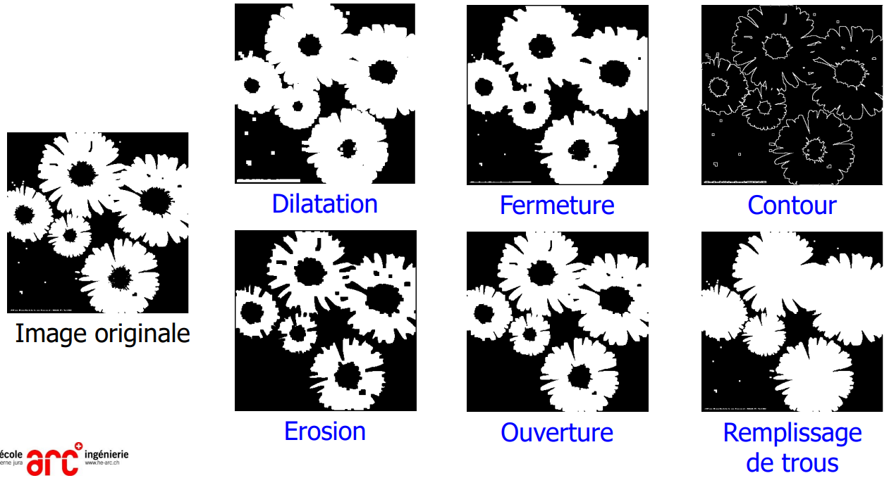

> 📖 Présentation `4.6 Opérations Morphologiques`

Modifier la forme d'objets :

- Les régions d’une image binaire   ont souvent
  - des bords irréguliers
  - des trous à l’intérieur
  - du bruit à l’extérieur
- But :
  - Boucher les trous
  - Adoucir les bords
  - Enlever les points du fond

  