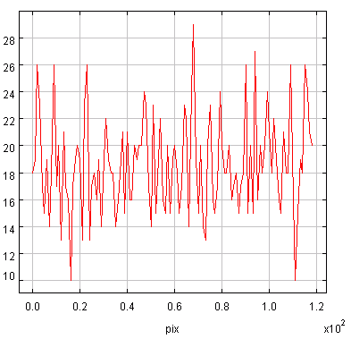

Convolution : 
- Détection de contour
- Moyenneur (passe bas) (on enlève les hautes fréquences)
- Passe haut : on a beaucoup de variation (exemple : noir blanc noir blanc)
- Passe bas : on laisse passer les basse fréquence (on vois moins les contours, l'image est "floutée") (exemple : dégradé blanc à noir)

# Noyau de convulution
- moyenne :
  ```
  1 1 1
  1 1 1
  1 1 1
  ```
- moyenne pondérée
    ```
    1 2 1
    2 4 2
    1 2 1
    ```

- Dérivée (filtre haut)
  ```
  -1 0 1
  -1 0 1
  -1 0 1
  ```
Appliquer le noyau :
- multiplier le pixel par la valeur du noyau, divisé par la somme des valeurs du noyau


# Bruit

Bruit gaussien ->


Bruit Poivre-Sel --> filtre Min/Max (équivalent du filtre médian)
(signal avec des pixels au hasard soit à 0 soit à 1)

