---
# Configuration de Markdown Preview Enhanced
print_background: true # Pour l'export en HTML qu'il prenne le thème de la prévisu (par défaut c'est la prévisu de githublight)
title: Traitement d'image - Chapitre 4.6 &#58; Morphologie
puppeteer:
    format: A4
    printBackground : true
    displayHeaderFooter: true
    margin: # le Header/footer ne prend pas ces paramètres en compte
        top: 2cm
        right: 2cm
        bottom: 2cm
        left: 2cm

    # taille de police requis, car par défaut c'est 0pt
    # id header/footer sont réservés : ph pour page header, pf pour page footer
    headerTemplate: '
      

      

          

              
Allemann Jonas

              
Traitement d&#39;images

              
Résumé du chapitre 4.6

          

          

              

              

              
Morphologie mathématiques I

          

      

    '
    footerTemplate: ' 
      

          

              

              

              

                  
                  /
                  
              

          

      

    '
---

@import "style.less"

<h0>Traitement d'images - Morphologie mathématiques I</h0>

> Couvre les slides 1 à 39

# Définitions
## Terminologie

Terme | Définition
--|--
**Région** | Ensemble de pixels connexes d'une image binaire.  bit **0** = **background**  bit **1** = foreground (l'**objet**)
**Elément structurant** | Formes géométriques et de taille connues. Exemple les carrés ou les cercles.
**Point d'ancrage** | **Centre** de l'élément structurant.

> par la suite, ces termes sont indiqués de cette manière : <ref>exemple</ref>

## Formules
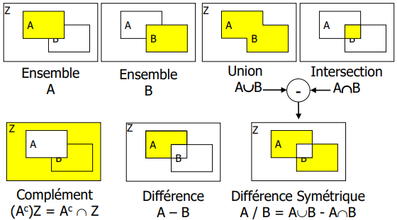

## Symboles
Symboles | Correspond à
--|--|--
⊖ | Erosion
⊕ | Dilatation
XC | Complémentaire (inversion des couleurs)
∘ | Ouverture
• | Fermeture

# Introduction
> Chapitre 4.6.1 : Slides 6 à 16

<table>
<tr>
<td>

Le **but** de la morphologie est de :
- Boucher les trous
- Adoucir les bords
- Enlever les points de fonds

> Sur l'image, les mots clés importants de la morphologie
</td>

<td>

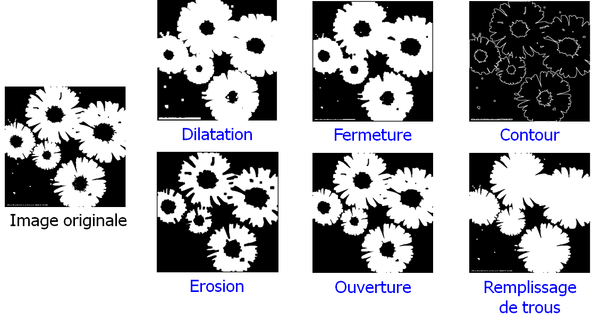
</td>
</tr>
</table>

## Méthodologie

<table>
<tr>
<td>

1. On pose un <ref>élément structurant</ref> sur une <ref>région</ref>
2. On **déplace** cet élément pour que le <ref>point d'ancrage</ref> pour qu'il passe par la totalité des pixels de l'image.
</td>

<td>

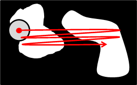
</td>
</tr>

<tr>
<td>

3. Pour chaque positions, vérifier l'<ref>union</ref> et l'<ref>intersection</ref> de l'<ref>élément structurant</ref> et les objets de l'image.
4. Reporter les résultats **positifs** sur la nouvelle image (nommée `image résultat`).
</td>

<td>

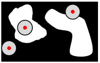
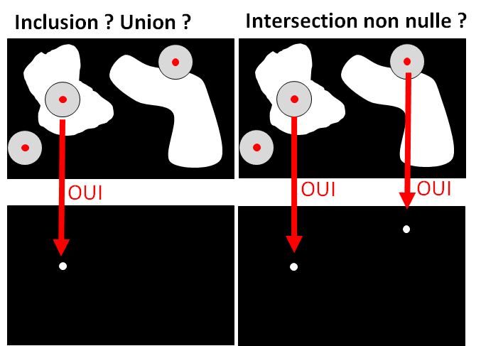
</td>
</tr>

<tr>
<td>

5. Obtention du résultat
   - En cas d'inclusion totale : nous érodons l'ojet
   - En cas d'intersection non nulle : nous dilatons l'objet

> Pour la similitude, c'est comme si nous augmentons ou diminuons la taille de l'objet.
</td>

<td>

> Similitude sous Gimp : *réduire* ou *agrendir* 
> 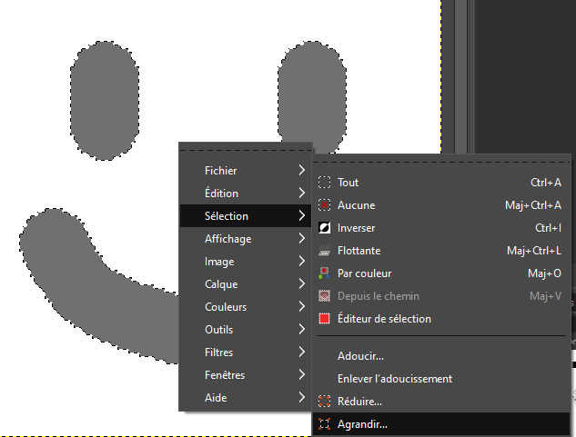
</td>
</tr>
</table>

## Eléments structurants

Les <ref>éléments structurants</ref> *(`B` dans les images qui suivent)* sont convertis en tableaux 2D. Comme par exemple ceux-ci : 
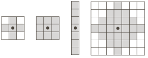

Sur ces éléments, il est possible d'effectuer des **réfléxions** et des **translations**.
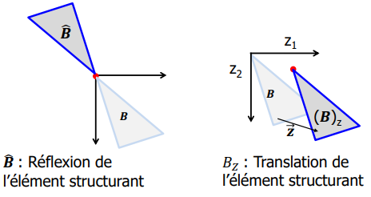

# Morphologie binaire
> Chapitre 4.6.2 : Slides 17 à 39

<!-- #region VARIABLE BLOCK --> 

 🔡 <b>Variables</b> 

`A` image source
`B` Elément structurant

<!-- #endregion VARIABLE BLOCK -->

## Erosion et Dilatation
> Slides 17 à 25

L'érosion et la dilation sont des opérations qui permettent de modifier la taille des objets. L'une ajoute de la "matière", l'autre en enlève.

### Erosion

L'**érosion** (`⊖`) à pour but de supprimer les pixels des bords de l'objet. C'est une opération qui **réduit** l'objet.

Notations : **A ⊖ B** = $E^B(A)$ = $\{ \vec{x} \mid B_x \subseteq A\}$

Les effets de l'érosions :
- Les parties plus petites que l'élément structurant sont **supprimées**
  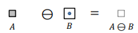
- Les autres parties sont **diminuées**
  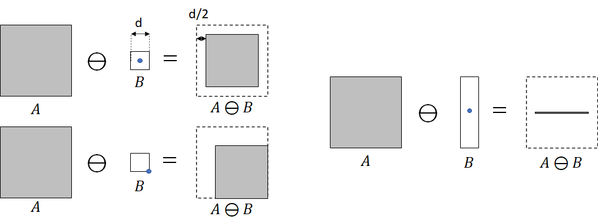
- Les trous sont **agrandis**
  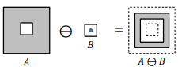
- Les objets peuvent se **séparer**
  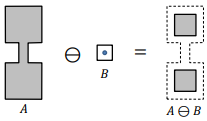

> La **connexité** des objets n'est **pas conservée**

### Dilatation

La **dilatation** (`⊕`) à pour but d'**ajouter** des pixels aux bords l'objet. C'est une opération qui **agrandit** l'objet.

Notations : **A ⊕ B** = $D^B(A)$ = $\{ \vec{x} \mid B_x \cap A \neq \emptyset \}$

Les effets de la dilatation :
- Les objets sont **agrandis**
  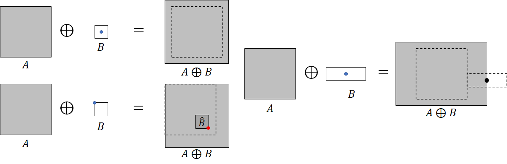
- Les trous sont **diminués**
  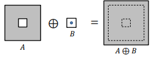
- Les objets peuvent **fusionner**
  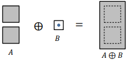

> La **connexité** des objets n'est en générale **pas conservée**

### Dualité

$A ⊖ B = (A^C ⊕ B)^C$
$A ⊕ B = (A^C ⊖ B)^C$

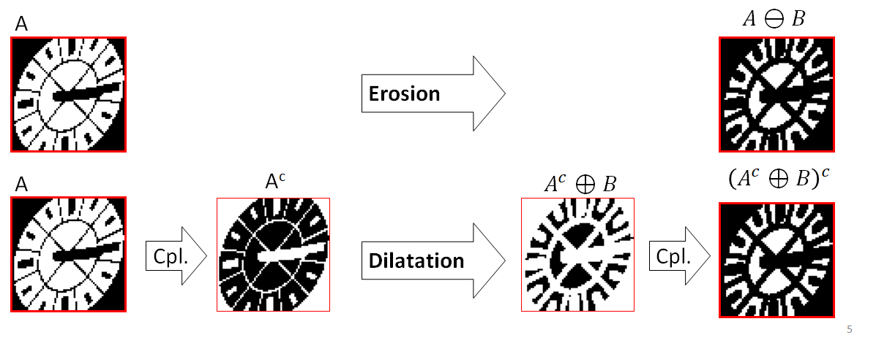

## Ouverture et fermeture
> Slides 26 à 33

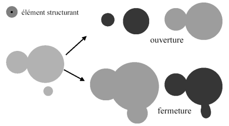

> Qu'est-ce qu'une isthmes : c'est des petites parcelles reliées à la terre ferme, exemple l'île saint-pierre du lac de bienne
> 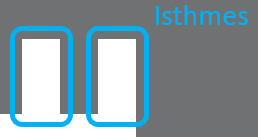

### Ouverture

L'**ouverture** (∘) c'est : une **érosion** suivie d'une **dilatation**.

Notations : **A ∘ B** = (A ⊖ B) ⊕ B = $O^B(A)$

Exemple :
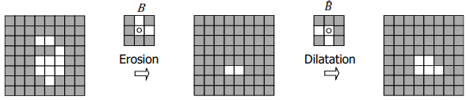

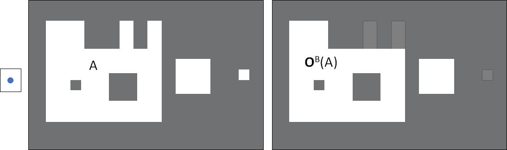

⤷ Les trous sont comblés sans modifier la forme générale de l'objet.

#### Propriétés :
- **Lisse** les formes
- **Elimine** les composantes connexes plus petites que l'<ref>élément structurant</ref>
- **Supprime** les
  - Petites iles (tâches)
  - Les isthmes
- **Conserve** souvant la taille et la forme
- Ne **préserve pas** la **connexité**
- Est idempotente (non itérative) : A ∘ B = A ∘ B ∘ B

### Fermeture

La **fermeture** (•) c'est : une **dilatation** suivie d'une **érosion**.

Notations : **A • B** = (A ⊕ B) ⊖ B = $F^B(A)$

Exemple :
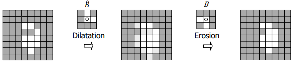
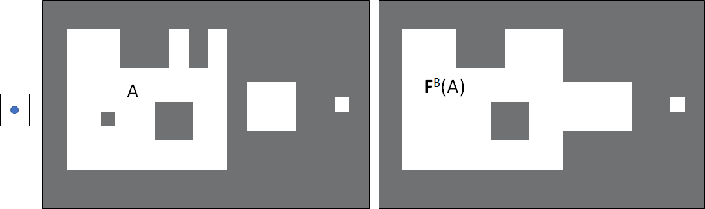
⤷ Les tâches sont retirée, les objets proches fusionnent entre eux, sans pour autant modifier la forme générale de l'objet.

#### Propriétés :
- **Elimine** les trous plus petites que l'<ref>élément structurant</ref>
- **Supprime** les
  - Petits lacs (trous)
  - Les détroits (espaces faibles entre 2 objets)
  - Les golfes étroits (espaces faibles entre 2 isthmes)
- Ne **préserve pas** la **connexité** (soude les éléments proches)
- Est idempotente (non itérative) : A • B = A • B • B

## Applications
> Slides 34 à 39

Pour résumés l'utilité des opérations mentionnées précédemment, nous avons :

| Opération | Utilité | Exemple
--- | --- | ---
<ref>Région</ref>, XOR sur l'érosion, dilatation | Déterminer les contours | 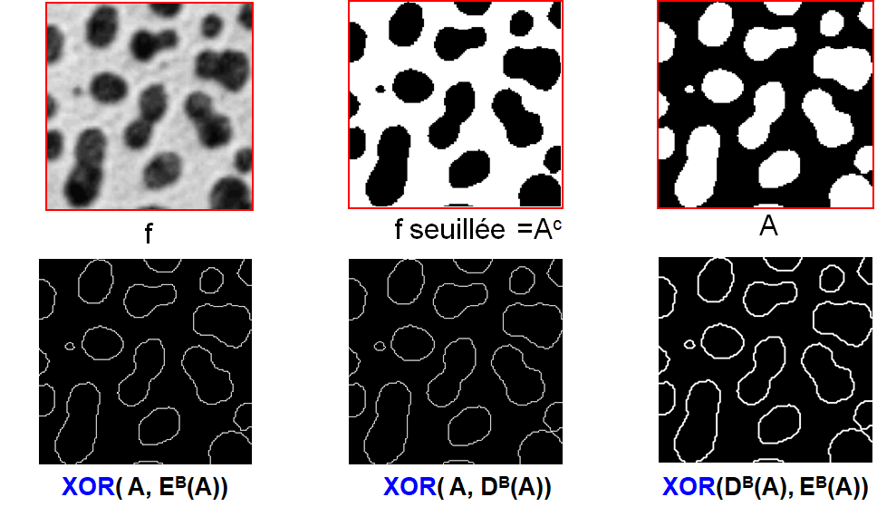
Erosion | Séparer des objets se touchant | 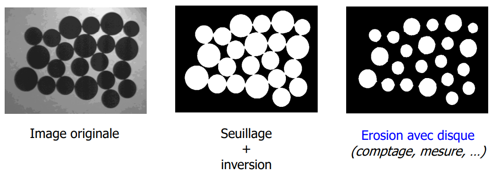
Dilatation | Augmenter la visibilité | 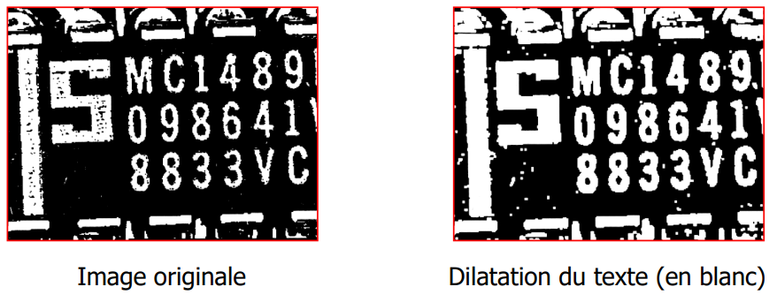
Ouverture | Filtrer le bruit selon la taille (Eliminer les petites tâches) | 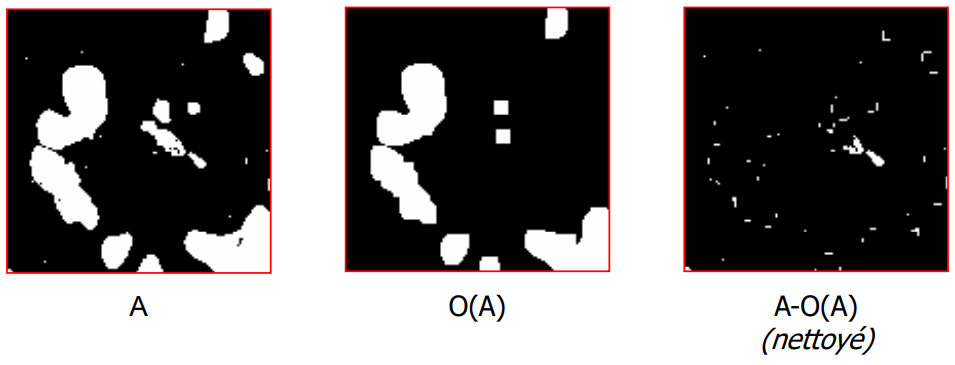
Ouverture puis fermeture | Enlever le bruit | 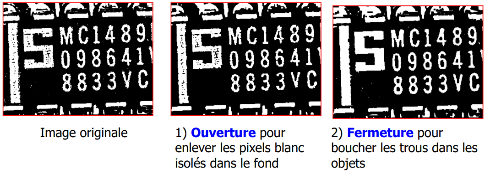

- **<ref>Région</ref>, XOR sur l'érosion, dilatation**
  - Déterminer les contours
    
- **Erosion**
  - Séparer des objets se touchant
    
- **Dilatation**
  - Augmenter la visibilité
    
- **Ouverture** 
  - Filtrer le bruit selon la taille (Eliminer les petites tâches)
    
- **Ouverture puis fermeture**
  - Enlever le bruit
    
