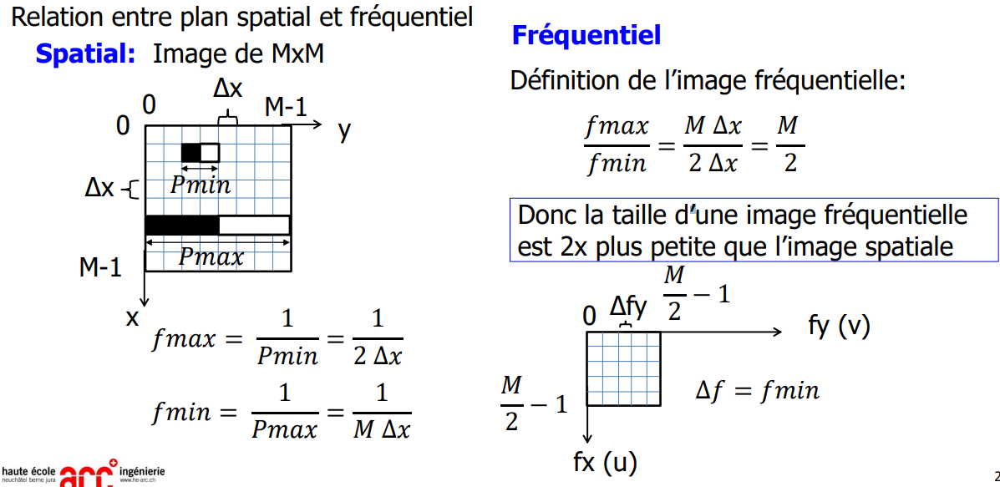
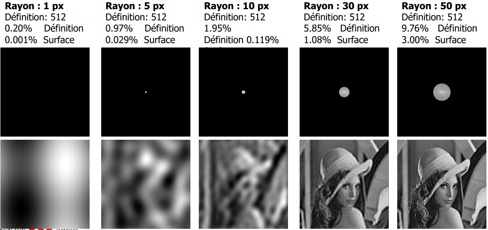

---
# Configuration de Markdown Preview Enhanced
print_background: true # Pour l'export en HTML qu'il prenne le thème de la prévisu (par défaut c'est la prévisu de githublight)
title: Traitement d'image - Chapitre 4.7 &#58; Transformée de Fourier
puppeteer:
    format: A4
    printBackground : true
    displayHeaderFooter: true
    margin: # le Header/footer ne prend pas ces paramètres en compte
        top: 2cm
        right: 2cm
        bottom: 2cm
        left: 2cm

    # taille de police requis, car par défaut c'est 0pt
    # id header/footer sont réservés : ph pour page header, pf pour page footer
    headerTemplate: '
      

      

          

              
Allemann Jonas

              
Traitement d&#39;images

              
Résumé du chapitre 4.7

          

          

              

              

              
Transformée de Fourier

          

      

    '
    footerTemplate: ' 
      

          

              

              

              

                  
                  /
                  
              

          

      

    '
---

@import "style.less"

<h0>Traitement d'images - Transformée de Fourier</h0>

> Couvre les slides 1 à 58

# Définitions

Jusqu'à maintenant, nous avons vu les `Transformations ponctuelles` et les `Transformations locales`.

~~> Dans ce chapitre, nous allons voir les `Transformations globales` qui sont des `Transformée de Fourier`

## Terminologie

Terme | Définition
--|--
**Basses fréquences** | Changements intensité lents
**Hautes fréquences** | Changements intensité rapides
**Domaine spatial** | L'image
**Domaine fréquentiel** | Le spectre

> par la suite, ces termes sont indiqués de cette manière : <ref>exemple</ref>

## Formules
Série de Fourier temporelle 1D

## Symboles
Symboles | Correspond à
--|--|--
$A(f_x, f_y)$ | Spectre
$\varphi(f_x, f_y)$ | Phase

# Fréquence dans une image
> Chapitre 4.7.1 : Slides 6 à 10

Un **signal périodique** peut être décomposé en une **somme de sinus**.

<ref>Basses fréquences</ref> | <ref>Hautes fréquences</ref>
--|--
 | 

- Les <ref>basses fréquences</ref> sont présentes quand il y a de faibles changement d'intensité, les régions sont homogènes, il y a du flou.
- Les <ref>hautes fréquences</ref> sont présentes quand il y a de forts changements d'intensité, les contours, le bruit.

# Série de Fourier temporelle 1D
> Chapitre 4.7.2 : Slides 11 à 15
>
> Pour la compréhension des formules, voir la slide 13

Celle qui nous interesse est la transformée de Fouris discrète (DFT)

# Série de Fourier spatiale 2D
> Chapitre 4.7.3 : Slides 16 à 21

Domaine fréquentiel : **Spectre**, **Phase**

la composante continue corresponds aux flèches des valeurs du spectre ou de la phase.
Les zones de basses fréquences sont proches de l'origine.
Les zones de hautes fréquences sont loin de l'origine.

Relation entre plan spatial et fréquentiel :

# Transformée de Fourier discrète (DFT)
> Chapitre 4.7.4 : Slides 22 à 27

## Mise en forme du spectre

DC == Spectre centré

# Influences de paramètres sur le spectre
> Chapitre 4.7.5 : Slides 28 à 35

La composante continue est au centre du spectre.

## Fenêtre de Hanning

# Transformée de Fourier discrète inverse
> Chapitre 4.7.6 : Slides 36 à 39

Permet de retrouver l'image à partir du spectre et de la phase. L'image obtenue est plus "gris foncée" que l'image d'origine.

# Filtrage fréquentiel
> Chapitre 4.7.7 : Slides 41 à 53

## Fréquentiel vs Spatial
Le filtrage spatial correspond au noyau de convolution.
Alors que le filtrage fréquentiel correspond à la multiplication du spectre et de la phase par un masque.

## Passes-bas et passes-haut

Un filtre passe haut va inverser les couleurs et faire ressortir les contours. Le masque est un cercle noir sur fond blanc. Plus le cercle est grand, plus les contours principaux sont ressortis.

Un filtre passe bas va flouter l'image d'origine. Le masque est un cercle blanc sur fond noir. Plus le cercle est grand, moins l'image est floue.

## Filtrages sélectifs
Au lieu d'un cercle, le masque est un donut.

Le `coupe bande` est plus souvant utilisé que le `passe bande`.

Exemple du `coupe bande` :
