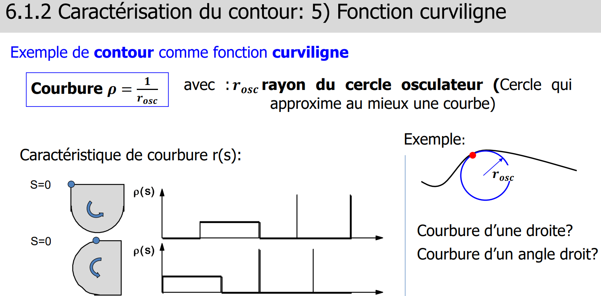
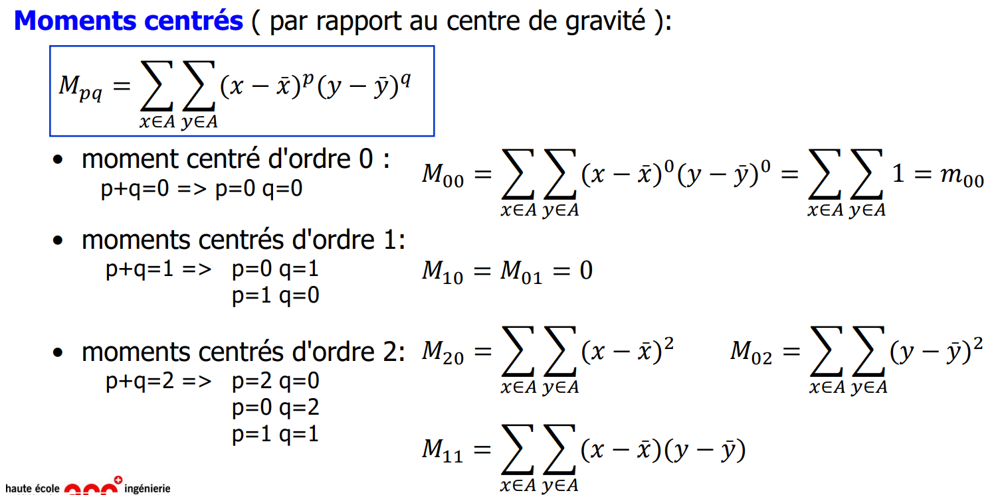
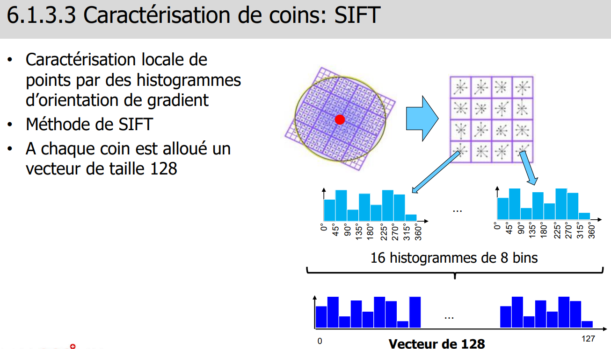
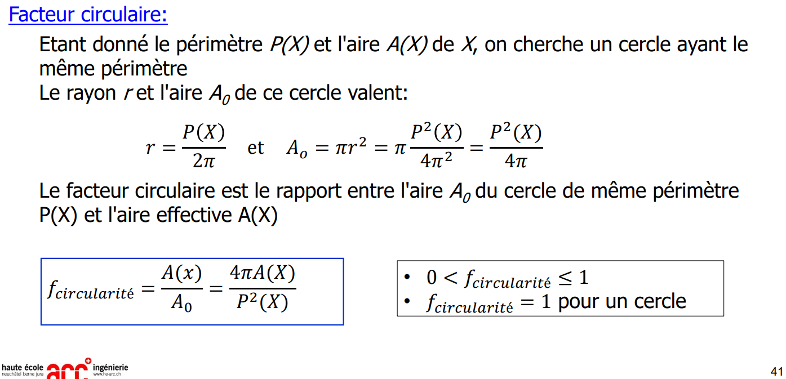

> 📖 Présentation `6.1 Représentation & Caractérisation`

Courbure = arc de cercle passant par les points "px", "px-1" et "px+1". On ne ce fie pas aux points plus éloignés

Si on a un angle droit, le cercle tends vers 0

# Moments

$M_{00} = \sum_{x=0} \sum_{y=0} 1 = 2$

Moment d'ordre 2 : caractérisé la forme (orientation et proportion)
- $M_{11} = \sum\sum(x-\overline{x}) * (y-\overline{y})$
- $M_{20} = \sum\sum(x-\overline{x})^2$
- $M_{02} = \sum\sum(y-\overline{y})^2$

# SIFT
SIFT = Scale Invariant Feature Transform

# Facteur de circularité

La forme ayant la plus grande aire et le plus petit périmètre est le **cercle**

On utilise donc le cercle comme référence pour calculer le facteur de circularité

