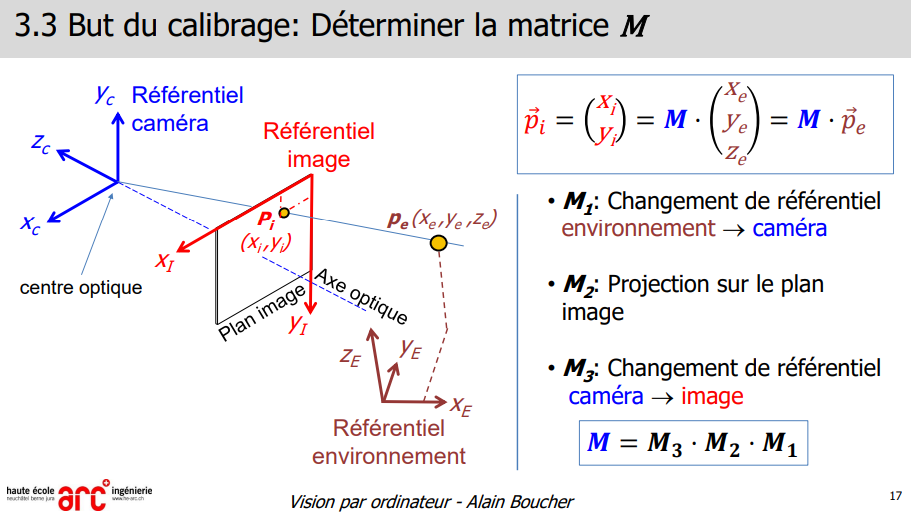
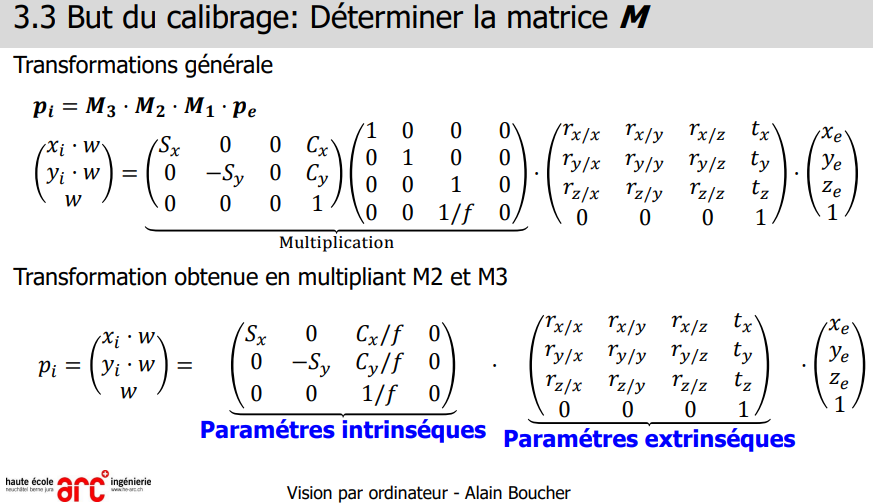
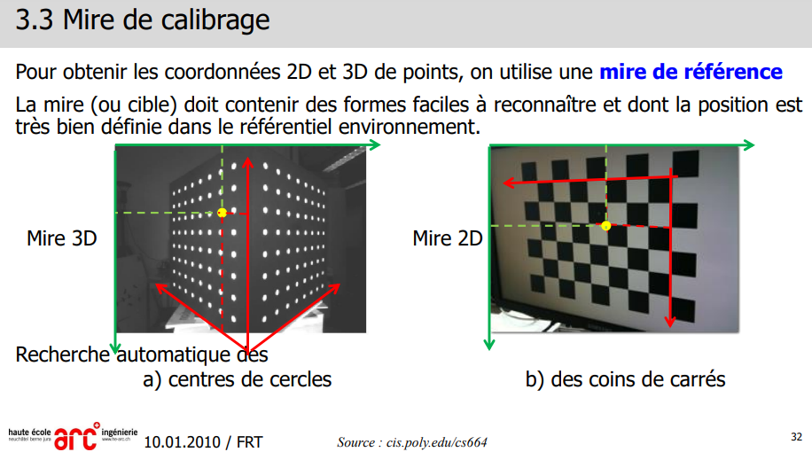
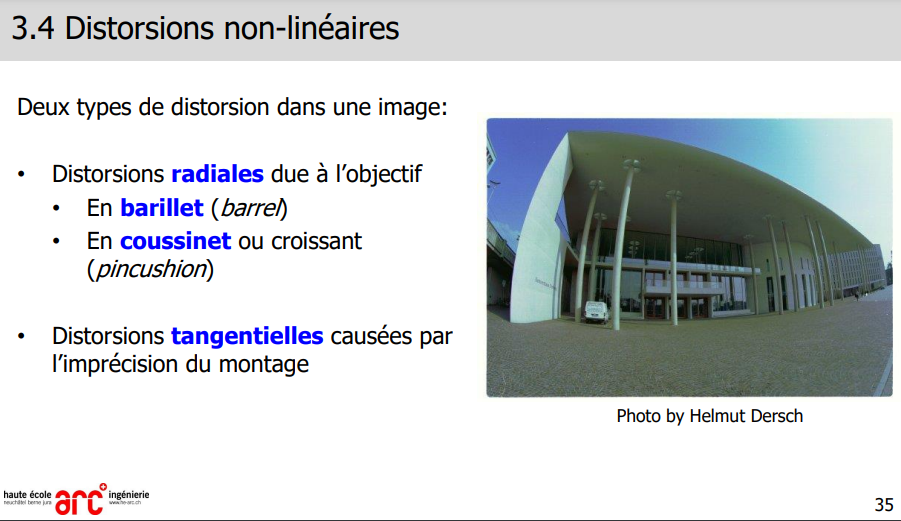
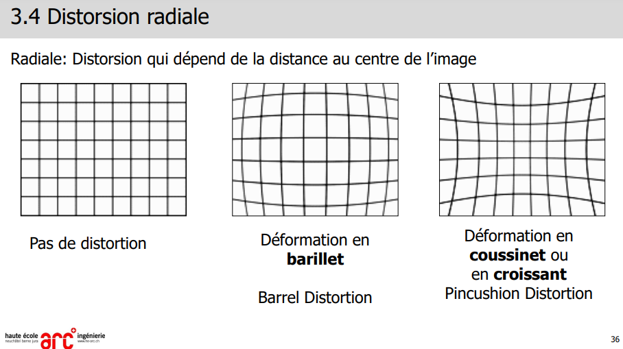
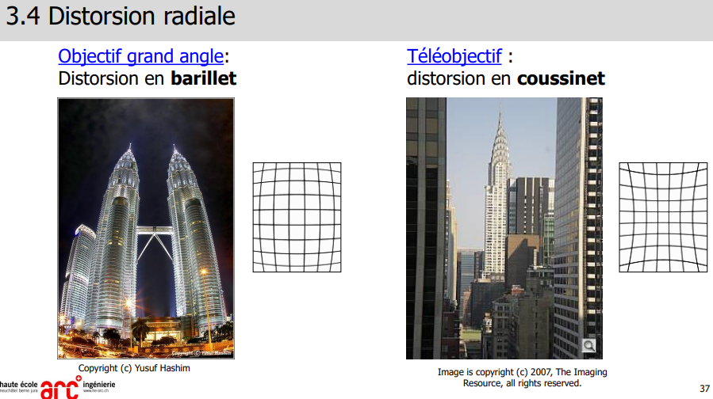
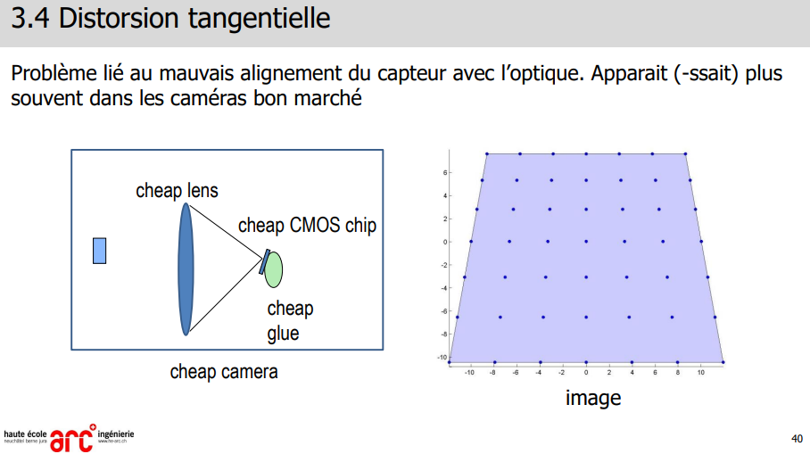
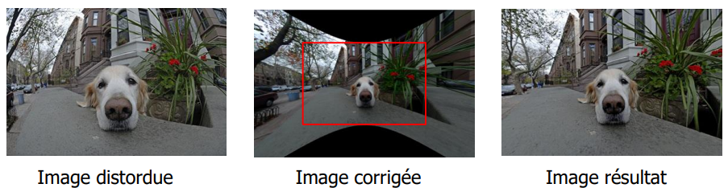

> 📖 Présentation `3 CalibrageCamera`

# Matrices

!!! info Formules
    Les formules et étapes sont expliqués de la slide 17 à 31

_slide 25_ 

**Paramètres intrinsèques** de la caméra :
- Pas besoin de calibrer cette matrice
- points internes de la caméra (focale, centre optique, etc.)
- 
**Paramètres extrinsèques** de la caméra :
- C'est ça qu'on va devoir calibrer
- Emplacement de la caméra par rapport à l'objet

# Mire de calibrage

Repère vert = repert de l'image en pixel
Rouge = Repère de l'image avec le calibrage (unité = mètres, ou "[unité]" (la taille du carré))
En jaune traitillé == coordonée en pixel du point dans l'image
En rouge traitillé == coordonées en [unité] du point dans l'image

# Distorsion non linéaire

## Radiale

## Tangentielle

## Risques d'une correction 
Corrigé une image distordue aura pour effet d'avoir de la perte d'information.

Pour corriger, on va étirer l'image pour avoir l'image non distordue. Une fois fait, on recadre l'image pour retirer les zones noires.

