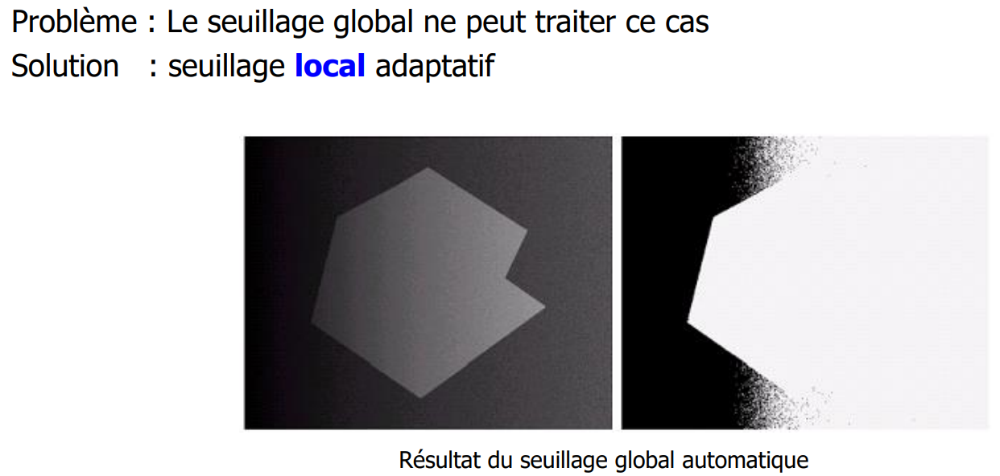
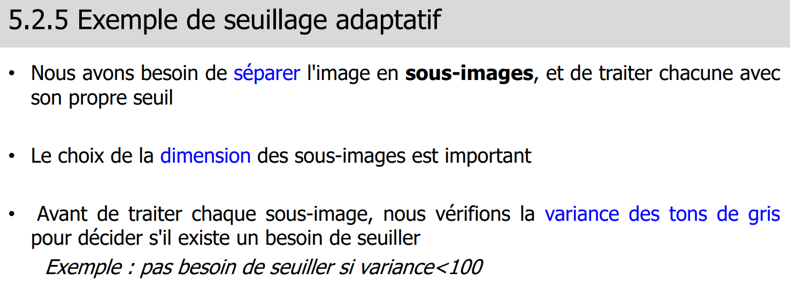
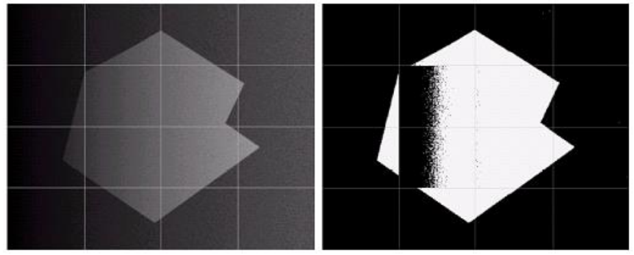

> 📖 Présentation `5.1 Segmentation Introduction`

**Partitionner en zone homogènes**
- Couleur, texture, niveau de gris, etc

# Basée sur
- **Contour**
  
- **surface**
  

# Seuillages locaux
> 5.2.5 (slide 30)

Problème du seuillage global :

## Seuillage adaptatif

