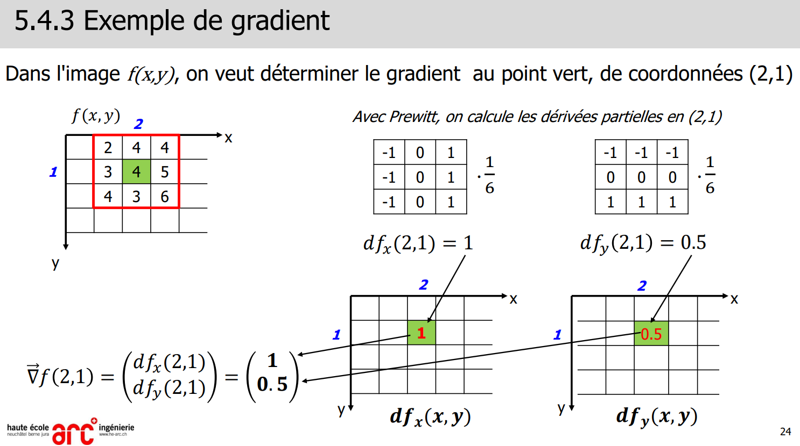
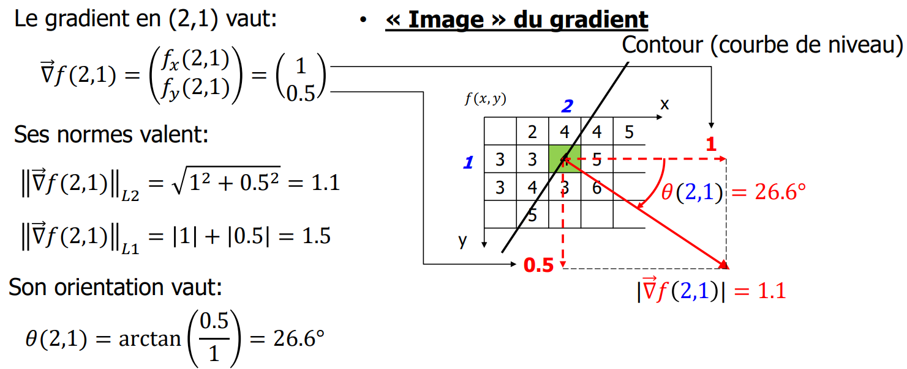
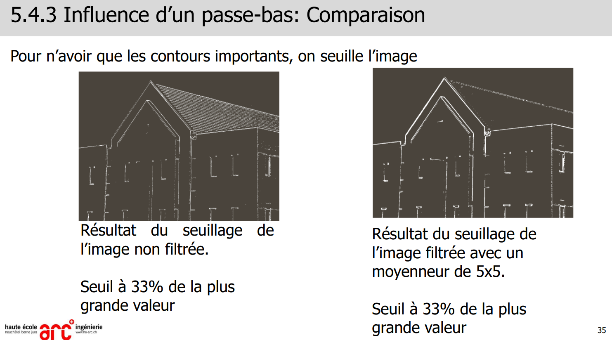
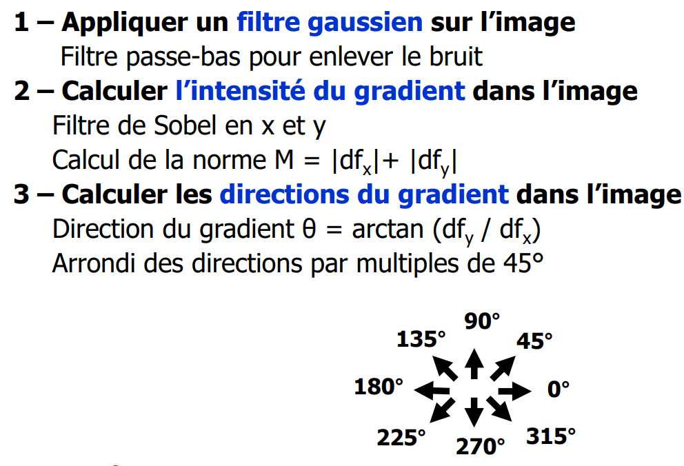
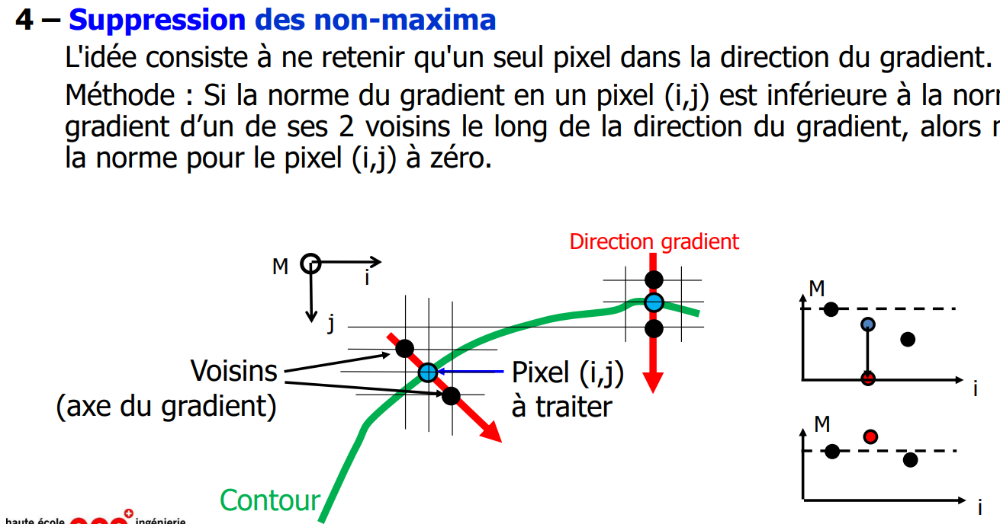

> 📖 Présentation `5.4 Détection de contours`

On cherche le gradient de l'image (vecteur (dx, dy)).

! L'angle est horaire, car l'axe Y descend.

- La première image n'a pas de passe-bas, on a juste fait un passe-haut. La seconde on a fait un passe-bas, puis un passe-haut. On a donc un gradient plus fort (on a éliminé les bruits des tuiles).

# Filtre de Canny
Un très bon filtre de détection de contours.

