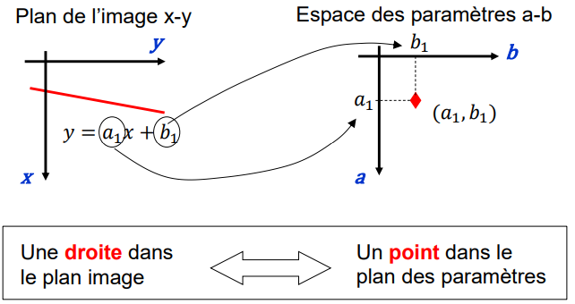
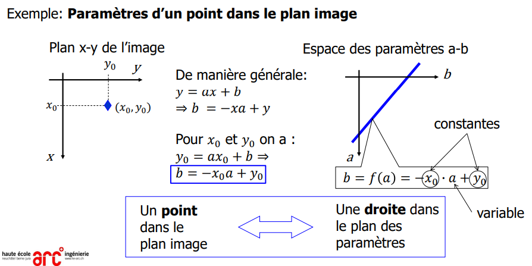
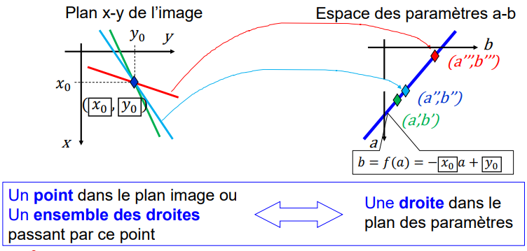
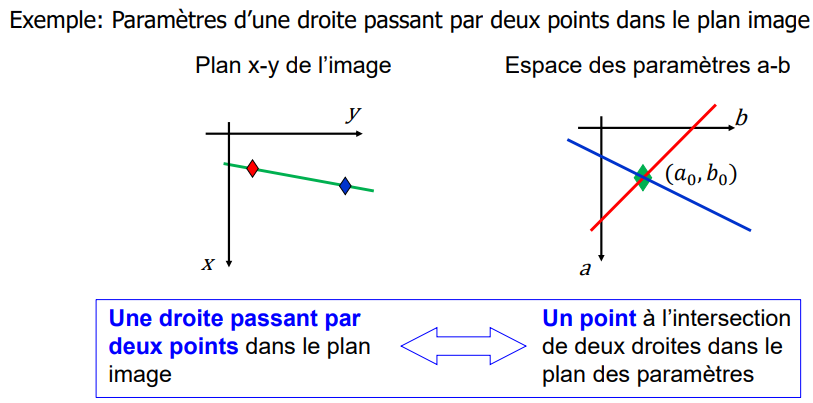
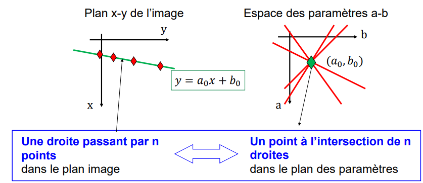
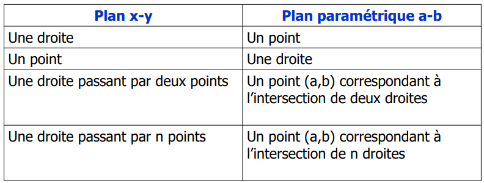
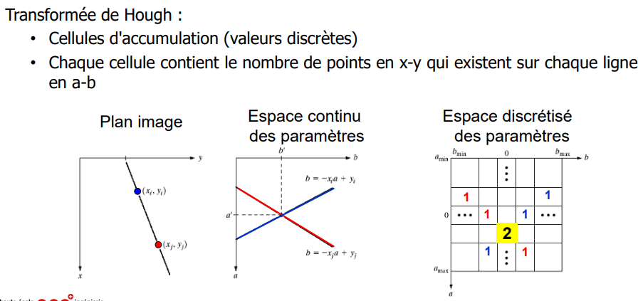
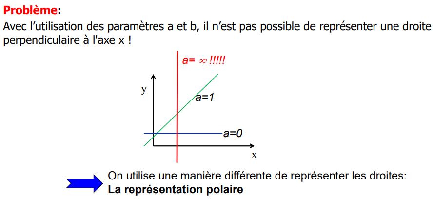
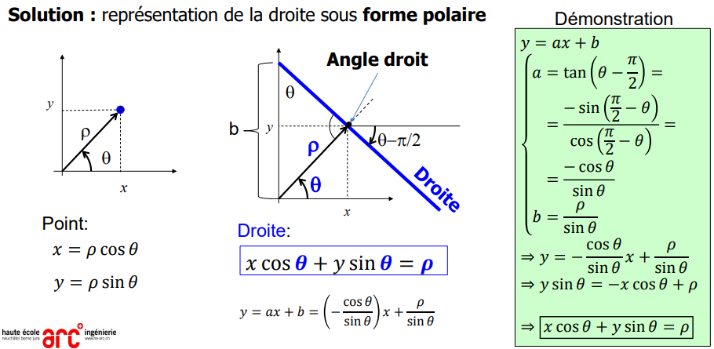

> 📖 Présentation `5.6 Détection de lignes par la transformée de Hough`

Pour rechercher une droite, on peut faire des régression linaire.
Mais on a un problème si la droite est "verticale".

> Hough se prononce "oeuf"

Une solution est d'utiliser les transformations de Hough. 
--> Espace de paramètre a-b

**Résumé**

Problème : si tous les points sont alignés

# Algorithme de Hough
**Déterminer les points qui sont sur l'espace a-b**
En informatique, on va faire une "matrice" et on incrémente les cases qui passes sur les droites.
Et on prend les coordonées des points avec la plus grande vleur

(avec une grille plus petite, si on a plusieurs valeurs on en prend une)

# Limite des paramètres a-b

**--> représentation polaire (theta $\theta$, rho $\varrho$)**

# Algorithme de Hough (theta rho)
> Expliqués au chapitre 3.6.3, page 28-34

Nombre de valeurs à prendre (conseillé)
- theta : tous les degrés
- rho : 400 valeurs (entre -200 et 200)
