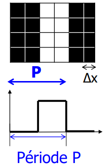
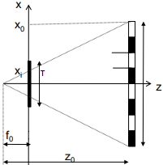
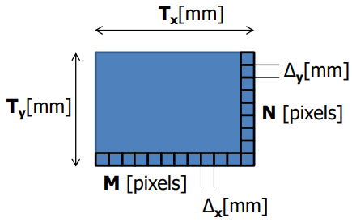
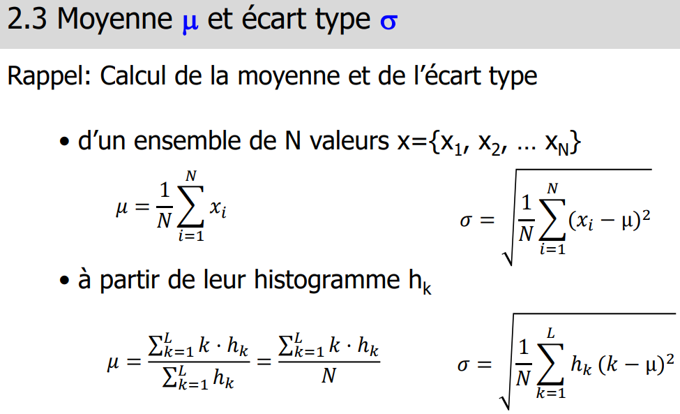
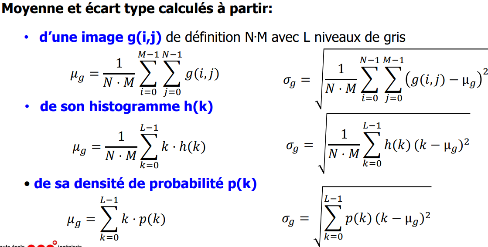
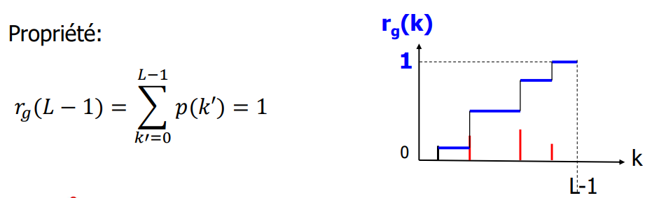
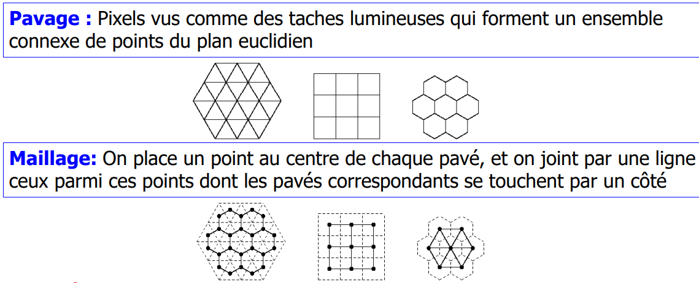
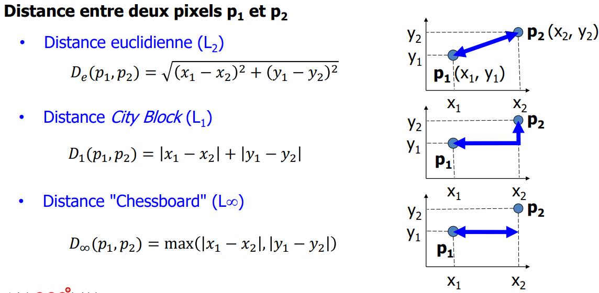
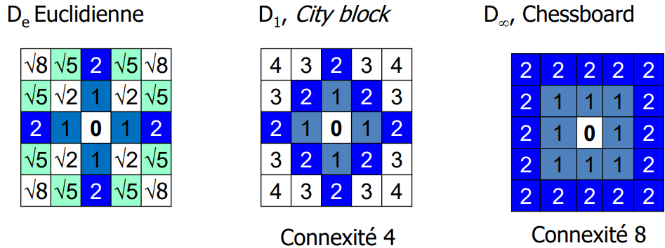

---
puppeteer:
    format: A4
    printBackground : true
---

<!--
!!!!!!!!!!!!!!!!!!!!!!!!!!!!!!!!!!
!!!!!!!!!!!!!!!!!!!!!!!!!!!!!!!!!!

L'export via Puppeteer ne fonctionne pas avec les balises <code> ~~> Open in Browser > Print to PDF 

!!!!!!!!!!!!!!!!!!!!!!!!!!!!!!!!!!
!!!!!!!!!!!!!!!!!!!!!!!!!!!!!!!!!!
-->

@import "style.less"

Ordre TI : acquisition / prétraitement / segmentation / Caractérisation

# Oeil
- bâtonnets = vision nocturne (vert)(scotopique) (`125M`)
- cônes = vision diurne (couleur) (photopique) (`6M`) (S : 2%, M : 32%, L : 64%)
  - <b>S</b>hort / <b>M</b>edium / <b>L</b>ong
- Photorécepteurs = 
  - `Macula` (que cônes)
  - `Fovéa` (principallement cônes)
  - `Périphérie` (~20 bâtonnets pour 1 cône)
- reçois 131M ~~> donne <1M ==> **réduction**
- 3 images envoyées au cerveau :
  - **HD** (détail, forme)
  - **BD** (mouvement)
  - **BD** (contrastes)

Bande de mach : <!-- #region drawnote -->
<svg id="svg" xmlns="http://www.w3.org/2000/svg" viewbox="91.69999694824219,43,411.84002685546875,55" style="height:55"><rect x="101.7" y="53" fill="black" stroke="black" stroke-width="2" width="39.999999999999986" height="21" d="M 101.7 53 h 39.999999999999986 v 21 h -39.999999999999986 Z"></rect><rect x="137.7" y="55" fill="#b5b5b5" stroke="#b5b5b5" stroke-width="2" width="54" height="18" d="M 137.7 55 h 54 v 18 h -54 Z"></rect><rect x="168.7" y="67" fill="#b5b5b5" stroke="#b5b5b5" stroke-width="2" d="undefined"></rect><rect x="162.7" y="73" fill="rgba(240, 240,240, 0.4)" stroke="#BBB" stroke-width="1"></rect><rect x="160.7" y="63" fill="rgba(240, 240,240, 0.4)" stroke="#BBB" stroke-width="1"></rect><line x1="208.7" y1="73" x2="244.7" y2="73" fill="none" stroke="black" stroke-width="2" d="M 208.7 73 L 244.7 73"></line><line x1="244.7" y1="74" x2="244.7" y2="60" fill="none" stroke="black" stroke-width="2" d="M 244.7 74 L 244.7 60"></line><line x1="244.7" y1="60" x2="282.7" y2="60" fill="none" stroke="black" stroke-width="2" d="M 244.7 60 L 282.7 60"></line><line x1="300.7" y1="78" x2="325.7" y2="78" fill="none" stroke="black" stroke-width="2" d="M 300.7 78 L 325.7 78"></line><line x1="325.7" y1="78" x2="337.7" y2="65" fill="none" stroke="black" stroke-width="2" d="M 325.7 78 L 337.7 65"></line><line x1="337.7" y1="65" x2="372.7" y2="64" fill="none" stroke="black" stroke-width="2" d="M 337.7 65 L 372.7 64"></line><line x1="401.54" y1="81" x2="445.54" y2="80" fill="none" stroke="black" stroke-width="2" d="M 401.54 81 L 445.54 80"></line><line x1="445.54" y1="80" x2="448.54" y2="88" fill="none" stroke="black" stroke-width="2" d="M 445.54 80 L 448.54 88"></line><line x1="448.54" y1="88" x2="456.54" y2="61" fill="none" stroke="black" stroke-width="2" d="M 448.54 88 L 456.54 61"></line><line x1="456.54" y1="61" x2="462.54" y2="68" fill="none" stroke="black" stroke-width="2" d="M 456.54 61 L 462.54 68"></line><line x1="462.54" y1="68" x2="493.54" y2="69" fill="none" stroke="black" stroke-width="2" d="M 462.54 68 L 493.54 69"></line></svg>  
<!-- #endregion -->

# Image réel à numérique
- La quantité de donnée d’une image correspond à `M * N * [bits par pixel]`. Passage du réel au numérique : <code> *= $f_x * f_y$ </code>.
- La quantité de niveau de gris correspond à `2^bits par pixel`.
- <code>$f_d = 1/{\Delta_d}$</code> (<code>$\Delta_d$</code> est la interval entre deux pixels, on remplace "d" par l'axe souhaité)

- Théorème de **Nyquist** : <code>$f_x \geq 2f_s$</code>.
- <code>$f_s$ = $1/P$</code> où <code>$P$</code> est la période d'échantillonnage (<code>$f_{sinus}$</code>) (<ref>IMG1</ref>). 

- Taille réelle vers image <ref>IMG2</ref> : <code>$x_i = x_0 * f_0 / z_0$</code>
  - Résolution (N*N) : <code>N = $T / x_i$</code> (! à mettre à la même unité  !)
  - T : taille de l'image [mm]
  - $x_i$ : taille de l'objet sur l'image [mm]
  - $x_0$ : taille réelle de l'objet [mm]
  - $f_0$ : focale de l'objectif [mm]
  - $z_0$ : distance du réel à  l'objectif [mm]
  - M ou N : nombre de pixel [px] // M = axe X, N = axe Y 
- Taille géométrique : $M = T_x / \Delta_x = f_x * T_x$

# Statistiques

**L** = $2^b -1$ niveau de gris (Quantification)
**Mode** : niveau de gris qui apparaît le plus souvent dans une image
**Contraste** : `Valeur max - Valeur min` du mode
**Moyenne $\mu$** & **Ecart-type $\sigma$** ~~> <ref>IMG3</ref>
**Luminance** $\approx$ <code>$\mu$</code>
**Dispertion** $\approx$ <code>$\sigma$</code>

**Histogrammes** :
- h(k) = nombre de pixels de niveau de gris k
- H(K) = histogramme **cumulé** de `h(k)` (somme des `h(k)` précédents, $0 \le k \le L$)
- p(k) = densité de probabilité = `h(k) / (M*N)`
- $r_g(k)$ = proba qu'un pixel soit $\le$ à niveau gris `k` = <code>$prob(g(px) \le k)$</code> <ref>IMG4</ref>
- **Max axeY** : h(k) et H(K) == **M*N** // p(k) et $r_g(k)$ == **1**

# Relations pixels
Pixel (**Pict**ure **El**ement) == position, valeur, taille et forme
**Pavage**, **Maillage** <ref>IMG5</ref>
**Voisinage** : ensemble de pixels qui sont à une distance de 1 pixel de `P` (V4 : 4 voisins, V8 : 8 voisins)
**Distances** <ref>IMG6</ref>

# Synthèse
Synthèse additive (lumière) : RGB
Synthèse soustractive (impression) : CMY

# Echantillonnage & Quantification
- **E(x,y)** = prendre la moyenne des points tous les XY pixels
- f(i,j) = E(i*$\Delta_x$, j*$\Delta_y$), avec $\Delta_?$ == pas d'échantillonnage

limites : 
- Echantillonage : nombre de pixels du capteur
- Quantification : nombre de niveau de gris

# Images

1. 
2. 
   
3. 
   
4. 
5. 
6. 
   
7. 