> <span style="font-size: 1.5em">📖</span> <span style="color: orange; font-size: 1.3em;">Présentation [4 Animation 3D](http://enseignement.pages.ing.he-arc.ch/isc/cours/niveau-3/3292.2-infographie-unity/website/docs/cours/04_01-animation-de-personnages-3d/)</span>

On va pas faire de l'animation, on va juste reprendre des modèles 3D avec des animations pré-faites. On en trouve dans le `Unity Asset Store` et sur `Mixamo`.

Mixamo :
- Plateforme très connue / populaire.
- Plateforme qui propose beaucoup de modèle 3D avec des animations pré-faites.
- Facile à intégrer dans Unity.


Les animations gratuite sont très souvant "basse qualité"


https://assetstore.unity.com/packages/3d/animations/zombie-animation-pack-free-150219
On l'ajoute a nos assets, et on ouvre dans l'éditeur
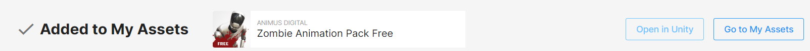
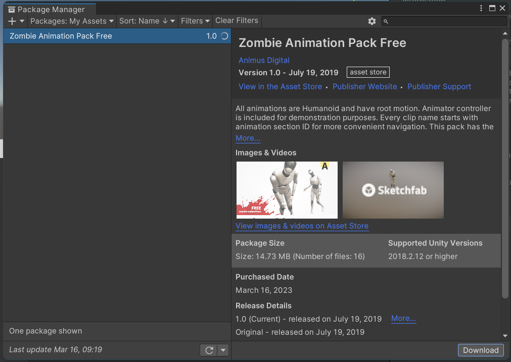

# Etapes par étapes
On commence par créer une scène (`animation`) et on ajoute le mesh du zombie
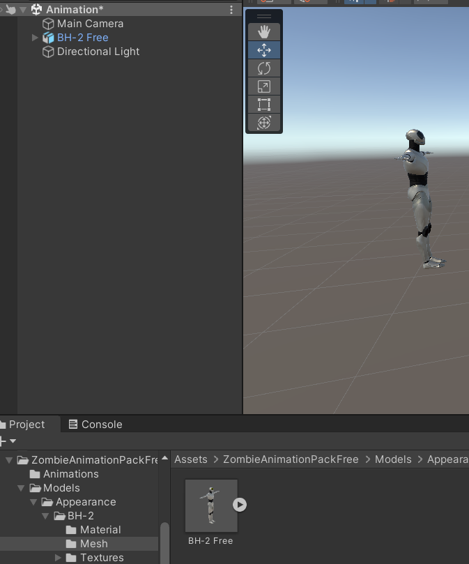

Ajout de l'animator :
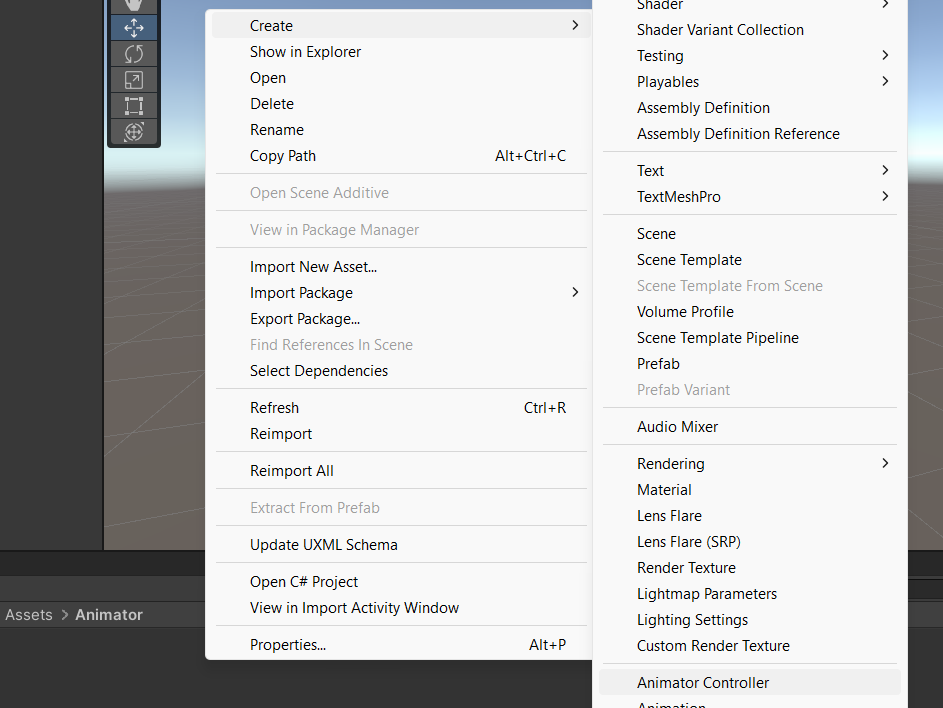
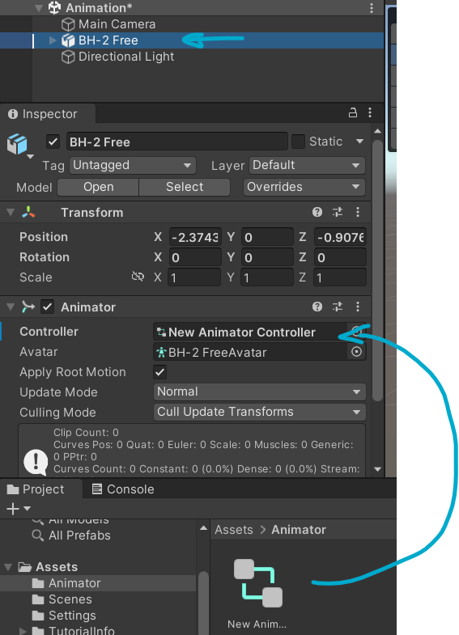
et on ouvre l'animator (double clic dans l'assets) :
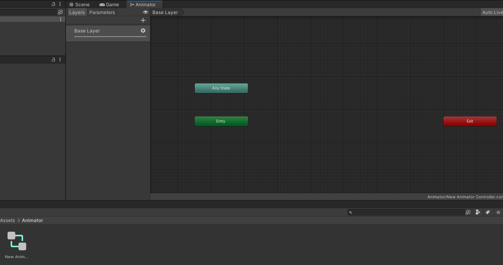

## Animations simples
On ajoute l'animation à un nouvel état
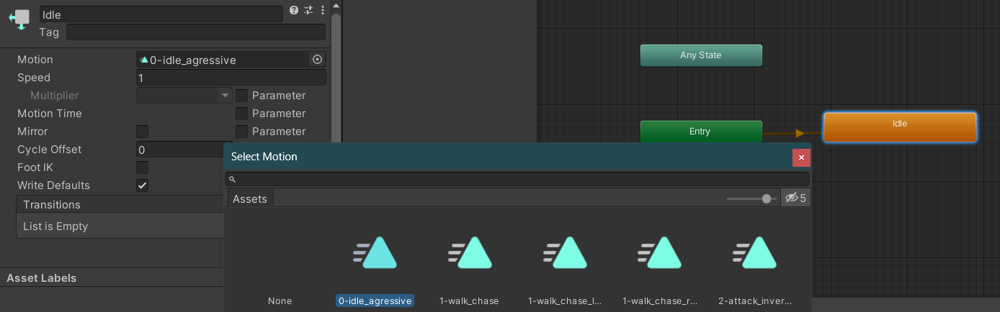
Et si on lance le jeu, on voit maintenant que notre personnage est animée ! Yeah !

Ajout de l'attaque
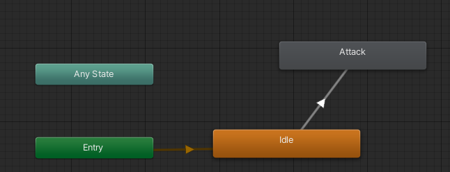
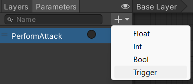
On sélectionne la transition et on ajoute une condition
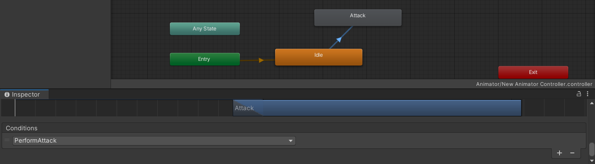
Si on veux que la transition se fasse sans que la précédente animation soit terminée : on décoche `Has Exit Time`


## Animations de déplacement
Pour les animations de déplacement, on va faire un "Blend Tree" :
- On va discrétiser les angles de déplacement (tourne à 30°, 40°, etc.) sauf que sa empêche de faire des déplacements à d'autres angles (non réaliste). Pour contourner ce problème, on va faire un "Blend Tree" qui va interpoler les angles de déplacement (tourne à 35°, sa va "fusionner" les animations 30 et 40°).

Clic droit sur "idle"
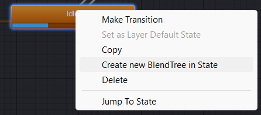
Et en double cliquant sur l'état, on ouvre son blend tree
> (renommage de l'état de `idle` à `locomotion`)

On ajoute 2 paramètres "float" (`speed` et `direction`)
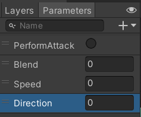

Et on les ajoute au blend tree (on le met en mode "2D" pour avoir les 2 axes) (pour bien couvrire les axes, on utilise "2D Freeform Directional")
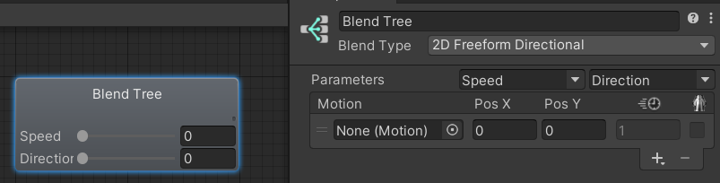

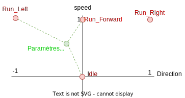
Sur ce graphe, on a les points rouges qui sont les animations, et le point vert qui est les paramètres actuelles. L'animation au point vert est calculées en fonction de la distance entre les points rouges et le point vert.

On ajoute les animations de déplacement (`add motion field`) en fonction de nos points rouges sur le graphe d'avant
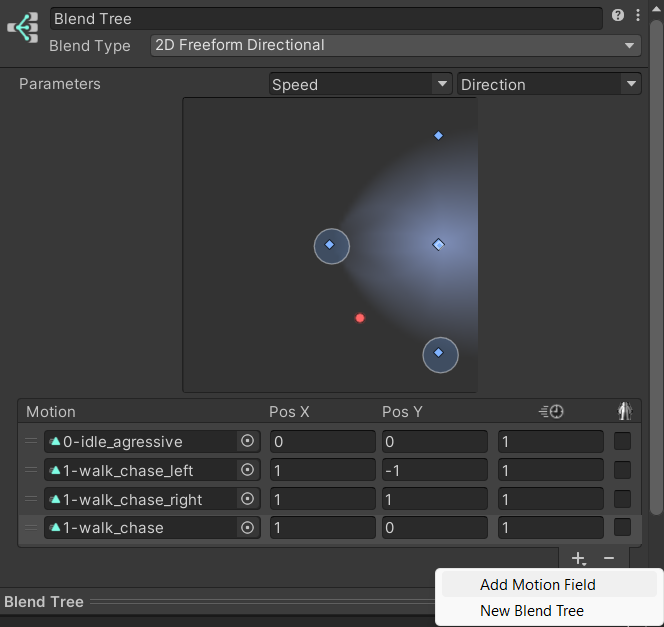

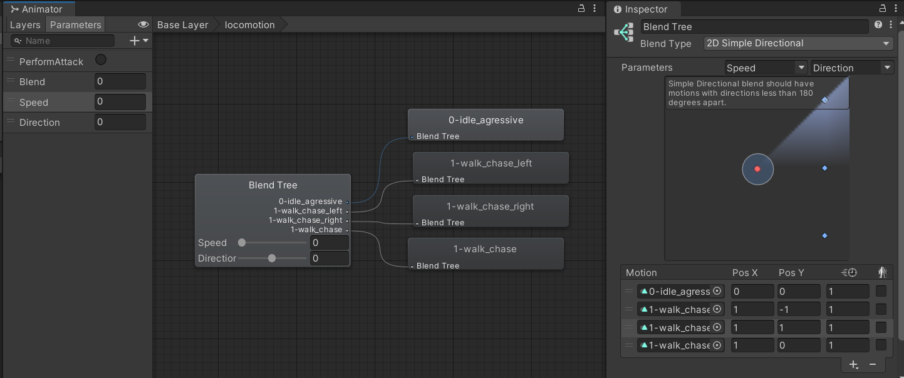

## Script
Maintenant qu'on a l'animation, il faut pouvoir la piloter. On ajoute un script au personnage. et on récupère son `animator` :
```csharp
[SerializeField]
private Animator animator;

void Start()
{
    animator = GetComponent<Animator>();
}
```

On ajoute l'action
> On va prendre un controle fournis de base par Unity : `Fire1`
> 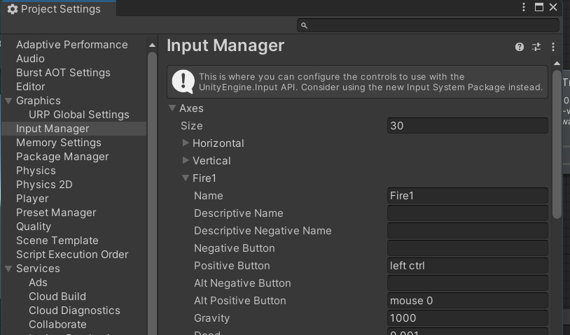
> 
```csharp
void Update()
{
    if (Input.GetAxis("Fire1") != 0)
        animator.SetTrigger("PerformAttack");
}
```
Maintenant, chaque fois qu'on fera un clic droit, le personnage attaquera.

!!! info buffer
    Il y a un buffer, ainsi si on spam le clic durant la même animation, il attaquera autant de fois que l'on a clic

Il ne reste qu'à ajouter le déplacement :
```csharp
void Update()
{
    ...
    float speedInput = Input.GetAxis("Vertical");
    if (speedInput >= 0)
        animator.SetFloat("Speed", speedInput);

    float directionInput = Input.GetAxis("Horizontal");
    animator.SetFloat("Direction", directionInput);
}
```