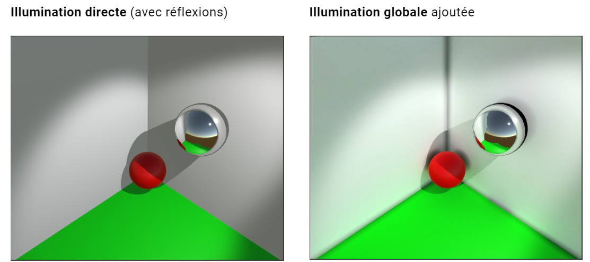
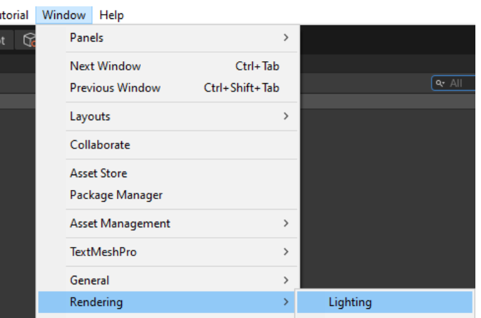
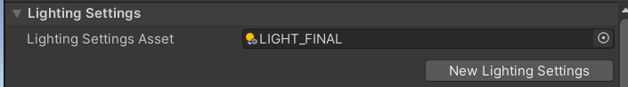
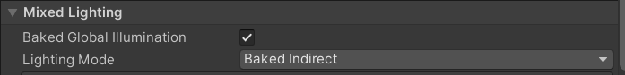
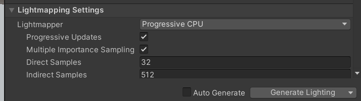
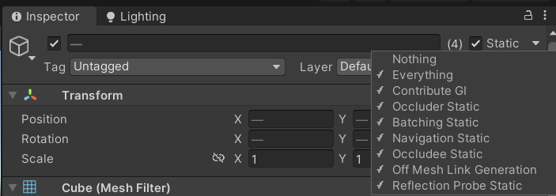
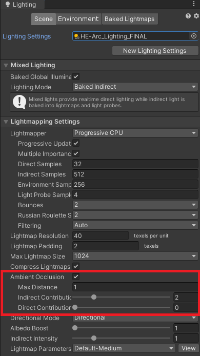
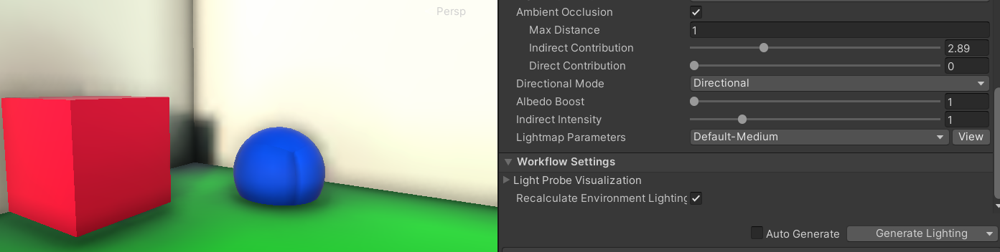
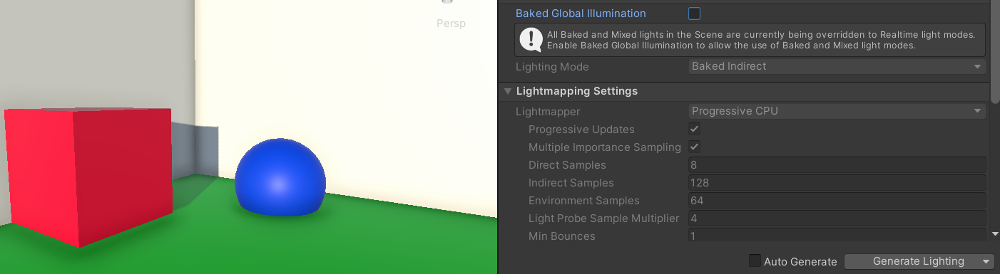
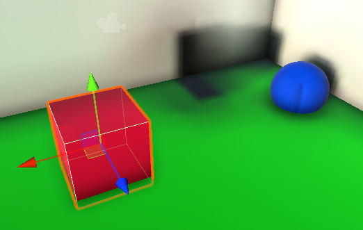

> 📖 Présentation [5 Illumination globale](http://enseignement.pages.ing.he-arc.ch/isc/cours/niveau-3/3292.2-infographie-unity/website/docs/cours/05-illumination-globale/)

2 types d'illumination :
- Illumination directe = interaction entre la lumière et un objet, simple a calculer car c'est 1 point
- Illumination indirecte = la surface diffuse sa couleur, ce qui fait qu'une projection de la couleur se fait sur un autre objet

Illumination globale = ensemble de techniques pour considérer la **lumière indirecte**

# Fonctionnement
**SIMULER LES INTERACTIONS COMPLEXES AVEC LA LUMIÈRE** :
- Coûteux en temps de calcul + algorithmes compliqués
- Pré-calculer (Baking) le plus d’informations possible (Lightmaps)
- Ne considère que les GOs marqués comme static

# Unity
On va créer les settings de la lumière (il ne s'agit pas d'un objet placé dans la scène, mais une configuration Unity)

1. Afficher l'interface des lumières :

On configure 2 type de lumière : 1 preview et 1 final, comme sa on peut simplement switch entre les 2 modes de lumières.
La preview est plus rapide a calculer et suffit pour le développement

(`New Lightning Settings`)

Sélectionner `Baked Indirect` pour avoir une lumière indirecte

niveau options, la preview on divise les valeurs par 4 (arbitraire)

Pour appliquer la configuration de lumière : `Generate Lighting`

## Appliquer la lumière pour les objets statiques
Pour autoriser l'illumination globale sur les objets statiques, il faut ajouter au gameobject a minima le `Contribute GI`

## Choisir les lumières qui précalculent l'illumination

Sélectionner le GO d'une lumière et mettre le mode `Baked`

**Modes** :
- `Realtime` (dynamique) : cette Light est calculée en temps-réel uniquement et ne contribue pas à l’illumination globale;
- `Baked` (statique) : cette Light n’est pas calculée en temps-réel. Cependant, elle est prise en compte dans le calcul de l’illumination globale;
- `Mixed` (mixée) : cette Light est calculée en temps-réel et est prise en compte dans le calcul de l’illumination globale.

## Occlusion ambiante

## Exemple de rendu
Pour voir le rendu, il suffit de regénérer la lumière (Generate Lighting)

Et si on veux désactiver l'illumination globale, il suffit de désactiver `Backed Global Illumination` dans les settings de la lumière

Si on déplace un objet dans la scène, il faut regénérer la lumière, sinon les ombres ne sont pas mis à jour

## Si on veux des objets dynamiques (non statiques) soit impacté par la lumière globale

Utiliser des `Light Probes` (qui sont des objets placés dans la scène)
- Une sorte de "sonde" à des endroits stratégiques de la scène
- Calcul l'impacte de la lumière à l'endroit de la `Light Probe`
- Si on mets une `Light Probe` vert un mur vert, la `LP` prend l'information (précalcule l'illumination), tous les objets proches de cette `LP` vont prendre un peu la couleur du mur par le biais de la `LP`