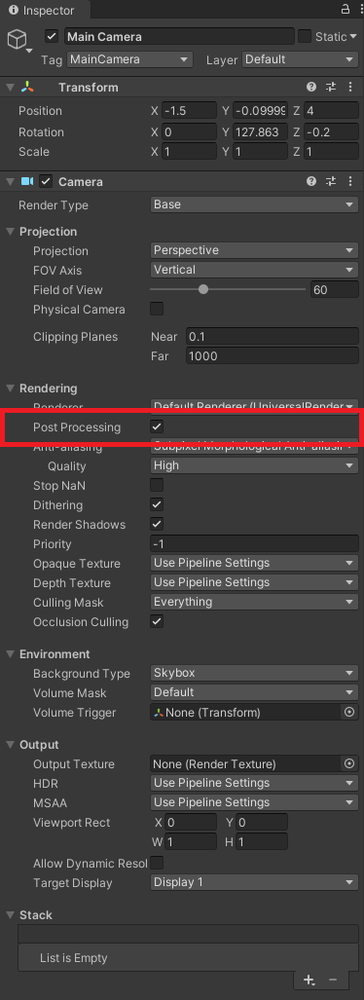

> 📖 Présentation [6. Post Processing](http://enseignement.pages.ing.he-arc.ch/isc/cours/niveau-3/3292.2-infographie-unity/website/docs/cours/06-post-processing/)

Sert à ajouter des filtres

Hérité du cinéma et des "caméra de bases" (physiques), comme l'ajout de grains. Avec les défauts des caméras, lentilles, etc.

L'editeur de Unity ne mets à jour que si des éléments bouges, si on veut forcer un refresh, il suffit d'appuyer sur la touche `alt`