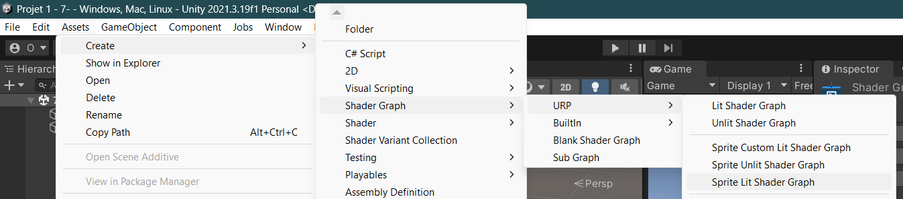
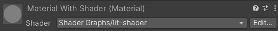
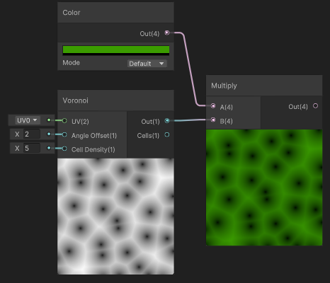
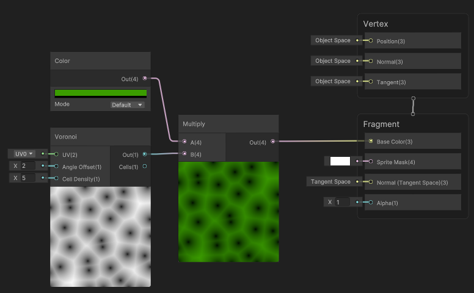
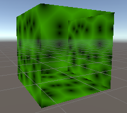
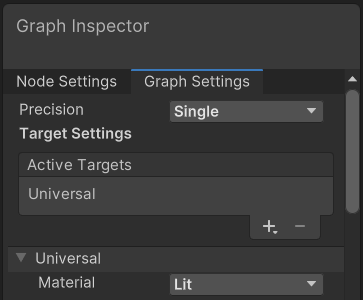
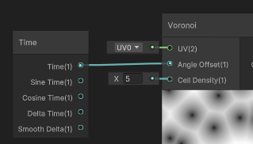
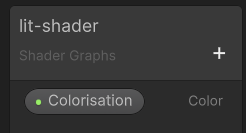
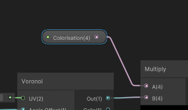
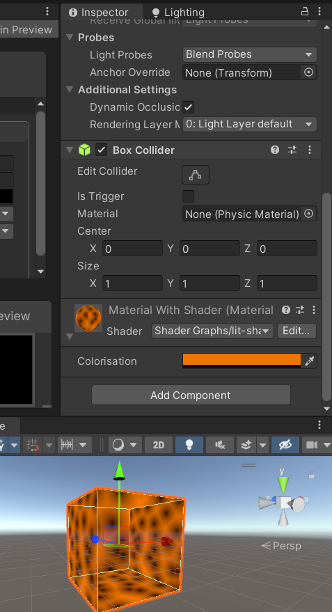

> 📖 Présentation [7. Shader Graph](http://enseignement.pages.ing.he-arc.ch/isc/cours/niveau-3/3292.2-infographie-unity/website/docs/cours/07-shadergraph/)

!!! info Shader Graphe est abrégé en SD

Système sous forme de graphe.

Type de programamtion : data flow programming

et sur un matérial :
 _(lit shader est le nom que j'ai donné à mon SD_)

# Edition du SD

Si on veut colorer un pattern (ici Voronoi), il faut le multiplier par une couleur :

!!! info Voronoi
    Pattern de bruit, qui va créer des "cellules" de bruit. Les niveaux de dégradé est le même et dépend de la distance entre les cellules 

On peut ensuite relier notre voronoi coloré au fragment

!!! remarque 
    
    On peut voir un petit bug visuel, ceci peut être lié à plusieurs choses. Mais c'est surement les normales qui sont orientées dans le mauvais sens.
    Sa peut également être lié à la carte graphique

    Pour corriger le problème, peut être désactiver le `backface culling` dans le shader

    Correction dans mon cas : 
    Changer le type de matérial dans le `Graph Settings` de `Sprite Lit` à `Lit`
    

Pour animer la texture, on ajoute un node "Time". Ici on va utiliser le temps pour changer l'angle des cellules

Pour ajouter des propriétés modifiable dans l'éditeur, on ajoute dans le `blackboard` des propriétés :

et on le lie au shader :

# Appliquer le shader sur une forme

Le shader est appliqué sur un matérial, mais si on ne spécifie pas comment géré la surface, il peut y avoir des problèmes d'affichage. Exemple un cube affichera le même contenu sur chaque face, et un cercle il aura du mal.

Il faut donc ajouter une UV map pour spécifier les "points de coutures"